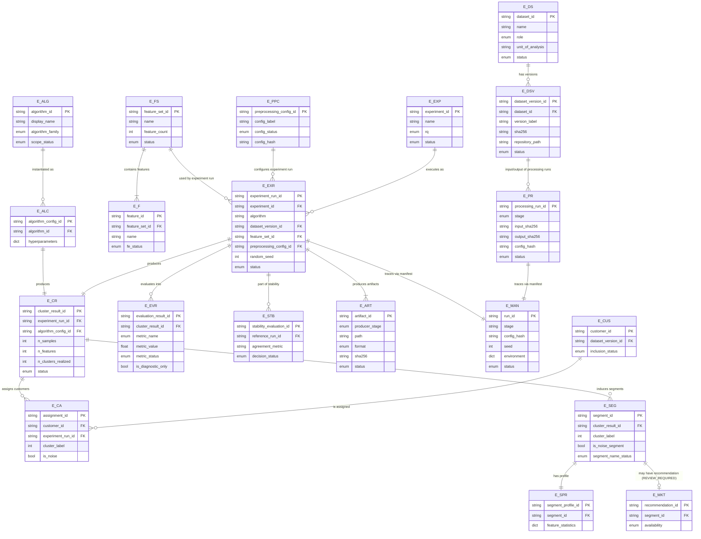
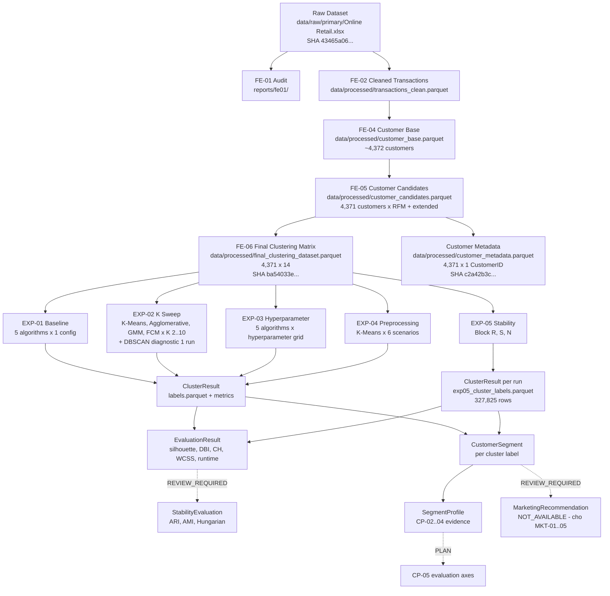
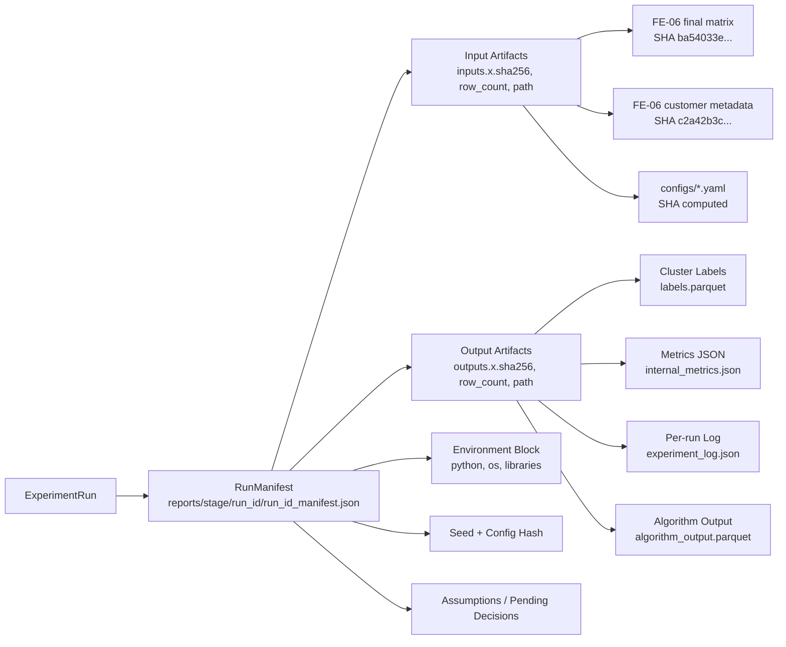

# SYS-03 — Data Model

> **Task ID:** EPIC-11 / SYS-03
> **Ngày:** 2026-10-07
> **Trạng thái:** DRAFT — pending mentor / human researcher review (REVIEW_REQUIRED)
> **Phạm vi:** THIẾT KẾ MÔ HÌNH DỮ LIỆU LOGICAL cho prototype — KHÔNG SQL, KHÔNG
> ORM, KHÔNG migration, KHÔNG database implementation, KHÔNG API DTO, KHÔNG
> frontend state model, KHÔNG thay đổi methodology / RQ / algorithm scope.
> **Ngôn ngữ:** tài liệu bằng tiếng Việt. Code / identifier / file name
> giữ nguyên convention tiếng Anh hiện có của repository.
> **Source of truth cho mọi thuật ngữ methodology:** `AGENTS.md`,
> `docs/methodology/research_questions.md`, `docs/methodology/methodology_overview.md`,
> `docs/decisions/0003-algorithm-scope.md`, `docs/decisions/0004-research-questions.md`,
> `docs/research/review/METHODOLOGY_LOCK_STATUS.md`, `docs/system/SYS-01_requirements.md`,
> `docs/system/SYS-02_architecture.md`.

| Field           | Value                                                 |
| --------------- | -------------------------------------------------------------- |
| Document ID     | SYS-03                                                       |
| Parent         | [SYS-01_requirements.md](./SYS-01_requirements.md), [SYS-02_architecture.md](./SYS-02_architecture.md) |
| Scope          | Logical data model cho offline prototype đã freeze trong SYS-01 + SYS-02 |
| Out of scope   | SYS-04 (ML Processing Pipeline), SYS-05 (API Design), SYS-06 (Prototype UI), SQL/ORM/migration, database setup, marketing framework tự tạo |
| Storage layer   | Filesystem + Parquet + JSON (per SYS-02 §1.14, §6.1, §10.2) |
| Constraint set | SYS-01 §8 (16 CON), SYS-02 §1.2–1.14, METHODOLOGY_LOCK_STATUS §2–§5, ADR-0003, ADR-0004 |

---

## 1. Purpose

SYS-03 thiết kế **mô hình dữ liệu logical** cho Prototype System, đủ để:

1. Mô tả và lưu trữ thông tin nghiên cứu (research artifact) từ
   DS-05 → FE-01 → FE-06 → EPIC-06 → EPIC-07 → EPIC-08 → EPIC-09.
2. Hỗ trợ các chức năng nghiệp vụ đã freeze trong SYS-01 §6
   (Data Management, Experiment Management, Clustering, Evaluation,
   Visualization, Customer Segment / Profiling, Marketing Recommendation,
   Report / Export).
3. Đảm bảo 5 thuộc tính nền tảng:

   - **Reproducibility** — mỗi output truy ngược được input SHA-256,
     config hash, seed, environment block, output SHA-256.
   - **Traceability** — mỗi dataset, feature, run, result, evaluation,
     profile đều có lineage rõ ràng về source.
   - **Provenance** — nguồn gốc file (raw, interim, processed, report)
     được ghi nhận đầy đủ với SHA-256 + nguồn dataset.
   - **Experiment lineage** — mỗi run liên kết được với experiment
     (RQ1/RQ2/RQ3), algorithm, feature set, preprocessing configuration.
   - **Research artifact integrity** — file bất biến có SHA-256, file
     sinh ra có manifest với đủ metadata.

Data Model phục vụ workflow nghiên cứu:

```
Dataset → Validation → Preprocessing → Feature Engineering
       → Clustering → Evaluation → Customer Segment / Profiling
       → Marketing Recommendation (REVIEW_REQUIRED)
       → Visualization / Report
```

đồng thời bám đúng **filesystem + Parquet** đã chốt trong SYS-02 §1.14,
§6.1, §10 (KHÔNG database, KHÔNG ORM, KHÔNG SQL).

## 2. Scope

### 2.1. In Scope

SYS-03 thiết kế ở mức logical:

| Hạng mục | Nội dung |
| --- | --- |
| Logical entities | Dataset, DatasetVersion, ProcessingRun, FeatureSet, PreprocessingConfiguration, Experiment, ExperimentRun, AlgorithmConfiguration, ClusterResult, EvaluationResult, StabilityEvaluation, Customer, ClusterAssignment, CustomerSegment, SegmentProfile, MarketingRecommendation, ArtifactReference, RunManifest |
| Attributes | Tên field, kiểu dữ liệu, ý nghĩa, nguồn gốc, status |
| Relationships | Quan hệ cha-con, cardinality, ràng buộc |
| Identifier | Khóa chính, khóa ngoại, version label |
| Lifecycle / status | Status taxonomy (VALID_VALUE, NOT_APPLICABLE, PENDING_REVIEW, …) |
| Provenance | SHA-256, config hash, seed, environment |
| Constraints | Integrity invariants bắt buộc |
| Artifact references | Path → logical entity, format, SHA-256 |
| Diagrams | Mermaid ER, lineage, provenance |
| Traceability | Mapping từ SYS-01 / SYS-02 → SYS-03 entity |

### 2.2. Out of Scope (explicit)

SYS-03 **KHÔNG** thực hiện:

- SQL DDL / DML.
- ORM model (SQLAlchemy, Tortoise, …).
- Database setup, migration, seed data.
- PostgreSQL / MySQL / SQLite / MongoDB / cloud database.
- API request / response DTO.
- Frontend state model, component prop schema.
- Backend code, repository code modification.
- ML service deployment, packaging, container image.
- Marketing strategy / KPI / segment names tự tạo (chờ MKT-01..05).
- Authentication / Authorization.
- Cloud infrastructure.

Nếu phát hiện dependency với những mục trên → ghi vào §26 Open Questions
hoặc §27 Dependencies, KHÔNG tự ý giải quyết.

## 3. Data Model Principles

### 3.1. Nguyên tắc Research Integrity (AGENTS.md §2.1)

- KHÔNG tự invent data, kết quả, metadata, hay con số thống kê
  của một phase cụ thể.
- KHÔNG tự đổi `WORKING_ASSUMPTION` thành `FINAL_DECISION`.
- Mọi thuộc tính schema có nguồn từ research evidence (FE-0X,
  EXP-0X, EVA-0X, CP-0X, ADR, methodology doc) phải ghi rõ.
- KHÔNG tự thêm algorithm, metric, feature, preprocessing policy,
  ranking, winner, optimal, recommended, final.

### 3.2. Phân biệt Logical Entity và Artifact

- **Logical entity**: định danh nghiệp vụ (Dataset, Experiment,
  ClusterResult, …). KHÔNG quy đổi thành "một bảng duy nhất".
- **Artifact**: file vật lý (parquet, csv, json, md, png, log) trên
  filesystem. Mỗi artifact PHẢI có reference/provenance đến
  logical entity tương ứng.

Ví dụ phân biệt:

| Logical entity          | Artifact đại diện                                |
| ----------------------- | ----------------------------------------------- |
| `DatasetVersion`        | `data/raw/primary/Online Retail.xlsx`           |
| `ProcessingRun` (FE-02) | `data/processed/transactions_clean.parquet`     |
| `ProcessingRun` (FE-04) | `data/processed/customer_base.parquet`          |
| `ProcessingRun` (FE-05) | `data/processed/customer_candidates.parquet`    |
| `ProcessingRun` (FE-06) | `data/processed/final_clustering_dataset.parquet` |
| `Customer` metadata     | `data/processed/customer_metadata.parquet`      |
| `ExperimentRun` (EXP-01)| `reports/exp01/<run_id>/cluster_labels_*.parquet` + `experiment_log_*.json` |
| `ExperimentRun` (EXP-05)| `reports/exp05/exp05_cluster_labels.parquet` + `exp05_manifest.json` |

### 3.3. Phase Isolation (AGENTS.md §2.2)

Data Model mô tả TẤT CẢ các phase đã freeze (DS-05 → FE-06 → EPIC-09)
vì SYS-03 là bản thiết kế, không phải implementation. Tuy nhiên:

- KHÔNG tự thêm field cho phase chưa khởi động (MKT framework).
- KHÔNG tự ý modify schema của phase đã implement (FROZEN STATUS).
- Mọi phần mở rộng phải ghi REVIEW_REQUIRED kèm owner (mentor).

### 3.4. Data Integrity (AGENTS.md §2.3)

Mỗi logical entity có immutable record khi applicable:

- Raw dataset / interim / processed (immutable) → có SHA-256 bắt buộc.
- Run manifest → có input SHA + output SHA + config hash.
- Configuration → có content hash.
- KHÔNG sửa raw dataset để test pass hoặc SHA khớp.

### 3.5. Reproducibility (AGENTS.md §2.7, SYS-02 §9.2)

Mỗi ExperimentRun ghi nhận 5 field bắt buộc:

1. Input SHA-256 (ít nhất: feature matrix, customer metadata).
2. Config hash (YAML config đã dùng).
3. Random seed.
4. Environment block (Python, OS, key library versions).
5. Output SHA-256 (label artifact, manifest, metrics JSON).

Đây là 5-field reproducibility contract đã freeze trong SYS-02 §9.2,
§10.2. SYS-03 chỉ mô tả, KHÔNG sửa.

### 3.6. Status Taxonomy (consolidate từ SYS-01, SYS-02, EVA, EXP)

Giữ nguyên convention hiện có, KHÔNG tạo mới:

| Status | Ngữ nghĩa | Nguồn |
| --- | --- | --- |
| `VALID_VALUE` | Metric / value computed successfully | SYS-01 §2.5, `metrics.py` |
| `NOT_APPLICABLE` | Metric không áp dụng (e.g., single cluster) | `metrics.py` |
| `COMPUTATION_ERROR` | sklearn raised exception | `metrics.py` |
| `MISSING` | Placeholder chưa được populate | `result.py` |
| `SUCCESS` | Experiment run thành công | `result.py` |
| `FAILED` | Experiment run thất bại | `result.py` |
| `WORKING_ASSUMPTION` | Default chưa mentor approve | METHODOLOGY_LOCK_STATUS WA-01..08 |
| `WORKING_DEFAULT` | Cấu hình working mặc định (EXP-01) | CP-01 §3.3 |
| `WORKING_SELECTED` | Cấu hình working chọn từ EXP-03 | METHODOLOGY_LOCK_STATUS WA-02 |
| `TIED_WORKING_SELECTED` | EXP-03 nhiều cấu hình tie | CP-01 §3.3 |
| `ELIGIBLE` | Feature được approve về mặt feature-level | FE-06 §13 |
| `ELIGIBLE_WORKING_ASSUMPTION` | Feature eligible nhưng cần review | FE-06 §13 |
| `REPRODUCIBILITY_VERIFIED` | Cùng seed → cùng labels | EXP-05 config |
| `REPRODUCIBILITY_FAILED` | Cùng seed → khác labels | EXP-05 config |
| `STABILITY_EVIDENCE_GENERATED` | Block S / N đã chạy | EXP-05 config |
| `PERTURBATION_EVIDENCE_GENERATED` | Block N đã chạy | EXP-05 config |
| `SIGMA_ZERO_BASELINE_MATCH` | sigma=0 reproduce EXP-01 | EXP-05 config |
| `SIGMA_ZERO_BASELINE_MISMATCH` | sigma=0 không reproduce EXP-01 | EXP-05 config |
| `PENDING_REVIEW` | Quyết định chưa được resolve | METHODOLOGY_LOCK_STATUS |
| `REVIEW_REQUIRED` | SYS-03 dùng cho protocol/framework chưa lock | SYS-01 §6.7, SYS-02 I-10 |
| `DEFERRED` | Quyết định hoãn sang phase sau | METHODOLOGY_LOCK_STATUS |
| `FUTURE_WORK` | Nghiên cứu ngoài scope hiện tại | RFM_ONLY_FUTURE_WORK_PLAN |
| `NAMED` | Segment đã có tên (CP-04) | CP-04 §4.3 |
| `COMPARATIVE` | Segment so sánh (chưa NAMED) | CP-04 §4.3 |
| `NOT_AVAILABLE` | Segment chưa khả dụng | CP-04 §4.3, CP-01 §3.2 |
| `NOISE` | DBSCAN noise (label = -1) | CP-01 §4.4 |
| `NAMING_PENDING` | Segment có labels nhưng chưa qua CP-04 mapping | CP-05 |

Nếu cần status không có trong bảng trên → ghi REVIEW_REQUIRED, KHÔNG
tự ý tạo status mới.

### 3.7. Methodology Gate (AGENTS.md §2.5, §2.6)

KHÔNG có field nào trong Data Model mang semantics:

- "best", "winner", "optimal", "recommended", "final", "superior".
- Numerical score tổng hợp / weighted ranking.
- Cross-algorithm cluster ID mapping (CP-05 §14 cấm).

Nếu cần dùng "candidate" thì dùng đúng convention:

- `CANDIDATE`
- `RETAIN_CANDIDATE`
- `PENDING_REVIEW`
- `EXCLUDE`
- `ADJUST`
- `UNSUPPORTED`

`RETAIN_CANDIDATE` ≠ `FINAL`.

## 4. Current Research Data Context

### 4.1. Evidence có thật trong repository

Tóm tắt dữ liệu, schema, artifact đã tồn tại (verified bằng cách
đọc trực tiếp file, KHÔNG suy luận):

| # | Stage | Artifact | Status | SHA-256 / Source |
| --- | --- | --- | --- | --- |
| DS-05 | Primary dataset | `data/raw/primary/Online Retail.xlsx` | Verified | `43465a06f2ccf7c8b5bd2892bc7defb52f97487934fe93b16ae4c3936424676d` |
| DS-05 | Backup dataset | `data/raw/backup/online_retail_II.xlsx` | Verified | `bcbe73b35f5b7babf197cb0cb983a11f5d9ff929078d4aa53d171b1f2df2e980` |
| FE-01 | Audit (row/col/dtype) | `reports/fe01/*.csv` | Implemented | n/a (report) |
| FE-02 | Cleaned transactions | `data/processed/transactions_clean.parquet` | Implemented | SHA trong `fe02_run.json` |
| FE-03 | Outlier analysis (diagnostic) | `reports/fe03/*.csv` | Implemented | n/a (diagnostic) |
| FE-04 | Customer base | `data/processed/customer_base.parquet` | Implemented | 4,372 customers pre-dedup |
| FE-05 | Customer candidates (RFM-extended pre-transformation) | `data/processed/customer_candidates.parquet` | Implemented | 4,371 customers × 14 features (post-dedup + RFM + extended) |
| FE-06 | Final clustering matrix | `data/processed/final_clustering_dataset.parquet` | Implemented | `ba54033e45525bf5123c2d9d3684b110676a84e81d4d505bb781a3be10980f9c` (4,371 × 14) |
| FE-06 | Customer metadata (CustomerID only) | `data/processed/customer_metadata.parquet` | Implemented | `c2a42b3c8b035dcf6a5af8e4b6afb6a444099e6ad0e12a271ea59d95c7382ad2` (4,371 × 1) |
| FE-06 | Fitted preprocessing pipeline | `data/processed/fitted_preprocessing_pipeline.pkl` | Implemented | pickle SHA tracked trong metadata |
| EXP-01 | Baseline labels + metrics | `reports/exp01/*.parquet` + `*.json` | Implemented (5 algos, rep4 output) | manifest `d5172c4640d7bc2cbbaa0bc22b9de9353c4e851bbf21dec2e801bf06951abd79` |
| EXP-02 | Cluster-number sweep | `reports/exp02/` | Implemented (37 runs) | per-run log + aggregate |
| EXP-03 | Hyperparameter search | `reports/exp03/` | Implemented (38 runs) | per-run log + aggregate |
| EXP-04 | Preprocessing sensitivity | `reports/exp04/` | Implemented (30 runs, K-Means only, K=4) | per-run log + aggregate |
| EXP-05 | Stability & reproducibility | `reports/exp05/` | Implemented (75 runs, 327,825 labels rows) | `exp05_manifest.json` + `exp05_cluster_labels.parquet` |
| EVA-01..05 | Evaluation evidence | `reports/evaluation/` + `docs/evaluation/EVA-0X.md` | Implemented (EVA-01..04 done, EVA-05 in progress) | n/a (docs + reports) |
| CP-01..04 | Profiling evidence | `reports/profiling/cp0X/` + `docs/evaluation/CP-0X.md` | Implemented | n/a (docs + reports) |
| CP-05 | Profiling plan | `docs/research/EPIC09_CP05_PLAN.md` | PLAN | n/a (plan) |
| MKT-01..05 | Marketing framework | **KHÔNG TỒN TẠI trong repo** (verified bằng grep) | NOT STARTED | n/a |

### 4.2. Feature Set (FE-06 §13, RESEARCH_APPROVED hiện tại)

14 features với status:

| # | Feature | FE-06 Status | Notes |
| --- | --- | --- | --- |
| 1 | Recency | `ELIGIBLE` | Days from last purchase to ReferenceDate |
| 2 | Frequency | `ELIGIBLE_WORKING_ASSUMPTION` | nunique(InvoiceNo) |
| 3 | Monetary | `ELIGIBLE` | Sum of signed LineRevenue |
| 4 | TotalQuantity | `ELIGIBLE` | Sum of signed Quantity |
| 5 | AverageQuantity | `ELIGIBLE_WORKING_ASSUMPTION` | TotalQuantity / Frequency |
| 6 | BasketSize | `ELIGIBLE_WORKING_ASSUMPTION` | Alias for AverageQuantity |
| 7 | TenureDays | `ELIGIBLE` | First-to-last purchase |
| 8 | PurchaseIntervalMean | `ELIGIBLE` | NaN if <2 invoices |
| 9 | PurchaseIntervalStd | `ELIGIBLE` | NaN if <3 invoices |
| 10 | ActiveDays | `ELIGIBLE_WORKING_ASSUMPTION` | nunique(calendar days) |
| 11 | AverageInvoiceValue | `ELIGIBLE` | Monetary / Frequency |
| 12 | ProductsPerInvoice | `ELIGIBLE` | DistinctProducts / DistinctInvoiceCount |
| 13 | CancellationRate | `ELIGIBLE_WORKING_ASSUMPTION` | CancellationInvoiceCount / Frequency |
| 14 | ReturnRate | `ELIGIBLE_WORKING_ASSUMPTION` | ReturnInvoiceCount / Frequency |

### 4.3. Algorithm Scope (ADR-0003, METHODOLOGY_LOCK_STATUS)

5 algorithm entities:

1. `KMeans` — `algorithm_name = "kmeans"`, family = `hard`.
2. `Agglomerative` — `algorithm_name = "agglomerative"`, family = `hard`.
3. `DBSCAN` — `algorithm_name = "dbscan"`, family = `density_based`,
   noise_label = -1.
4. `GMM` — `algorithm_name = "gmm"`, family = `model_based`.
5. `FuzzyCMeans` — `algorithm_name = "fuzzy_cmeans"`, family = `fuzzy`.

`KMedoids` entity **KHÔNG được tạo** (ADR-0003 OUT OF SCOPE).

### 4.4. Experiments (EPIC-07)

| Experiment | Trục | Algorithms | Status |
| --- | --- | --- | --- |
| EXP-01 | Baseline single-config | All 5 | Implemented |
| EXP-02 | K sweep [2..10] | K-Means, Agglomerative, GMM, Fuzzy C-Means (K-sweep) + DBSCAN (diagnostic only, 1 run, NOT in K-sweep) | Implemented (37 runs total: 36 K-sweep + 1 DBSCAN diagnostic) |
| EXP-03 | Hyperparameter grid | All 5 | Implemented |
| EXP-04 | Preprocessing variants (C0..C7) | K-Means, K=4 | Implemented |
| EXP-05 | Block R / S / N | All 5 (S chỉ K-Means + GMM + FCM) | Implemented |

Ghi chú EXP-02: bốn thuật toán có tham số K (K-Means / Agglomerative /
GMM / Fuzzy C-Means) chạy K-sweep 9 giá trị K=2..10; DBSCAN không
tham gia K-sweep mà chỉ ghi nhận 1 diagnostic entry với
`eps=0.5, min_samples=5` (per `EXP02_cluster_number_PLAN.md`
§1.1, §3.3, §5.3, `configs/exp02_cluster_number.yaml`).

### 4.5. Evaluation (EPIC-08)

| Component | Status | Note |
| --- | --- | --- |
| `InternalMetrics` (silhouette, DBI, CH, WCSS) | Implemented | EXP-01 đã populate |
| `Runtime` | Implemented | per algo per repeat |
| `StabilityMetrics` (ARI / AMI / Hungarian) | Implemented as raw labels | EXP-05 evidence; computation in EPIC-08 plan |
| `StatisticalTests` (paired t / Wilcoxon) | Deferred (EPIC-08 plan) | `EPIC08-STAT` |
| `ConfidenceIntervals` (bootstrap / percentile) | Deferred (EPIC-08 plan) | `EPIC08-CI` |
| `Cross-algorithm ranking` | OUT OF SCOPE | AGENTS.md §2.5, EPIC08-CROSS-ALG-01 |

### 4.6. Customer Profiling (EPIC-09)

| Component | Status |
| --- | --- |
| `Segment` (cluster ID per algorithm) | Implemented (CP-01..04) |
| `SegmentProfile` (descriptive stats) | Implemented (CP-02..03) |
| `SegmentName` mapping | CP-04 (NAMED / COMPARATIVE / NOT_AVAILABLE) |
| `DistinguishingFeatures` | Implemented (CP-03) |
| `EvaluationAxes` (6 axes từ CP-05) | PLAN (CP-05 chưa implement) |
| `SegmentSizeBand` (DOMINANT/LARGE/...) | PLAN (CP-05 §8.3) |
| `BusinessRelevance` | PLAN (CP-05 §9) |

### 4.7. Marketing (EPIC-X — NOT STARTED)

| Component | Status |
| --- | --- |
| `MarketingRecommendation` framework | NOT STARTED (MKT-01..05 absent) |
| `MarketingObjective / Strategy / Action / KPI` | NOT STARTED |
| `Segment → Recommendation` mapping | NOT STARTED |

→ `MarketingRecommendation` chỉ thiết kế ở mức shell với
`status = REVIEW_REQUIRED` (xem §15).


## 5. Logical Entities — Overview

Bảng dưới liệt kê 18 logical entity mà Data Model mô tả. Mỗi entity có
mã định danh (`EntityID`), owner phase, mô tả ngắn, và **2 trạng thái
tách biệt**:

- **Cấu trúc lõi (structure)** — schema / contract field list đã
  freeze hay chưa.
- **Giá trị hiện tại (current values)** — giá trị thực tế của các
  field status / configuration còn WORKING / PENDING_REVIEW hay
  đã LOCKED.

Phân biệt rõ hai chiều này để SYS-04/05/06 không đọc nhầm rằng
"structure frozen = toàn bộ entity immutable". Ví dụ E-FS có cấu trúc
lõi (14 features, 6 fields chính) đã freeze, nhưng `status` hiện ở
`WORKING` (6 features còn `ELIGIBLE_WORKING_ASSUMPTION`); đó không
phải đồng nghĩa với việc methodology đã final.

| Structure | Current values | Ngữ nghĩa |
| --- | --- | --- |
| `Frozen` | `LOCKED` | Schema + giá trị đều bất biến (vd. E-DS, E-ALG registry). |
| `Frozen` | `WORKING` | Schema bất biến nhưng giá trị status / config còn pending review (vd. E-FS với 6 features `ELIGIBLE_WORKING_ASSUMPTION`). |
| `Extendable` | `WORKING` | Schema có thể mở rộng (vd. thêm variant preprocessing) nhưng cấu trúc lõi đã freeze (vd. E-PPC với C0..C7). |
| `Extendable` | `REVIEW_REQUIRED` | Schema và protocol đều chưa lock (vd. E-STB với ARI / AMI / Hungarian protocol). |
| `ReviewRequired` | `REVIEW_REQUIRED` | Chưa canonical, cần mentor quyết định (vd. E-MKT khi MKT-01..05 absent). |

| EntityID | Tên entity | Owner phase | Cấu trúc lõi | Current values |
| --- | --- | --- | --- | --- |
| E-DS | Dataset | DS-05 | Frozen | LOCKED |
| E-DSV | DatasetVersion | DS-05 + FE-0X | Frozen | LOCKED |
| E-PR | ProcessingRun | FE-01..FE-06 | Frozen (per run) | LOCKED (per run metadata) |
| E-FS | FeatureSet | FE-04..FE-06 | Frozen (14 features) | WORKING (6 features còn `ELIGIBLE_WORKING_ASSUMPTION`) |
| E-F | Feature | FE-04..FE-06 | Frozen (14 features) | Mixed: 8 `ELIGIBLE` + 6 `ELIGIBLE_WORKING_ASSUMPTION` |
| E-PPC | PreprocessingConfiguration | FE-05..FE-06 | Extendable (C0..C7) | WORKING (C7 chưa mentor approve) |
| E-EXP | Experiment | EPIC-07 | Frozen (5 experiments) | LOCKED cho EXP-01..05 scope; EXP plan status xem field `status` |
| E-EXR | ExperimentRun | EPIC-07 / EPIC-08 | Frozen (per run) | LOCKED per run; stability evidence status thuộc E-STB |
| E-ALG | Algorithm | EPIC-06 | Frozen (5 algorithms) | LOCKED |
| E-ALC | AlgorithmConfiguration | EPIC-06 / EPIC-07 | Frozen (per run params + seed) | LOCKED per run snapshot |
| E-CR | ClusterResult | EPIC-06 / EPIC-07 | Frozen | LOCKED per run |
| E-CA | ClusterAssignment | EPIC-06 / EPIC-07 | Frozen (CustomerID × label) | LOCKED per run |
| E-EVR | EvaluationResult | EPIC-08 / EPIC-07 | Frozen (per metric) | LOCKED per metric; stability/matching protocol chưa lock ở E-STB |
| E-STB | StabilityEvaluation | EPIC-08 | Extendable | REVIEW_REQUIRED (ARI / AMI / Hungarian / statistical test / CI method chưa lock) |
| E-CUS | Customer | FE-04 / EPIC-09 | Frozen | LOCKED |
| E-SEG | CustomerSegment | EPIC-09 | Frozen (CP-01..04) | LOCKED cho CP-01..04; CP-05 evaluation axes còn PLAN |
| E-SPR | SegmentProfile | EPIC-09 | Frozen (CP-02..04) | LOCKED cho CP-02..04; `evaluation_axes` OPTIONAL chờ CP-05 |
| E-MKT | MarketingRecommendation | EPIC-X | ReviewRequired | REVIEW_REQUIRED (MKT-01..05 absent) |
| E-ART | ArtifactReference | All phases | Frozen (manifest pattern) | LOCKED per artifact |
| E-MAN | RunManifest | All phases | Frozen (SYS-02 §10 schema) | LOCKED per manifest |

Quan hệ tổng quan (chi tiết ở §18):

```
E-DS 1 ──── N E-DSV
E-DSV 1 ──── N E-PR
E-FS 1 ──── N E-F
E-PPC 1 ──── N E-EXR
E-EXP 1 ──── N E-EXR
E-EXR 1 ──── N E-CR
E-EXR 1 ──── N E-EVR
E-EXR 1 ──── N E-STB
E-ALG 1 ──── N E-ALC
E-ALC N ──── 1 E-CR
E-CR  1 ──── N E-CA
E-CR  1 ──── N E-SEG
E-SEG 1 ──── 1 E-SPR
E-CUS 1 ──── N E-CA
E-MKT 0..1 ──── 1 E-SEG  (REVIEW_REQUIRED; mỗi segment có tối đa 1 recommendation; mỗi recommendation thuộc đúng 1 segment)
E-EXR 1 ──── N E-ART
E-EXR 1 ──── 1 E-MAN
```

## 6. Dataset & Dataset Version Model

### 6.1. E-DS — Dataset (logical identity)

Định danh nghiệp vụ của dataset. KHÔNG phụ thuộc vào file cụ thể.

| Field | Type | Required | Source | Note |
| --- | --- | --- | --- | --- |
| `dataset_id` | `str` | Yes | derived | Stable identifier, e.g. `UCI_Online_Retail` |
| `name` | `str` | Yes | ADR | Human-readable name |
| `role` | `enum{primary, backup}` | Yes | `configs/dataset.yaml` | DS-05 decision |
| `unit_of_analysis` | `str` | Yes | ADR | e.g. `customer` |
| `description` | `str` | Yes | ADR | Short description |
| `status` | `enum{ACTIVE, DEPRECATED, RETIRED}` | Yes | derived | Lifecycle |
| `notes` | `str` | No | derived | Free text |

### 6.2. E-DSV — DatasetVersion

Một version cụ thể của Dataset. Mỗi version có SHA-256 bất biến.

| Field | Type | Required | Source | Note |
| --- | --- | --- | --- | --- |
| `dataset_version_id` | `str` | Yes | derived | e.g. `UCI_Online_Retail__v1` |
| `dataset_id` | `FK(E-DS)` | Yes | E-DS | Parent |
| `version_label` | `str` | Yes | ADR | e.g. `FE06-v1.0` |
| `dataset_role` | `enum{raw, processed, derived, intermediate}` | Yes | derived | Phân biệt raw dataset (gốc từ provider) vs processed artifact (output của FE-*) vs derived artifact (output của analysis stage) vs intermediate (transient giữa các stage). Required để phân biệt các version có cùng `version_label` lineage khác nhau. |
| `source` | `enum{UCI_MLR, OTHER}` | Yes | `dataset_provenance.md` | Source provider |
| `source_url` | `str` | Yes | verified | UCI URL |
| `license` | `str` | Yes | verified | e.g. `CC BY 4.0` |
| `original_filename` | `str` | Yes | `dataset_provenance.md` | e.g. `Online Retail.xlsx` |
| `repository_path` | `str` | Yes | `configs/dataset.yaml` | e.g. `data/raw/primary/Online Retail.xlsx` |
| `sha256` | `str` | Yes | computed | Hex digest, 64 chars |
| `file_size_bytes` | `int` | Yes | computed | From filesystem |
| `file_format` | `str` | Yes | `file` command | e.g. `Microsoft Excel 2007+` |
| `row_count` | `int` | Conditional | FE-01 | Required if dataset is row-shaped |
| `column_count` | `int` | Conditional | FE-01 | Required if dataset is row-shaped |
| `acquisition_date_utc` | `str` | No | (only if available) | Not invented; null nếu repo chưa có |
| `gitignore_status` | `enum{IGNORED, TRACKED}` | Yes | `git check-ignore` | SYS-02 §9.6 |
| `status` | `enum{VERIFIED, UNVERIFIED, SUPERSEDED}` | Yes | derived | |
| `notes` | `str` | No | derived | Free text |

**Constraint (E-DSV):**
- `sha256` KHÔNG được null khi artifact là immutable research
  artifact (raw / processed).
- `repository_path` phải resolve được từ `configs/dataset.yaml` (NFR-10).
- `dataset_role` phải tương thích với `version_label`:
  - `raw` ↔ version_label dạng `raw_v*` (artifact từ provider).
  - `processed` ↔ version_label dạng `FE0X-v*` (output của FE-0X
    pipeline chuẩn).
  - `derived` ↔ version_label dạng analysis-stage output
    (vd. EXP-NN derived artifact) — KHÔNG dùng cho FE-0X output.
  - `intermediate` ↔ artifact tạm giữa hai stage (vd. pre-dedup).

### 6.3. Evidence trong repository

| dataset_id | version_label | dataset_role | sha256 | repository_path | status |
| --- | --- | --- | --- | --- | --- |
| `UCI_Online_Retail` | `raw_v1` | `raw` | `43465a06...4676d` | `data/raw/primary/Online Retail.xlsx` | VERIFIED |
| `UCI_Online_Retail_II` | `raw_v1` | `raw` | `bcbe73b3...2e980` | `data/raw/backup/online_retail_II.xlsx` | VERIFIED |
| `UCI_Online_Retail` | `FE06-v1.0` | `processed` | `ba54033e...80f9c` | `data/processed/final_clustering_dataset.parquet` | VERIFIED |
| `UCI_Online_Retail` | `FE06-v1.0` | `processed` | `c2a42b3c...c7382ad2` | `data/processed/customer_metadata.parquet` | VERIFIED |

(Backup dataset không sử dụng trong 185 runs hiện tại; chỉ để dự phòng
theo ADR-0002.)

## 7. Processing & Feature Model

### 7.1. E-PR — ProcessingRun

Một lần chạy cụ thể của một stage xử lý dữ liệu (FE-01..FE-06). Mỗi
stage có nhiều ProcessingRun qua các lần re-execute, nhưng hiện tại
mỗi stage chỉ có 1 canonical run (FE-06 v1.0).

| Field | Type | Required | Source | Note |
| --- | --- | --- | --- | --- |
| `processing_run_id` | `str` | Yes | derived | e.g. `FE06_v1` |
| `stage` | `enum{FE01, FE02, FE03, FE04, FE05, FE06, OTHER}` | Yes | `reports/fe0X/fe0X_run.json` | |
| `input_dataset_version_id` | `FK(E-DSV)` | Yes | E-DSV | Input bất biến |
| `input_sha256` | `str` | Yes | computed | SHA input artifact |
| `output_dataset_version_id` | `FK(E-DSV)` | Yes | E-DSV | Output bất biến |
| `output_sha256` | `str` | Yes | computed | SHA output artifact |
| `output_artifact_paths` | `list[str]` | Yes | run manifest | Repository-relative paths |
| `config_path` | `str` | Yes | `configs/` | Path to YAML config |
| `config_hash` | `str` | Yes | computed | SHA of config file |
| `random_seed` | `int \| null` | No | config | null nếu pipeline deterministic |
| `environment_block` | `dict` | Yes | runtime | Python, OS, key libraries |
| `pipeline_objective` | `str` | Yes | config | e.g. "median impute + Yeo-Johnson + RobustScaler" |
| `rows_in` | `int` | Yes | computed | Input row count |
| `rows_out` | `int` | Yes | computed | Output row count |
| `columns_in` | `int` | Yes | computed | |
| `columns_out` | `int` | Yes | computed | |
| `dropped_rows_summary` | `dict` | No | report | Per-rule dropped row count |
| `imputation_summary` | `dict` | No | report | Per-feature imputation count |
| `outlier_summary` | `dict` | No | report | FE-03 diagnostic |
| `status` | `enum{SUCCESS, FAILED, PARTIAL}` | Yes | derived | |
| `timestamp_utc` | `str` | Yes | runtime | ISO-8601 |
| `assumptions` | `list[str]` | Yes | report | |
| `pending_review_notes` | `list[str]` | Yes | report | |
| `scope_boundaries` | `list[str]` | Yes | report | |

### 7.2. E-FS — FeatureSet

Một bộ features đầy đủ cho clustering. Hiện tại chỉ có 1 working
FeatureSet: `rfm_extended_v1` (14 features).

| Field | Type | Required | Source | Note |
| --- | --- | --- | --- | --- |
| `feature_set_id` | `str` | Yes | derived | e.g. `rfm_extended_v1` |
| `name` | `str` | Yes | derived | e.g. `RFM Extended` |
| `version` | `str` | Yes | FE-06 | e.g. `v1` |
| `feature_count` | `int` | Yes | computed | 14 |
| `feature_ids` | `list[FK(E-F)]` | Yes | E-F | Ordered list |
| `status` | `enum{CANDIDATE, WORKING, FUTURE, EXCLUDED, REVIEW_REQUIRED}` | Yes | FE-06 | `FINAL` deliberately excluded — see §3.1; promotion to research-approved is governed by mentor decision (AGENTS.md §2.10) and NOT modeled as a value in this enum |
| `source_stage` | `enum{FE04, FE05, FE06}` | Yes | FE-06 | |
| `notes` | `str` | No | derived | |

**Constraint (E-FS):**
- `feature_count` phải bằng `len(feature_ids)`.
- `FINAL` không nằm trong enum `status`; AGENTS.md §2.5 cấm ngữ
  nghĩa "final" tự động, AGENTS.md §2.10 quy định promotion thuộc
  thẩm quyền mentor / human researcher. Trạng thái "đã được mentor
  approve" nên được phản ánh bằng giá trị review status riêng ở
  metadata cấp feature-level (`E-F.fe_status = ELIGIBLE` vs
  `ELIGIBLE_WORKING_ASSUMPTION`) chứ không phải bằng `FINAL`.
- Hiện tại `rfm_extended_v1` ở `status = WORKING` (do 6 features
  còn `ELIGIBLE_WORKING_ASSUMPTION`).

### 7.3. E-F — Feature

Một feature cụ thể trong FeatureSet.

| Field | Type | Required | Source | Note |
| --- | --- | --- | --- | --- |
| `feature_id` | `str` | Yes | derived | e.g. `feature__Recency` |
| `feature_set_id` | `FK(E-FS)` | Yes | E-FS | Parent |
| `name` | `str` | Yes | FE-06 | e.g. `Recency` |
| `column_index` | `int` | Yes | matrix | 0-based position |
| `dtype` | `enum{float64, int64}` | Yes | parquet schema | |
| `unit` | `str` | No | data dictionary | e.g. `days`, `GBP`, `count` |
| `business_meaning` | `str` | Yes | data dictionary | |
| `derivation` | `str` | Yes | FE-05 | How feature is computed |
| `missing_policy` | `str` | Yes | FE-06 | e.g. `median_impute`, `none` |
| `transformation_policy` | `str` | Yes | FE-06 | e.g. `yeo_johnson`, `none` |
| `scaling_policy` | `str` | Yes | FE-06 | e.g. `robust`, `none` |
| `fe_status` | `enum{ELIGIBLE, ELIGIBLE_WORKING_ASSUMPTION, EXCLUDED, PENDING_REVIEW}` | Yes | FE-06 | |
| `notes` | `str` | No | derived | |

### 7.4. E-PPC — PreprocessingConfiguration

Cấu hình preprocessing cho từng lần chạy. Một ProcessingRun có đúng
1 PreprocessingConfiguration; một ExperimentRun tham chiếu đến
PreprocessingConfiguration.

| Field | Type | Required | Source | Note |
| --- | --- | --- | --- | --- |
| `preprocessing_config_id` | `str` | Yes | derived | e.g. `ppc__FE06_C7` |
| `transformation` | `enum{none, log1p, yeo_johnson}` | Yes | `configs/transformation.yaml` | |
| `scaling` | `enum{none, standard, minmax, robust}` | Yes | `configs/transformation.yaml` | |
| `imputation_method` | `enum{median, mean, none}` | Yes | `configs/transformation.yaml` | |
| `imputation_features` | `list[str]` | Yes | config | Features imputed |
| `applied_features` | `list[str]` | Yes | config | Features transformed + scaled |
| `is_full_matrix` | `bool` | Yes | config | EXP-04 log1p NOT full-matrix |
| `config_label` | `str` | Yes | config | e.g. `C7` (FE-06 matrix) |
| `config_status` | `enum{WORKING_ASSUMPTION, MENTOR_REVIEW_PENDING, LOCKED}` | Yes | FE-06 | C7 = WORKING_ASSUMPTION |
| `config_path` | `str` | Yes | `configs/` | e.g. `configs/transformation.yaml` |
| `config_hash` | `str` | Yes | computed | SHA of YAML |
| `notes` | `str` | No | derived | |

**Constraint (E-PPC):**
- `config_label = "C7"` có `config_status = WORKING_ASSUMPTION`
  theo FE-06. KHÔNG được tự ý promote thành `LOCKED` (AGENTS.md §2.10).
- `applied_features` phải match FeatureSet nếu `is_full_matrix = true`.

## 8. Experiment Model

### 8.1. E-EXP — Experiment (logical research experiment)

Định danh nghiên cứu, không phụ thuộc vào lần chạy cụ thể.

| Field | Type | Required | Source | Note |
| --- | --- | --- | --- | --- |
| `experiment_id` | `str` | Yes | ADR / plan | e.g. `EXP-01` |
| `name` | `str` | Yes | plan | e.g. `EXP-01 Baseline` |
| `rq` | `enum{RQ1, RQ2, RQ3, MULTI}` | Yes | ADR-0004 | Mapping per methodology |
| `description` | `str` | Yes | plan | |
| `loop_axis` | `enum{fixed, k_sweep, hyperparameter_grid, preprocessing_variants, seeds_perturbations}` | Yes | plan | |
| `algorithm_coverage` | `list[str]` | Yes | plan | Subset of 5 algorithms |
| `k_treatment` | `str` | Yes | plan | e.g. `K=4 fixed`, `K ∈ [2, 10]` |
| `feature_set_id` | `FK(E-FS)` | Yes | E-FS | |
| `preprocessing_config_ids` | `list[FK(E-PPC)]` | Yes | plan | EXP-04 có nhiều |
| `metrics_collected` | `list[str]` | Yes | plan | silhouette, DBI, CH, WCSS, runtime, ARI/AMI |
| `status` | `enum{LOCKED, IMPLEMENTED, IN_PROGRESS, PLANNED, DEFERRED}` | Yes | methodology | |
| `plan_path` | `str` | Yes | `docs/research/` | e.g. `EXP01_baseline_experiment_PLAN.md` |
| `notes` | `str` | No | derived | |

### 8.2. E-EXR — ExperimentRun

Một lần chạy cụ thể của một experiment với một configuration cụ thể.

| Field | Type | Required | Source | Note |
| --- | --- | --- | --- | --- |
| `experiment_run_id` | `str` | Yes | runtime | e.g. `EXP05-S-kmeans-seed42-r00` |
| `experiment_id` | `FK(E-EXP)` | Yes | E-EXP | |
| `algorithm` | `FK(E-ALG)` | Yes | E-ALG | K-Means / Agglo / DBSCAN / GMM / FCM |
| `feature_set_id` | `FK(E-FS)` | Yes | E-FS | Hiện chỉ `rfm_extended_v1` |
| `preprocessing_config_id` | `FK(E-PPC)` | Yes | E-PPC | C7 cho baseline |
| `hyperparameters` | `dict` | Yes | `clustering.yaml` + per-EXP config | Snapshot at fit time |
| `random_seed` | `int \| null` | Yes | config | null nếu deterministic |
| `random_seed_used` | `int \| null` | No | runtime | Sau per-algorithm override |
| `supports_random_state` | `bool` | Yes | adapter | Agglo / DBSCAN = False |
| `dataset_version_id` | `FK(E-DSV)` | Yes | E-DSV | FE06-v1.0 |
| `input_sha256` | `str` | Yes | computed | |
| `config_hash` | `str` | Yes | computed | |
| `output_artifacts` | `list[FK(E-ART)]` | Yes | E-ART | labels, metrics, log, etc. |
| `manifest_id` | `FK(E-MAN)` | Yes | E-MAN | Run manifest |
| `status` | `enum{QUEUED, RUNNING, SUCCESS, FAILED, REPRODUCIBILITY_VERIFIED, REPRODUCIBILITY_FAILED, STABILITY_EVIDENCE_GENERATED, PERTURBATION_EVIDENCE_GENERATED, SIGMA_ZERO_BASELINE_MATCH, SIGMA_ZERO_BASELINE_MISMATCH}` | Yes | runtime | |
| `n_samples` | `int` | Yes | runtime | 4,371 |
| `n_features` | `int` | Yes | runtime | 14 |
| `execution_time_seconds` | `float` | Yes | runtime | Algorithm only |
| `timestamp_utc` | `str` | Yes | runtime | ISO-8601 |
| `environment` | `dict` | Yes | runtime | Python, OS, libraries |
| `assumptions` | `list[str]` | Yes | report | |
| `pending_review_notes` | `list[str]` | Yes | report | |
| `error` | `dict \| null` | Conditional | runtime | Populated if FAILED |

**Constraint (E-EXR):**
- KHÔNG có field "winner" / "best" / "optimal" / "recommended" / "final".
- 5-field reproducibility contract (SYS-02 §9.2):
  `(input_sha256, config_hash, random_seed, environment, output_sha256)`.
- `algorithm` phải thuộc `AlgorithmRegistry.list_registered()`
  (5 names; K-Medoids rejected).

### 8.3. Experiment-specific fields (per stage)

Một số EXP có field bổ sung (tất cả OPTIONAL ngoại trừ khi áp dụng):

| Field | Áp dụng cho | Note |
| --- | --- | --- |
| `repeat_index` | EXP-01 / EXP-05 | 0..n_repeat-1 |
| `block` | EXP-05 | `R` / `S` / `N` |
| `sigma` | EXP-05 Block N | sigma × column std |
| `perturbation_seed` | EXP-05 Block N | In-memory seed |
| `labels_hash` | EXP-05 | SHA-256 of cluster labels (Block R reproducibility) |
| `n_clusters_realized` | All | May differ from requested (DBSCAN) |
| `noise_count`, `noise_ratio` | DBSCAN-only | null nếu không phải DBSCAN |


## 9. Algorithm Configuration Model

### 9.1. E-ALG — Algorithm (logical identity)

Định danh của 5 algorithm đã freeze. KHÔNG thêm algorithm mới.

| Field | Type | Required | Source | Note |
| --- | --- | --- | --- | --- |
| `algorithm_id` | `str` | Yes | ADR-0003 | `kmeans`, `agglomerative`, `dbscan`, `gmm`, `fuzzy_cmeans` |
| `display_name` | `str` | Yes | ADR-0003 | e.g. `K-Means` |
| `algorithm_family` | `enum{hard, density_based, model_based, fuzzy}` | Yes | `result.py` | |
| `source_module` | `str` | Yes | `src/customer_segmentation/clustering/` | e.g. `clustering/kmeans.py` |
| `source_class` | `str` | Yes | module | e.g. `KMeansAdapter` |
| `sklearn_or_custom` | `enum{sklearn, custom}` | Yes | source | FCM = custom |
| `supports_random_state` | `bool` | Yes | `base.py` | Agglo / DBSCAN = False |
| `defines_noise_label` | `bool` | Yes | spec | DBSCAN = True; others = False |
| `noise_label` | `int` | Conditional | spec | -1 (DBSCAN only) |
| `defines_soft_probabilities` | `bool` | Yes | spec | GMM = True |
| `defines_soft_membership` | `bool` | Yes | spec | FCM = True |
| `defines_wcss_native` | `bool` | Yes | spec | K-Means = True; others = False |
| `registered_in_registry` | `bool` | Yes | `registry.py` | |
| `scope_status` | `enum{LOCKED, OUT_OF_SCOPE}` | Yes | ADR-0003 | K-Medoids = OUT_OF_SCOPE |

### 9.2. E-ALC — AlgorithmConfiguration

Một snapshot cụ thể của algorithm + hyperparameters + seed cho một run.

| Field | Type | Required | Source | Note |
| --- | --- | --- | --- | --- |
| `algorithm_config_id` | `str` | Yes | derived | |
| `algorithm_id` | `FK(E-ALG)` | Yes | E-ALG | |
| `hyperparameters` | `dict` | Yes | config + adapter.get_params() | |
| `random_seed` | `int \| null` | No | config | |
| `config_path` | `str` | Yes | `configs/` | |
| `config_hash` | `str` | Yes | computed | |
| `n_clusters_requested` | `int \| null` | No | hyperparameters | K-Means / Agglo / FCM |
| `n_components_requested` | `int \| null` | No | hyperparameters | GMM |
| `eps_requested` | `float \| null` | No | hyperparameters | DBSCAN |
| `min_samples_requested` | `int \| null` | No | hyperparameters | DBSCAN |
| `linkage` | `str \| null` | No | hyperparameters | Agglo |
| `covariance_type` | `str \| null` | No | hyperparameters | GMM |
| `fuzziness_m` | `float \| null` | No | hyperparameters | FCM |
| `notes` | `str` | No | derived | |

**Constraint (E-ALC):**
- KHÔNG có field "winner" / "ranking" / "score".
- Các algorithm-specific parameter (eps, linkage, m, …) chỉ populate
  khi áp dụng cho algorithm tương ứng (validation rule).

## 10. Cluster Result Model

### 10.1. E-CR — ClusterResult

Output của một lần fit một algorithm trên một feature matrix. Map
gần 1-1 với `ClusterResult` dataclass trong
`src/customer_segmentation/clustering/result.py`.

| Field | Type | Required | Source | Note |
| --- | --- | --- | --- | --- |
| `cluster_result_id` | `str` | Yes | derived | e.g. `cr__EXP01-kmeans_rep4` |
| `experiment_run_id` | `FK(E-EXR)` | Yes | E-EXR | |
| `algorithm_config_id` | `FK(E-ALC)` | Yes | E-ALC | |
| `algorithm_id` | `FK(E-ALG)` | Yes | E-ALG | |
| `algorithm_version` | `str` | Yes | adapter | e.g. `sklearn_1.9.1`, `custom_v1` |
| `n_samples` | `int` | Yes | runtime | 4,371 |
| `n_features` | `int` | Yes | runtime | 14 |
| `n_clusters_realized` | `int` | Yes | runtime | May differ from requested (DBSCAN) |
| `cluster_labels_artifact` | `FK(E-ART)` | Yes | E-ART | Path to labels parquet |
| `labels_hash` | `str` | Conditional | SHA-256 of labels array | Required for EXP-05 reproducibility |
| `soft_probabilities_artifact` | `FK(E-ART) \| null` | Conditional | E-ART | GMM only |
| `soft_membership_artifact` | `FK(E-ART) \| null` | Conditional | E-ART | FCM only |
| `noise_label` | `int` | Yes | spec | -1 |
| `noise_count` | `int \| null` | No | runtime | DBSCAN only |
| `noise_ratio` | `float \| null` | No | runtime | DBSCAN only |
| `cluster_sizes` | `dict[int, int]` | No | runtime | e.g. `{0: 555, 1: 3021, 2: 571, 3: 224}` |
| `model_artifact_path` | `str \| null` | No | runner | null nếu không persist |
| `extra` | `dict` | No | adapter | n_iter, inertia, J_m, etc. |
| `status` | `enum{SUCCESS, FAILED}` | Yes | runtime | |
| `error` | `dict \| null` | Conditional | runtime | Populated if FAILED |

### 10.2. DBSCAN-specific modeling

DBSCAN KHÔNG tham số `n_clusters`; số cluster là output, không phải
input. Data Model phải phân biệt rõ:

- `n_clusters_requested` không tồn tại cho DBSCAN.
- `n_clusters_realized` = 17 (4,371 mẫu, 17 cluster + noise, LIM-07).
- `noise_label = -1` (sklearn convention, `configurations/clustering.yaml`).
- `noise_count = 3177` (72.68% tại baseline, EXP-01 evidence).
- `noise_ratio = 0.7268359643102265` (baseline).

DBSCAN noise **KHÔNG** được coi là CustomerSegment (CP-01 §4.4,
SYS-01 CON-08). Data Model đảm bảo rằng DBSCAN cluster với label = -1
KHÔNG xuất hiện trong bất kỳ SegmentProfile nào (xem §13).

### 10.3. E-CA — ClusterAssignment

Một customer thuộc cluster nào trong một ExperimentRun cụ thể.

| Field | Type | Required | Source | Note |
| --- | --- | --- | --- | --- |
| `assignment_id` | `str` | Yes | derived | e.g. `ca__C12346__EXP01-kmeans` |
| `customer_id` | `FK(E-CUS)` | Yes | customer_metadata | |
| `experiment_run_id` | `FK(E-EXR)` | Yes | E-EXR | |
| `cluster_result_id` | `FK(E-CR)` | Yes | E-CR | |
| `cluster_label` | `int` | Yes | labels array | -1 nếu noise (DBSCAN only) |
| `is_noise` | `bool` | Yes | derived | `cluster_label == noise_label` |

**Constraint (E-CA):**
- KHÔNG duplicate customer feature data tại assignment level.
  Customer features reference qua FK(E-CUS) (xem §12).
- Một customer có đúng 1 cluster label per ExperimentRun.
- `is_noise = true` chỉ hợp lệ cho DBSCAN runs.

## 11. Evaluation Result Model

### 11.1. E-EVR — EvaluationResult

Một metric cụ thể cho một ClusterResult. Map gần 1-1 với
`MetricsResult` trong `src/customer_segmentation/clustering/result.py`.

| Field | Type | Required | Source | Note |
| --- | --- | --- | --- | --- |
| `evaluation_result_id` | `str` | Yes | derived | |
| `cluster_result_id` | `FK(E-CR)` | Yes | E-CR | |
| `experiment_run_id` | `FK(E-EXR)` | Yes | E-EXR | |
| `metric_name` | `enum{silhouette, davies_bouldin, calinski_harabasz, wcss, runtime_seconds, …}` | Yes | `metrics.py` | |
| `metric_value` | `float \| null` | Yes | computed | null nếu NOT_APPLICABLE |
| `metric_unit` | `str` | No | spec | seconds, score, ratio |
| `metric_status` | `enum{VALID_VALUE, NOT_APPLICABLE, COMPUTATION_ERROR, MISSING}` | Yes | `metrics.py` | |
| `metric_reason` | `str \| null` | No | `metrics.py` | e.g. `ALL_NOISE`, `SINGLE_CLUSTER` |
| `is_diagnostic_only` | `bool` | No | methodology | `True` cho WCSS |
| `higher_is_better` | `bool \| null` | No | spec | `True` silhouette, `False` DBI, `True` CH, `False` WCSS |
| `computed_at_utc` | `str` | Yes | runtime | |
| `notes` | `str` | No | derived | |

**Constraint (E-EVR):**
- KHÔNG có field "composite_score", "overall_algorithm_score", "winner",
  "best", "recommended", "optimal", "final".
- `metric_status = NOT_APPLICABLE` thì `metric_value` PHẢI là `null`
  (KHÔNG dùng giá trị giả như 0 hoặc -1).
- WCSS có `is_diagnostic_only = true` (METHODOLOGY_LOCK_STATUS WA-07,
  CON-05).
- DBSCAN silhouette: noise excluded (CON-15).

### 11.2. Metric applicability rules

| Edge case | Reason | Status |
| --- | --- | --- |
| All labels = noise | `ALL_NOISE` | NOT_APPLICABLE cho mọi metric |
| Single cluster (k=1) | `SINGLE_CLUSTER` | NOT_APPLICABLE cho silhouette / DBI / CH |
| Fewer than 2 clusters | `INSUFFICIENT_CLUSTERS` | NOT_APPLICABLE |
| sklearn raised exception | exception class name + message | COMPUTATION_ERROR |
| Metric not yet populated | n/a | MISSING |

## 12. Stability Evaluation Model

### 12.1. E-STB — StabilityEvaluation

Mô tả kết quả stability cho một reference run vs comparison runs.
Protocol (ARI / AMI / Hungarian / permutation test) CHƯA locked
tại SYS-02 / SYS-03 (xem SYS-02 §4.10, §18 I-10,
METHODOLOGY_LOCK_STATUS §4 EPIC08-ARI/STAT/CI/RUNTIME).

| Field | Type | Required | Source | Note |
| --- | --- | --- | --- | --- |
| `stability_evaluation_id` | `str` | Yes | derived | |
| `reference_run_id` | `FK(E-EXR)` | Yes | E-EXR | Reference run (Block R / S / N baseline) |
| `comparison_run_ids` | `list[FK(E-EXR)]` | Yes | E-EXR | Comparison runs |
| `algorithm_id` | `FK(E-ALG)` | Yes | E-ALG | |
| `agreement_metric` | `str \| REVIEW_REQUIRED` | Yes | EPIC-08 plan | Field tên chưa lock |
| `agreement_metric_value` | `float \| null` | Yes | computed | |
| `perturbation_condition` | `enum{seed_sweep, gaussian_noise, none}` | Yes | config | |
| `perturbation_params` | `dict` | No | config | seeds, sigma, … |
| `matching_protocol` | `str \| REVIEW_REQUIRED` | Yes | EPIC-08 plan | e.g. `Hungarian`, `permutation_test` |
| `protocol_metadata` | `dict` | No | EPIC-08 plan | bootstrap_size, statistic, … |
| `statistical_test` | `str \| REVIEW_REQUIRED` | No | EPIC-08 plan | `paired_t`, `wilcoxon` |
| `confidence_interval_method` | `str \| REVIEW_REQUIRED` | No | EPIC-08 plan | `bootstrap`, `percentile` |
| `p_value` | `float \| null` | Conditional | computed | |
| `ci_lower` | `float \| null` | Conditional | computed | |
| `ci_upper` | `float \| null` | Conditional | computed | |
| `decision_status` | `enum{REPRODUCIBILITY_VERIFIED, REPRODUCIBILITY_FAILED, STABILITY_EVIDENCE_GENERATED, PERTURBATION_EVIDENCE_GENERATED, SIGMA_ZERO_BASELINE_MATCH, SIGMA_ZERO_BASELINE_MISMATCH, PENDING_REVIEW}` | Yes | EXP-05 config | |
| `computed_at_utc` | `str` | Yes | runtime | |
| `notes` | `str` | No | derived | |

**Constraint (E-STB):**
- `agreement_metric`, `matching_protocol`, `statistical_test`,
  `confidence_interval_method` đánh dấu `REVIEW_REQUIRED` nếu
  chưa được EPIC-08 plan lock (xem SYS-02 §18 I-10,
  METHODOLOGY_LOCK_STATUS §4 EPIC08-ARI/STAT/CI/RUNTIME).
- KHÔNG có field "best_stable_algorithm" / "winner_stability".
- KHÔNG có cross-algorithm stability ranking
  (EPIC08-CROSS-ALG-01 mentor decision).

### 12.2. Mapping tới EXP-05 evidence

`exp05_cluster_labels.parquet` (327,825 rows × 9 columns) chứa raw
labels cho Block R / S / N. E-STB chỉ là logical view trên các
labels rows này. Protocol chưa lock → chưa có E-STB instance
TECHNICALLY_IMPLEMENTED.


## 13. Customer & Cluster Assignment Model

### 13.1. E-CUS — Customer

Một customer ở mức metadata. Tách biệt khỏi feature data để tránh
identifier leakage vào feature matrix.

| Field | Type | Required | Source | Note |
| --- | --- | --- | --- | --- |
| `customer_id` | `int \| float` | Yes | `customer_metadata.parquet` | 4,371 unique |
| `dataset_version_id` | `FK(E-DSV)` | Yes | E-DSV | FE06-v1.0 |
| `source_dataset_version_id` | `FK(E-DSV)` | Yes | E-DSV | FE02/04 source |
| `country` | `str` | No | raw | Optional geographic |
| `inclusion_status` | `enum{INCLUDED, EXCLUDED_IN_FAST, EXCLUDED_IN_CLEANING, EXCLUDED_IN_OUTLIER, EXCLUDED_IN_AGGREGATION, EXCLUDED_IN_DEDUPLICATION}` | Yes | FE-0X | Audit chain |
| `first_seen_utc` | `datetime` | No | FE-04 | First purchase |
| `last_seen_utc` | `datetime` | No | FE-04 | Last purchase |

**Constraint (E-CUS):**
- `customer_id` KHÔNG ĐƯỢC xuất hiện trong bất kỳ feature matrix nào
  (`final_clustering_dataset.parquet`). Identifier chỉ ở
  `customer_metadata.parquet` (FE-06 A6).
- Một customer có thể có nhiều `ClusterAssignment` (mỗi cái cho
  một ExperimentRun) nhưng chỉ một `inclusion_status` tại một
  dataset version.

### 13.2. Customer Feature Data

KHÔNG phải logical entity riêng; tham chiếu qua:

- `E-DSV` (final clustering dataset) — chứa feature matrix
  (4,371 × 14) với row order giữ position-1-1 với customer_metadata.
- Alignment convention: `verified_by_position_and_unique_key`
  (FE-06 A6).

Khi truy vấn customer features cho một run cụ thể:

```
dataset_version_id = "FE06-v1.0"
→  file: data/processed/final_clustering_dataset.parquet
→  shape: 4,371 × 14
→  CustomerID lookup: data/processed/customer_metadata.parquet
```

## 14. Segment & Profiling Model

### 14.1. E-SEG — CustomerSegment

Một segment = một cluster label từ một ClusterResult. KHÔNG tự đặt
tên; tên đến từ CP-04 evidence (SYS-01 §2.10, AGENTS.md §3 Profiling).

| Field | Type | Required | Source | Note |
| --- | --- | --- | --- | --- |
| `segment_id` | `str` | Yes | derived | e.g. `seg__EXP01-kmeans__c0` |
| `cluster_result_id` | `FK(E-CR)` | Yes | E-CR | |
| `cluster_label` | `int` | Yes | labels array | |
| `analysis_unit_id` | `str` | Yes | CP-01 §3.2 | e.g. `EXP-01-default` |
| `algorithm_id` | `FK(E-ALG)` | Yes | E-ALG | |
| `configuration_status` | `enum{WORKING_DEFAULT, WORKING_SELECTED, TIED_WORKING_SELECTED, NOT_AVAILABLE}` | Yes | CP-01 §3.3 | |
| `n_customers_assigned` | `int` | Yes | derived | n in cluster |
| `pct_of_assigned` | `float` | Yes | derived | n / n_assigned |
| `pct_of_total` | `float` | Yes | derived | n / n_total |
| `is_noise_segment` | `bool` | Yes | derived | `cluster_label == -1` (DBSCAN only) |
| `segment_name` | `str \| null` | Conditional | CP-04 | null nếu NAMING_PENDING / NOT_AVAILABLE |
| `segment_name_status` | `enum{NAMED, COMPARATIVE, NOT_AVAILABLE, NOISE, NAMING_PENDING}` | Yes | CP-04 §4.3 | |
| `size_band` | `enum{DOMINANT, LARGE, MEDIUM, SMALL, VERY_SMALL} \| null` | No | CP-05 §8.3 | PLAN |
| `size_band_status` | `enum{WORKING_ANALYTICAL_SIZE_BAND, LOCKED}` | No | CP-05 §8.3 | |
| `notes` | `str` | No | derived | |

**Constraint (E-SEG):**
- `is_noise_segment = true` thì `segment_name` PHẢI null
  (SYS-01 CON-08, CP-01 §4.4).
- `segment_name` KHÔNG được hard-code "Champions" / "Loyal" /
  "VIP" / "at-risk" trong Data Model (AGENTS.md §3 Profiling).
- KHÔNG có field "priority_band" / "best_segment" / "target_segment"
  (SYS-01 FR-SEG-11, CON-08).
- KHÔNG có cross-algorithm segment mapping (SYS-01 CON-09, CP-05 §14).

### 14.2. E-SPR — SegmentProfile

Descriptive statistics cho một segment. KHÔNG mang semantics business.

| Field | Type | Required | Source | Note |
| --- | --- | --- | --- | --- |
| `segment_profile_id` | `str` | Yes | derived | |
| `segment_id` | `FK(E-SEG)` | Yes | E-SEG | 1:1 với segment |
| `feature_set_id` | `FK(E-FS)` | Yes | E-FS | |
| `feature_statistics` | `dict[str, dict]` | Yes | CP-02 | per feature: {count, mean, median, std, min, max, q25, q50, q75} |
| `distinguishing_features` | `list[str]` | No | CP-03 | Top features |
| `evaluation_axes` | `dict[str, dict]` | No | CP-05 | 6 axes: distinctiveness, interpretability, consistency, size, stability, business_relevance |
| `evaluation_axes_status` | `enum{WORKING_ANALYTICAL_EVALUATION_AXIS, LOCKED}` | No | CP-05 | |
| `computed_at_utc` | `str` | Yes | runtime | |
| `assumptions` | `list[str]` | No | report | |
| `pending_review_notes` | `list[str]` | No | report | |
| `notes` | `str` | No | derived | |

**Constraint (E-SPR):**
- `evaluation_axes` là OPTIONAL, chỉ populate khi CP-05 implemented.
- KHÔNG có "business_recommendation" / "action_priority" trong
  SegmentProfile (CP-05 §11.5 cấm "best segment" claim).

## 15. Marketing Compatibility Model

### 15.1. E-MKT — MarketingRecommendation (REVIEW_REQUIRED)

> **Trạng thái:** REVIEW_REQUIRED — KHÔNG xây dựng trong SYS-03.
> Lý do: MKT-01..MKT-05 chưa tồn tại trong repository (verified bằng
> grep, SYS-01 §2.8). Chỉ định nghĩa schema shell với
> `availability = NOT_AVAILABLE` cho đến khi MKT framework tồn tại.

| Field | Type | Required | Source | Note |
| --- | --- | --- | --- | --- |
| `recommendation_id` | `str` | Yes (when applicable) | derived | |
| `segment_id` | `FK(E-SEG)` | Yes | E-SEG | 1:1 với segment; **UNIQUE** trên `segment_id` để enforce 1 segment chỉ có tối đa 1 recommendation (xem §18.1) |
| `availability` | `enum{AVAILABLE, NOT_AVAILABLE, REVIEW_REQUIRED}` | Yes | SYS-01 §2.8 | Currently NOT_AVAILABLE |
| `marketing_objective` | `str \| null` | Conditional | MKT-01..05 (future) | null nếu NOT_AVAILABLE |
| `strategy` | `str \| null` | Conditional | MKT framework | |
| `recommended_action` | `str \| null` | Conditional | MKT framework | |
| `kpi` | `list[str] \| null` | Conditional | MKT framework | |
| `evidence_ref` | `list[FK(E-SPR)]` | Conditional | SegmentProfile | |
| `limitation` | `str \| null` | Conditional | MKT framework | |
| `source_framework_version` | `str \| null` | No | MKT framework | e.g. `MKT-01..05__v1` |
| `computed_at_utc` | `str \| null` | Conditional | runtime | |
| `notes` | `str` | No | derived | |

**Constraint (E-MKT):**
- `availability` mặc định = `NOT_AVAILABLE` cho tất cả segment
  trong SYS-03 scope.
- `E-MKT.segment_id` UNIQUE → enforce 1 segment có tối đa 1
  recommendation. (1 E-SEG → 0..1 E-MKT.)
- KHÔNG tự tạo strategy / KPI / segment name trong Data Model.
- KHÔNG dùng internal clustering metric (silhouette, DBI, CH) như
  business effectiveness (CON-07).
- KHÔNG dùng cluster ID = -1 (DBSCAN noise) làm input cho
  recommendation (CON-08, FR-MKT-06).
- Prototype UI ẩn Marketing section cho đến khi MKT framework
  tồn tại (SYS-01 FR-MKT-01, FR-MKT-02).

## 16. Artifact & Provenance Model

### 16.1. E-ART — ArtifactReference

Một file vật lý trên filesystem. KHÔNG phải logical entity nghiệp vụ
mà là reference đến file.

| Field | Type | Required | Source | Note |
| --- | --- | --- | --- | --- |
| `artifact_id` | `str` | Yes | derived | |
| `producer_stage` | `enum{DS, FE01, FE02, FE03, FE04, FE05, FE06, EXP01, EXP02, EXP03, EXP04, EXP05, EVA01, EVA02, EVA03, EVA04, EVA05, CP01, CP02, CP03, CP04, CP05, SYS, OTHER}` | Yes | run manifest | |
| `experiment_run_id` | `FK(E-EXR) \| null` | Conditional | run manifest | Required nếu là output of an experiment |
| `processing_run_id` | `FK(E-PR) \| null` | Conditional | run manifest | Required nếu là output of FE-0X |
| `path` | `str` | Yes | filesystem | Repository-relative |
| `format` | `enum{parquet, csv, json, md, png, pkl, log, other}` | Yes | filesystem | |
| `sha256` | `str` | Conditional | computed | Required nếu artifact là immutable research artifact |
| `row_count` | `int \| null` | Conditional | parquet/csv | Required nếu row-shaped |
| `schema` | `list[str] \| null` | Conditional | parquet | Column names |
| `created_at_utc` | `str` | No | filesystem mtime | NOT provenance timestamp |
| `gitignore_status` | `enum{IGNORED, TRACKED}` | Yes | `git check-ignore` | |
| `status` | `enum{ACTIVE, SUPERSEDED, ORPHAN, PARTIAL}` | Yes | derived | |
| `description` | `str` | Yes | manifest | |
| `source_ref` | `str \| null` | No | manifest | Pointer to source artifact |

**Constraint (E-ART):**
- `path` PHẢI là repository-relative (SYS-02 §6.2, NFR-10).
- `sha256` PHẢI populate nếu artifact là immutable research artifact
  (raw / interim / processed / report).
- `format = parquet \| csv \| json \| md \| pkl \| log \| png \| other`.
- KHÔNG commit raw / interim / processed vào git (AGENTS.md §2.12,
  `.gitignore /data/**`).

### 16.2. Mapping E-ART đến evidence thực tế

| Stage | Artifact path | Format | sha256 (nếu có) | Source |
| --- | --- | --- | --- | --- |
| FE-01 | `data/raw/primary/Online Retail.xlsx` | xlsx | `43465a06...4676d` | dataset_provenance.md |
| FE-01 | `reports/fe01/*.csv` | csv | n/a | FE-01 evidence |
| FE-02 | `data/processed/transactions_clean.parquet` | parquet | trong `fe02_run.json` | FE-02 evidence |
| FE-04 | `data/processed/customer_base.parquet` | parquet | trong `fe04_run.json` | FE-04 evidence |
| FE-05 | `data/processed/customer_candidates.parquet` | parquet | trong `fe05_run.json` | FE-05 evidence |
| FE-06 | `data/processed/final_clustering_dataset.parquet` | parquet | `ba54033e...80f9c` | FE-06 evidence |
| FE-06 | `data/processed/customer_metadata.parquet` | parquet | `c2a42b3c...c7382ad2` | FE-06 evidence |
| FE-06 | `data/processed/fitted_preprocessing_pipeline.pkl` | pkl | trong metadata | FE-06 evidence |
| EXP-01 | `reports/exp01/exp01_baseline_manifest.json` | json | n/a | run manifest |
| EXP-01 | `reports/exp01/experiment_log_EXP-01-{algo}_rep4.json` | json | n/a | run log |
| EXP-01 | `reports/exp01/cluster_labels_EXP-01-{algo}_rep4.parquet` | parquet | n/a | labels |
| EXP-01 | `reports/exp01/algorithm_output_EXP-01-{algo}_rep4.parquet` | parquet | n/a | GMM probs / FCM membership |
| EXP-05 | `reports/exp05/exp05_manifest.json` | json | n/a | EXP-05 manifest |
| EXP-05 | `reports/exp05/exp05_cluster_labels.parquet` | parquet | n/a | 327,825 rows × 9 cols |
| EXP-05 | `reports/exp05/exp05_*_results.csv` | csv | n/a | per-block aggregates |
| CP-01..04 | `reports/profiling/cp0X/*` | csv/md/json | n/a | CP-0X evidence |
| EVA-01..05 | `reports/evaluation/eva0X/*` | csv/md/json | n/a | EVA-0X evidence |

## 17. Run Manifest Mapping

### 17.1. E-MAN — RunManifest

Map đến schema đã freeze trong SYS-02 §10.2.

| Field | Type | Required | Source | Note |
| --- | --- | --- | --- | --- |
| `run_id` | `str` | Yes | runtime | `<stage>_<UTC-timestamp>_<6-hex>` |
| `stage` | `str` | Yes | config | e.g. `exp01_baseline` |
| `schema_version` | `str` | Yes | SYS-02 §10.2 | semver |
| `created_utc` | `str` | Yes | runtime | ISO-8601 |
| `config_path` | `str` | Yes | config | Repository-relative |
| `config_hash` | `str` | Yes | computed | sha256:<hex> |
| `inputs` | `dict[str, ArtifactRef]` | Yes | runtime | Per SYS-02 §10.2 |
| `outputs` | `dict[str, ArtifactRef]` | Yes | runtime | Per SYS-02 §10.2 |
| `seed` | `int \| null` | Yes | config | null nếu deterministic |
| `environment` | `dict` | Yes | runtime | Python, OS, libraries |
| `assumptions` | `list[str]` | Yes | report | |
| `pending_decisions` | `list[str]` | Yes | report | |
| `experiment_id` | `FK(E-EXP) \| null` | Conditional | E-EXP | Required nếu stage = EXP-* |
| `experiment_run_id` | `FK(E-EXR) \| null` | Conditional | E-EXR | Required nếu stage = EXP-* |
| `processing_run_id` | `FK(E-PR) \| null` | Conditional | E-PR | Required nếu stage = FE-* |
| `status` | `enum{SUCCESS, FAILED, PARTIAL}` | Yes | runtime | |

### 17.2. Five-field reproducibility contract

Đây là 5 field bắt buộc để verify một rerun reproduce cùng output
(SYS-02 §9.2, EXP-05 Block R):

1. `inputs[*].sha256` — SHA-256 của từng input artifact.
2. `config_hash` — SHA-256 của YAML config.
3. `seed` — random seed.
4. `environment` — Python version, OS, key library versions.
5. `outputs[*].sha256` — SHA-256 của từng output artifact.

E-MAN KHÔNG thêm field nào ngoài 5 trên cho reproducibility.

### 17.3. Manifest location

`reports/<stage>/<run_id>/<run_id>_manifest.json` (SYS-02 §10.1).

Một số stage có flat layout (EXP-05, EXP-01 manifest ở
`reports/exp05/exp05_manifest.json` chứ không phải trong
`reports/exp05/<run_id>/`). Data Model ghi nhận cả hai pattern —
flat vs per-run — và xem đó là convention từng stage.


## 18. Relationships & Cardinalities

### 18.1. Relationship Table

| Parent | Child | Cardinality | Relationship | Constraint |
| --- | --- | --- | --- | --- |
| `E-DS` Dataset | `E-DSV` DatasetVersion | 1 ─ N | dataset has versions | `E-DS.dataset_id = E-DSV.dataset_id` |
| `E-DSV` DatasetVersion | `E-PR` ProcessingRun | 1 ─ N | version is input to many runs | input_sha256 matches |
| `E-DSV` DatasetVersion | `E-PR` ProcessingRun | 1 ─ N (as output) | version is output of many runs | output_sha256 matches |
| `E-FS` FeatureSet | `E-F` Feature | 1 ─ N | feature set contains features | `feature_count = len(feature_ids)` |
| `E-PPC` PreprocessingConfiguration | `E-EXR` ExperimentRun | 1 ─ N | config used in runs | config_hash matches |
| `E-EXP` Experiment | `E-EXR` ExperimentRun | 1 ─ N | experiment has runs | `E-EXR.experiment_id = E-EXP.experiment_id` |
| `E-EXR` ExperimentRun | `E-ART` ArtifactReference | 1 ─ N | run produces artifacts | output paths valid |
| `E-EXR` ExperimentRun | `E-MAN` RunManifest | 1 ─ 1 | run has manifest | `run_id` unique |
| `E-EXR` ExperimentRun | `E-CR` ClusterResult | 1 ─ N (typically 1) | run produces cluster result | per EXP-05 multi-run, see §18.2 |
| `E-EXR` ExperimentRun | `E-EVR` EvaluationResult | 1 ─ N | run produces evaluation | one per metric |
| `E-EXR` ExperimentRun | `E-STB` StabilityEvaluation | 1 ─ N (as reference or comparison) | run is part of stability | `reference_run_id` or in `comparison_run_ids` |
| `E-ALG` Algorithm | `E-ALC` AlgorithmConfiguration | 1 ─ N | algorithm has many configs | per run snapshot |
| `E-ALC` AlgorithmConfiguration | `E-CR` ClusterResult | 1 ─ 1 | config produces one result | unique per run |
| `E-CR` ClusterResult | `E-CA` ClusterAssignment | 1 ─ N | result has assignments | one per customer |
| `E-CR` ClusterResult | `E-SEG` CustomerSegment | 1 ─ N | result has segments | one per cluster label |
| `E-SEG` CustomerSegment | `E-SPR` SegmentProfile | 1 ─ 1 | segment has profile | optional CP-05 fields |
| `E-CUS` Customer | `E-CA` ClusterAssignment | 1 ─ N | customer has assignments | one per ExperimentRun |
| `E-SEG` CustomerSegment | `E-MKT` MarketingRecommendation | 1 ─ 0..1 (REVIEW_REQUIRED) | segment MAY have a recommendation; recommendation is optional & currently NOT_AVAILABLE cho tất cả segment | not yet populated; FK đặt ở phía E-MKT (`E-MKT.segment_id`) để giữ ownership rõ ràng |
| `E-MAN` RunManifest | `E-PR` ProcessingRun | 1 ─ 1 (FE-*) or 0 (non-FE) | manifest traces processing | for FE-* stages |
| `E-MAN` RunManifest | `E-EXR` ExperimentRun | 1 ─ 1 (EXP-*) or 0 (non-EXP) | manifest traces experiment | for EXP-* stages |

### 18.2. Note on EXP-05 multi-run

EXP-05 thực hiện 75 runs, mỗi run có:

- 1 `E-EXR` (với `block = R|S|N`, `seed`, `sigma`, `perturbation_seed`).
- 1 `E-CR` (1 cluster result per algorithm per seed/perturbation).
- 1 `E-MAN` (1 manifest per run).
- N `E-CA` (4,371 customer × 75 runs = 327,825 rows in
  `exp05_cluster_labels.parquet`).

E-STB tham chiếu tới 1 `E-EXR` reference và N `E-EXR` comparison.

### 18.3. EXP-01 vs EXP-05 evidence

| Aspect | EXP-01 | EXP-05 |
| --- | --- | --- |
| Number of `E-EXR` | 5 (1 per algorithm, 1 rep retained) | 75 (25 R + 15 S + 35 N) |
| Per-run artifacts | 1 labels parquet + 1 experiment log JSON | 1 record in `exp05_manifest.json` + 1 labels parquet row |
| Manifest location | `reports/exp01/exp01_baseline_manifest.json` (flat) | `reports/exp05/exp05_manifest.json` (flat) |
| Per-algo per-rep files | `experiment_log_EXP-01-{algo}_rep4.json` | 1 record per run in flat manifest |

## 19. Integrity Constraints

Các invariant bắt buộc để bảo đảm data integrity, traceability,
reproducibility.

### 19.1. Dataset Integrity

- `E-DSV.sha256` KHÔNG được null cho immutable research artifact
  (raw, interim, processed).
- `E-DSV.gitignore_status = IGNORED` cho mọi `data/raw/**` và
  `data/interim/**` và `data/processed/**`.
- `E-DSV.repository_path` PHẢI resolve được từ `configs/*.yaml`.
- `E-DSV.file_size_bytes` PHẢI khớp với filesystem (`du -b`).

### 19.2. Processing Run Integrity

- `E-PR.input_sha256 == sha256(actual input file)`.
- `E-PR.output_sha256 == sha256(actual output file)`.
- `E-PR.rows_in == rows of input artifact`.
- `E-PR.rows_out == rows of output artifact`.
- `E-PR.config_hash == sha256(actual config YAML)`.
- KHÔNG sửa raw dataset để test pass hoặc SHA khớp (AGENTS.md §2.3).
- `data/raw/primary/**` KHÔNG bị mutate sau run (filesystem mtime unchanged,
  SYS-01 §4.2 OOS-12).

### 19.3. Feature Set Integrity

- `E-FS.feature_count == len(E-FS.feature_ids)`.
- `FINAL` không nằm trong enum `status` của E-FS (xem §7.2). Promotion
  thuộc thẩm quyền mentor / human researcher (AGENTS.md §2.10); Data
  Model KHÔNG mô hình hóa trạng thái này như một enum value tự
  khóa.
- Hiện tại `E-FS.status = WORKING` (do 6 features còn
  `ELIGIBLE_WORKING_ASSUMPTION`).
- Mỗi `E-F.feature_id` duy nhất trong một `E-FS`.

### 19.4. Experiment Run Integrity

- `E-EXR.run_id` unique per invocation (SYS-02 §8.2).
- `E-EXR.experiment_id` PHẢI tham chiếu `E-EXP` hiện có.
- `E-EXR.dataset_version_id` PHẢI tham chiếu `E-DSV` hiện có.
- `E-EXR.feature_set_id` PHẢI tham chiếu `E-FS` hiện có.
- `E-EXR.algorithm` PHẢI thuộc 5 names (ADR-0003):
  `kmeans`, `agglomerative`, `dbscan`, `gmm`, `fuzzy_cmeans`.
- `E-EXR` KHÔNG có field "winner" / "best" / "optimal" / "recommended"
  / "final" (AGENTS.md §2.5).
- 5-field reproducibility contract: input_sha256 + config_hash +
  seed + environment + output_sha256 (SYS-02 §9.2).

### 19.5. Cluster Result Integrity

- `E-CR.cluster_result_id` unique.
- `E-CR.experiment_run_id` PHẢI tham chiếu `E-EXR` hiện có.
- `E-CR.algorithm_config_id` PHẢI tham chiếu `E-ALC` hiện có.
- `E-CR.cluster_labels_artifact` PHẢI là 1-1 với `E-EXR`.
- DBSCAN `noise_count + sum(cluster_sizes) == n_samples`
  (noise tính riêng).
- Non-DBSCAN: `sum(cluster_sizes) == n_samples`, `noise_count = null`.
- `E-CR` KHÔNG được tồn tại như orphan artifact
  (i.e., phải có experiment_run_id hợp lệ).

### 19.6. Evaluation Result Integrity

- `E-EVR.cluster_result_id` PHẢI tham chiếu `E-CR` hiện có.
- `E-EVR.metric_status` PHẢI là một trong 4 giá trị đã freeze
  (VALID_VALUE, NOT_APPLICABLE, COMPUTATION_ERROR, MISSING).
- `E-EVR.metric_value` PHẢI là null khi `metric_status = NOT_APPLICABLE`
  hoặc `MISSING` (KHÔNG dùng giá trị giả).
- `E-EVR.is_diagnostic_only = true` cho WCSS (CON-05, METHODOLOGY_LOCK_STATUS WA-07).
- `E-EVR` KHÔNG có composite score / overall ranking
  (AGENTS.md §2.6, CON-06).

### 19.7. Cluster Assignment Integrity

- `E-CA` PHẢI có duy nhất một row per `(customer_id, experiment_run_id)`.
- `E-CA.is_noise = true` chỉ khi `E-CR.algorithm_id = dbscan`.
- `E-CA.cluster_label` PHẢI nằm trong `{0, 1, …, n_clusters_realized-1}` hoặc
  `noise_label` (-1) cho DBSCAN.

### 19.8. Customer Integrity

- `E-CUS.customer_id` unique trong `E-DSV`.
- `E-CUS` KHÔNG xuất hiện trong feature matrix (CHỈ ở
  `customer_metadata.parquet`).
- `E-CUS.row_count` của metadata PHẢI bằng `E-DSV.rows`
  của final clustering matrix.

### 19.9. Artifact Integrity

- `E-ART.path` PHẢI là repository-relative (SYS-02 §6.2).
- `E-ART.sha256` populate nếu artifact là immutable.
- `E-ART.gitignore_status = IGNORED` cho `data/**`.
- `E-ART` KHÔNG trỏ đến file đã bị xoá.

### 19.10. Manifest Integrity

- `E-MAN.run_id` unique.
- 5-field reproducibility contract populate đầy đủ.
- `E-MAN.assumptions` và `E-MAN.pending_decisions` là list non-null.

## 20. Status / Lifecycle Model

### 20.1. Per-entity Status enums (consolidated)

| Entity | Status fields | Allowed values | Source |
| --- | --- | --- | --- |
| `E-DS` | `status` | `ACTIVE, DEPRECATED, RETIRED` | derived |
| `E-DSV` | `status` | `VERIFIED, UNVERIFIED, SUPERSEDED` | dataset_provenance |
| `E-PR` | `status` | `SUCCESS, FAILED, PARTIAL` | fe0X_run.json |
| `E-FS` | `status` | `CANDIDATE, WORKING, FUTURE, EXCLUDED, REVIEW_REQUIRED` (FINAL deliberately omitted) | FE-06 |
| `E-F` | `fe_status` | `ELIGIBLE, ELIGIBLE_WORKING_ASSUMPTION, EXCLUDED, PENDING_REVIEW` | FE-06 §13 |
| `E-PPC` | `config_status` | `WORKING_ASSUMPTION, MENTOR_REVIEW_PENDING, LOCKED` | FE-06 |
| `E-EXP` | `status` | `LOCKED, IMPLEMENTED, IN_PROGRESS, PLANNED, DEFERRED` | methodology |
| `E-EXR` | `status` | `QUEUED, RUNNING, SUCCESS, FAILED, REPRODUCIBILITY_VERIFIED, REPRODUCIBILITY_FAILED, STABILITY_EVIDENCE_GENERATED, PERTURBATION_EVIDENCE_GENERATED, SIGMA_ZERO_BASELINE_MATCH, SIGMA_ZERO_BASELINE_MISMATCH` | runtime + EXP-05 config |
| `E-ALG` | `scope_status` | `LOCKED, OUT_OF_SCOPE` | ADR-0003 |
| `E-CR` | `status` | `SUCCESS, FAILED` | runtime |
| `E-EVR` | `metric_status` | `VALID_VALUE, NOT_APPLICABLE, COMPUTATION_ERROR, MISSING` | metrics.py |
| `E-STB` | `decision_status` | `REPRODUCIBILITY_VERIFIED, REPRODUCIBILITY_FAILED, STABILITY_EVIDENCE_GENERATED, PERTURBATION_EVIDENCE_GENERATED, SIGMA_ZERO_BASELINE_MATCH, SIGMA_ZERO_BASELINE_MISMATCH, PENDING_REVIEW` | EXP-05 + EPIC-08 plan |
| `E-SEG` | `configuration_status` | `WORKING_DEFAULT, WORKING_SELECTED, TIED_WORKING_SELECTED, NOT_AVAILABLE` | CP-01 §3.3 |
| `E-SEG` | `segment_name_status` | `NAMED, COMPARATIVE, NOT_AVAILABLE, NOISE, NAMING_PENDING` | CP-04 §4.3 |
| `E-MKT` | `availability` | `AVAILABLE, NOT_AVAILABLE, REVIEW_REQUIRED` | SYS-01 §2.8 |
| `E-ART` | `status` | `ACTIVE, SUPERSEDED, ORPHAN, PARTIAL` | derived |
| `E-MAN` | `status` | `SUCCESS, FAILED, PARTIAL` | runtime |

### 20.2. Lifecycle Transitions

Mỗi entity có lifecycle đơn giản. Ví dụ:

`E-DSV`:

```
UNVERIFIED ─verify─▶ VERIFIED ─supersede─▶ SUPERSEDED
```

`E-EXR`:

```
QUEUED ─start─▶ RUNNING ─complete─▶ SUCCESS
                          ─fail───▶ FAILED
                          ─EXP05──▶ REPRODUCIBILITY_VERIFIED | REPRODUCIBILITY_FAILED
                                   STABILITY_EVIDENCE_GENERATED | PERTURBATION_EVIDENCE_GENERATED
                                   SIGMA_ZERO_BASELINE_MATCH | SIGMA_ZERO_BASELINE_MISMATCH
```

`E-EVR.metric_status`:

```
MISSING ─compute─▶ VALID_VALUE
                  ─edge case─▶ NOT_APPLICABLE
                  ─exception─▶ COMPUTATION_ERROR
```


## 21. Logical ER Diagram

Diagram dưới thể hiện 18 logical entity chính và quan hệ giữa chúng
(theo Mermaid). MarketingRecommendation được đánh dấu rõ REVIEW_REQUIRED.



## 22. Experiment Lineage Diagram

Sơ đồ truy ngược từ Output đến Source.



**Truy ngược (Output → Source):**

```
Output (e.g. EXP-05 labels)
  → ExperimentRun
  → Experiment (EXP-05)
  → AlgorithmConfiguration
  → Algorithm (K-Means, Agglo, DBSCAN, GMM, FCM)
  → FeatureSet (rfm_extended_v1)
  → PreprocessingConfiguration (C7)
  → DatasetVersion (FE06-v1.0)
  → ProcessingRun (FE-06)
  → DatasetVersion (FE-02, FE-04, FE-05)
  → Source Dataset (UCI Online Retail raw, SHA 43465a06...)
```

## 23. Artifact Provenance Diagram



**Mapping rõ ràng:**

- Mỗi ExperimentRun có đúng 1 RunManifest.
- Manifest chứa references (KHÔNG nhúng) đến input/output artifacts.
- Mỗi artifact reference có path (repo-relative) + sha256 + row_count
  (nếu row-shaped).
- 5-field reproducibility contract nằm trong manifest.

## 24. Physical Prototype Representation

Vì SYS-02 đã chốt **filesystem + Parquet, no database**, Data Model
phải map được xuống artifact vật lý. Bảng dưới cho thấy mapping
logical entity → artifact path (repository-relative).

### 24.1. Dataset / Version Mapping

| Logical Entity | Artifact path | Format | SHA-256 | Source |
| --- | --- | --- | --- | --- |
| `E-DSV` (primary raw) | `data/raw/primary/Online Retail.xlsx` | xlsx | `43465a06f2ccf7c8b5bd2892bc7defb52f97487934fe93b16ae4c3936424676d` | dataset_provenance.md |
| `E-DSV` (backup raw) | `data/raw/backup/online_retail_II.xlsx` | xlsx | `bcbe73b35f5b7babf197cb0cb983a11f5d9ff929078d4aa53d171b1f2df2e980` | dataset_provenance.md |

### 24.2. Processing Run Mapping

| Stage | Output path | Format | SHA-256 |
| --- | --- | --- | --- |
| FE-01 | `reports/fe01/*.csv` | csv | n/a (reports) |
| FE-02 | `data/processed/transactions_clean.parquet` | parquet | trong `fe02_run.json` |
| FE-03 | `reports/fe03/*.csv` | csv | n/a (diagnostic) |
| FE-04 | `data/processed/customer_base.parquet` | parquet | trong `fe04_run.json` |
| FE-05 | `data/processed/customer_candidates.parquet` | parquet | trong `fe05_run.json` |
| FE-06 | `data/processed/final_clustering_dataset.parquet` | parquet | `ba54033e...80f9c` |
| FE-06 | `data/processed/customer_metadata.parquet` | parquet | `c2a42b3c...c7382ad2` |
| FE-06 | `data/processed/fitted_preprocessing_pipeline.pkl` | pkl | trong metadata |

### 24.3. Experiment Run Mapping

| Experiment | Manifest path | Labels path | Metrics/Log path |
| --- | --- | --- | --- |
| EXP-01 | `reports/exp01/exp01_baseline_manifest.json` | `reports/exp01/cluster_labels_EXP-01-{algo}_rep{rep}.parquet` | `reports/exp01/experiment_log_EXP-01-{algo}_rep{rep}.json` |
| EXP-02 | `reports/exp02/<run_id>/...` | `reports/exp02/...` | `reports/exp02/...` |
| EXP-03 | `reports/exp03/<run_id>/...` | `reports/exp03/...` | `reports/exp03/...` |
| EXP-04 | `reports/exp04/<run_id>/...` | `reports/exp04/...` | `reports/exp04/...` |
| EXP-05 | `reports/exp05/exp05_manifest.json` | `reports/exp05/exp05_cluster_labels.parquet` (327,825 rows × 9 cols) | `reports/exp05/exp05_*_aggregate.csv` |

### 24.4. Evaluation / Profiling Mapping

| Component | Path | Note |
| --- | --- | --- |
| EVA-01..05 | `reports/evaluation/eva0X/`, `docs/evaluation/EVA-0X.md` | Implemented EVA-01..04, EVA-05 in progress |
| CP-01..04 | `reports/profiling/cp0X/`, `docs/evaluation/CP-0X.md` | Implemented |
| CP-05 | `docs/research/EPIC09_CP05_PLAN.md` | PLAN |

### 24.5. Configuration Files Mapping

| Config | Path | Owner |
| --- | --- | --- |
| Dataset | `configs/dataset.yaml` | DS-05 |
| Preprocessing | `configs/preprocessing.yaml` | FE-01..02 |
| Outlier | `configs/outlier.yaml` | FE-03 |
| Aggregation | `configs/aggregation.yaml` | FE-04 |
| Feature engineering | `configs/feature_engineering.yaml` | FE-05 |
| Features | `configs/features.yaml` | FE-05 |
| Transformation | `configs/transformation.yaml` | FE-06 |
| Clustering | `configs/clustering.yaml` | ML-01..06 |
| Experiment | `configs/experiment.yaml` | ML-01 framework |
| EXP-01 | `configs/exp01_baseline.yaml` | EXP-01 |
| EXP-02 | `configs/exp02_cluster_number.yaml` | EXP-02 |
| EXP-03 | `configs/exp03_hyperparameter_search.yaml` | EXP-03 |
| EXP-04 | `configs/exp04_preprocessing_feature_set.yaml` | EXP-04 |
| EXP-05 | `configs/exp05_stability_reproducibility.yaml` | EXP-05 |
| EVA-03 | `configs/eva03_stability_evaluation.yaml` | EVA-03 |


## 25. SYS-01 / SYS-02 Traceability

### 25.1. Mapping SYS-01 Requirement → SYS-03 Entity

| SYS-01 ID | Mô tả ngắn | SYS-03 Entity | Note |
| --- | --- | --- | --- |
| FR-DATA-01 | Import FE-06 dataset read-only | `E-DSV`, `E-ART` | SHA verified |
| FR-DATA-02 | Validate schema | `E-DSV`, `E-FS`, `E-F` | |
| FR-DATA-03 | Display dataset info | `E-DSV` | n_samples, n_features, version, SHA |
| FR-DATA-04 | Display feature info | `E-F`, `E-FS` | FE-06 status per feature |
| FR-DATA-05 | Reject non-FE-06 dataset | `E-DSV` config allow-list | via `configs/*.yaml` |
| FR-DATA-06 | No edit / mutate dataset | `E-ART.gitignore_status = IGNORED` | read-only |
| FR-EXP-01 | Algorithm in 5 only | `E-ALG`, `E-ALC` | K-Medoids = OUT |
| FR-EXP-02 | Feature set RFM Ext only | `E-FS` | RFM-only = FUTURE |
| FR-EXP-03 | Preprocessing C7 only | `E-PPC` | config_status = WORKING_ASSUMPTION |
| FR-EXP-04 | Algorithm params + seed | `E-ALC` | |
| FR-EXP-05 | Random seed input | `E-ALC.random_seed` | default = 42 |
| FR-EXP-06 | Run via ExperimentRunner | `E-EXR` | |
| FR-EXP-07 | Save experiment config | `E-MAN`, `E-EXR` | 5-field contract |
| FR-EXP-08 | Track status | `E-EXR.status` | QUEUED/RUNNING/SUCCESS/FAILED |
| FR-EXP-09 | Rerun reproducibility | `E-EXR.labels_hash` + 5-field | EXP-05 Block R |
| FR-EXP-10 | History | `E-EXR` collection | |
| FR-CLUSTER-01 | 5 algorithms only | `E-ALG` | registry check |
| FR-CLUSTER-02 | Output cluster_labels shape | `E-CR.cluster_labels_artifact` | |
| FR-CLUSTER-03 | GMM soft_probabilities | `E-CR.soft_probabilities_artifact` | GMM only |
| FR-CLUSTER-04 | FCM soft_membership | `E-CR.soft_membership_artifact` | FCM only |
| FR-CLUSTER-05 | DBSCAN noise = -1 | `E-CR.noise_label`, `E-CA.is_noise` | |
| FR-EVAL-01..03 | Silhouette, DBI, CH | `E-EVR` per metric | |
| FR-EVAL-04 | WCSS diagnostic only | `E-EVR.is_diagnostic_only = true` | |
| FR-EVAL-05 | Runtime | `E-EVR` (metric_name = runtime_seconds) | |
| FR-EVAL-06 | ARI / AMI | `E-STB` | REVIEW_REQUIRED for protocol |
| FR-EVAL-07 | Cluster size distribution | `E-CR.cluster_sizes`, `E-SEG.n_customers_assigned` | |
| FR-EVAL-08, 09, 10 | No composite / winner | (constraint, not entity) | methodology gate |
| FR-VIZ-01..07 | Visualization | (out of SYS-03 scope, SYS-06) | |
| FR-SEG-01..11 | Customer Segment / Profiling | `E-CUS`, `E-CA`, `E-SEG`, `E-SPR` | |
| FR-MKT-01..06 | Marketing Recommendation | `E-MKT` | REVIEW_REQUIRED |
| FR-REPORT-01..03 | Report / Export | `E-ART`, `E-MAN` | |

### 25.2. Mapping SYS-02 Component → SYS-03 Entity

| SYS-02 Component | SYS-03 Entity | Note |
| --- | --- | --- |
| C-01 Configuration registry | `E-PPC`, all config_*_hash fields | |
| C-02 Driver / orchestration | `E-EXR` (per call), `E-PR` (per stage) | |
| C-03 Preprocessing | `E-PR` (FE-0X), `E-DSV` (output) | |
| C-04 Aggregation | `E-PR` (FE-04) | |
| C-05 Feature engineering | `E-PR` (FE-05), `E-FS`, `E-F` | |
| C-06 Transformation | `E-PR` (FE-06), `E-PPC` (C7) | |
| C-07 Clustering registry | `E-ALG` (5 names) | |
| C-08 Clustering runner | `E-EXR`, `E-ALC`, `E-CR` | |
| C-09 Internal evaluation | `E-EVR` (silhouette, DBI, CH, WCSS) | |
| C-10 Stability evaluation | `E-STB` | REVIEW_REQUIRED for protocol |
| C-11 Experiment runner | `E-EXP`, `E-EXR` | |
| C-12 Run manifest writer | `E-MAN` | per SYS-02 §10.2 |
| C-13 Profiling | `E-SEG`, `E-SPR` | |
| C-14 Reporting writer | `E-ART` (markdown / JSON / parquet) | |
| C-16 Marketing (REVIEW_REQUIRED) | `E-MKT` | |

### 25.3. Research Artifact → Data Model Representation

| Research Artifact | Logical Representation | Note |
| --- | --- | --- |
| `data/raw/primary/Online Retail.xlsx` (541,909 × 8) | `E-DSV` (UCI_Online_Retail__raw_v1) | SHA `43465a06...` |
| `data/processed/final_clustering_dataset.parquet` (4,371 × 14) | `E-DSV` (UCI_Online_Retail__FE06-v1.0) + `E-FS` (rfm_extended_v1) + 14× `E-F` | SHA `ba54033e...` |
| `data/processed/customer_metadata.parquet` (4,371 × 1) | `E-CUS` collection | SHA `c2a42b3c...` |
| EXP-01 results | `E-EXR` × 5 + `E-CR` × 5 + `E-EVR` × 4 per CR + `E-ART` × N | manifest `d5172c4640d7bc2cbbaa0bc22b9de9353c4e851bbf21dec2e801bf06951abd79` |
| EXP-02 results | `E-EXR` × 37 | per-run log + aggregate |
| EXP-03 results | `E-EXR` × 38 | per-run log + aggregate |
| EXP-04 results | `E-EXR` × 30 (K-Means only, K=4) | per-run log + aggregate |
| EXP-05 results | `E-EXR` × 75 + `E-CR` × 75 + `E-CA` 327,825 rows | `exp05_cluster_labels.parquet` |
| EVA-01 standardized dataset | `E-PR` (EVA-01) + `E-DSV` (EVA-01 standardized) | if materialize |
| EVA-02 evaluation results | `E-EVR` aggregated | if materialize |
| EVA-03 stability evidence | `E-STB` (REVIEW_REQUIRED for protocol) | uses `exp05_cluster_labels.parquet` |
| CP-01..04 segment profiles | `E-SEG` + `E-SPR` | reports + docs |
| CP-05 (PLAN) | `E-SEG.evaluation_axes` + `E-SPR.evaluation_axes` (planned fields) | not yet implemented |

## 26. Dependencies

### 26.1. Phụ thuộc Repository (đã có)

- **Data (immutable, git-ignored):**
  - `data/raw/primary/Online Retail.xlsx` (SHA `43465a06...`).
  - `data/raw/backup/online_retail_II.xlsx` (SHA `bcbe73b3...`).
  - `data/processed/transactions_clean.parquet` (FE-02 output).
  - `data/processed/customer_base.parquet` (FE-04 output).
  - `data/processed/customer_candidates.parquet` (FE-05 output).
  - `data/processed/final_clustering_dataset.parquet` (FE-06, SHA `ba54033e...`).
  - `data/processed/customer_metadata.parquet` (FE-06, SHA `c2a42b3c...`).
  - `data/processed/fitted_preprocessing_pipeline.pkl` (FE-06 pickle).
- **Configs:**
  - 15 YAML files under `configs/` (xem §24.5).
- **Source code:**
  - `src/customer_segmentation/clustering/` (ML-01..06 + 5 algorithms).
  - `src/customer_segmentation/evaluation/` (EVA-01..05).
  - `src/customer_segmentation/profiling/cp0X/` (CP-01..05).
  - `src/customer_segmentation/preprocessing/`, `transformation/`,
    `features/`, `aggregation/`, `data/`, `outlier_analysis/`.
- **Reports (read-only references):**
  - `reports/fe01/` … `reports/fe06/`.
  - `reports/exp01/` … `reports/exp05/`.
  - `reports/evaluation/eva01/` (và các EVA khác).
  - `reports/profiling/cp01/` … `cp05/`.
  - `reports/algorithm_comparison/`.
- **Tests:**
  - `tests/test_ml01_*.py`, `tests/test_ml02..06_*.py`,
    `tests/test_eva*.py`, `tests/test_cp*.py`, `tests/test_*.py`.

### 26.2. Phụ thuộc Documentation

- `AGENTS.md` (rules binding).
- `README.md`.
- `docs/methodology/research_questions.md`, `methodology_overview.md`.
- `docs/decisions/0001..0004-*.md`.
- `docs/research/review/METHODOLOGY_LOCK_STATUS.md`.
- `docs/research/ALGORITHM_THEORY_AND_EXPERIMENTAL_COMPARISON.md`.
- `docs/research/EPIC06_DOCUMENTATION_CONTRACT.md`.
- `docs/research/EXP01..05_*_PLAN.md`.
- `docs/research/EPIC09_CP05_PLAN.md`.
- `docs/data_dictionary/`.
- `docs/evaluation/EVA-01..05.md`, `CP-01..05.md`.
- `docs/system/SYS-01_requirements.md`, `SYS-02_architecture.md`.

### 26.3. Phụ thuộc Methodology (locked)

- Algorithm scope: 5 algorithms (ADR-0003).
- RQ definitions: RQ1, RQ2, RQ3 (ADR-0004).
- Dataset: UCI Online Retail (ADR-0001).
- Preprocessing: FE-06 C7 (WORKING_ASSUMPTION).
- Feature set: RFM Extended 14 features (FE-06).
- Final matrix SHA: `ba54033e45525bf5123c2d9d3684b110676a84e81d4d505bb781a3be10980f9c`.

### 26.4. Phụ thuộc Python Environment

- Python ≥ 3.11 (per `pyproject.toml`; evidence thấy 3.14.4 trong manifests).
- numpy, pandas, scipy, scikit-learn, pyarrow.
- pytest, ruff, black.

### 26.5. Phụ thuộc MKT framework

- **HIỆN TẠI: KHÔNG CÓ** (MKT-01..MKT-05 absent).
- `E-MKT.availability = NOT_AVAILABLE` cho đến khi có MKT framework.
- Xem §15 và §27 OQ-01.

## 27. Open Questions / REVIEW_REQUIRED

Các vấn đề methodology chưa lock cần mentor / human researcher quyết
định trước khi SYS-04 → SYS-06.

| ID | Open Question | Impact | Owner | Status |
| --- | --- | --- | --- | --- |
| OQ-DM-01 | **Stability metric / matching protocol** — ARI / AMI / Hungarian / statistical test / CI method chưa lock tại SYS-02. | E-STB fields `agreement_metric`, `matching_protocol`, `statistical_test`, `confidence_interval_method` đánh dấu REVIEW_REQUIRED | EPIC-08 plan | REVIEW_REQUIRED |
| OQ-DM-02 | **Marketing framework** — MKT-01..MKT-05 chưa tồn tại. | `E-MKT.availability = NOT_AVAILABLE`; UI ẩn Marketing section | MKT framework owner | REVIEW_REQUIRED |
| OQ-DM-03 | **Marketing Recommendation scope** — FR-MKT-03 yêu cầu "Marketing Objective, Strategy, Recommended Action, KPI, Evidence, Limitation" — có khớp MKT-01..05 dự kiến không? | Có thể phải điều chỉnh E-MKT fields khi MKT framework đến | Mentor | REVIEW_REQUIRED |
| OQ-DM-04 | **Segment naming** — CP-04 cung cấp mapping; CP-05 chưa implement. | E-SEG.segment_name_status hiện ở NAMED/COMPARATIVE/NOT_AVAILABLE; CP-05 thêm NAMING_PENDING | CP-05 plan | REVIEW_REQUIRED |
| OQ-DM-05 | **Cross-algorithm segment mapping** — CP-05 §14 cấm. E-SEG KHÔNG có field cross-algorithm mapping. | Nếu sau này cần, phải tạo entity mới với ADR | CP-05 plan | REVIEW_REQUIRED (policy-explicit) |
| OQ-DM-06 | **Cluster-size band labels** — CP-05 §8.3 (DOMINANT/LARGE/MEDIUM/SMALL/VERY_SMALL) chưa implement. | E-SEG.size_band OPTIONAL | CP-05 plan | REVIEW_REQUIRED |
| OQ-DM-07 | **6 evaluation axes từ CP-05** — distinctiveness, interpretability, consistency, size, stability, business_relevance — chưa populate. | E-SPR.evaluation_axes OPTIONAL | CP-05 plan | REVIEW_REQUIRED |
| OQ-DM-08 | **Business recommendation** — CP-05 §11.5 cấm "best segment" claim. | E-SPR KHÔNG có field business_recommendation | CP-05 plan | POLICY-EXPLICIT |
| OQ-DM-09 | **E-EXR artifact naming** — EXP-01 dùng `cluster_labels_EXP-01-{algo}_rep{rep}.parquet` (flat); EXP-05 dùng `exp05_cluster_labels.parquet` (flat); SYS-02 §10.1 đề xuất `reports/<stage>/<run_id>/...`. | Data Model ghi nhận cả hai pattern; quyết định thống nhất cần mentor | Mentor | EVAL-PENDING |
| OQ-DM-10 | **RFM-only schema** — RQ2 reformulated; RFM-only = FUTURE WORK. | E-FS KHÔNG có instance RFM-only hiện tại; nếu cần mở rộng, phải tạo entity mới với ADR | Mentor + FE-05 | FUTURE_WORK |
| OQ-DM-11 | **DBSCAN WCSS handling** — WCSS không tự nhiên cho DBSCAN; EXP-01 vẫn compute. | E-EVR cho DBSCAN WCSS có `metric_status = VALID_VALUE` nhưng nên được note | Mentor / EXP-01 | REVIEW_REQUIRED |
| OQ-DM-12 | **EXP-01 repeat handling** — `exp01_baseline_manifest.json` flat; per-algorithm `experiment_log_*_rep4.json` chỉ giữ rep4. | Data Model cần convention cho retention (giữ tất cả reps hay chỉ final?) | Mentor / EXP-01 | EVAL-PENDING |
| OQ-DM-13 | **Algorithm adapter version** — hiện ghi `"sklearn_1.9.1"` hoặc `"custom_v1"`. Có cần semantic version thống nhất? | E-ALG.algorithm_version có thể cần standard | SYS-05 / SYS-06 | EVAL-PENDING |
| OQ-DM-14 | **E-MKT schema completeness** — khi MKT framework đến, E-MKT có thể cần thêm fields (priority, target audience, …). | Schema có thể mở rộng với ADR | MKT framework owner | REVIEW_REQUIRED |
| OQ-DM-15 | **E-ART.description** — format chưa chuẩn hóa. | Có thể cần controlled vocabulary | SYS-05 | EVAL-PENDING |

## 28. Out of Scope

SYS-03 **KHÔNG** thực hiện:

- ❌ API request / response DTO.
- ❌ API endpoint specification.
- ❌ Frontend state model, component prop schema, wireframe.
- ❌ SQL DDL / DML.
- ❌ ORM model (SQLAlchemy, Tortoise, Django ORM, …).
- ❌ Database schema implementation (PostgreSQL, MySQL, SQLite, MongoDB, cloud).
- ❌ Migration script.
- ❌ ML service deployment, container image, Kubernetes manifest.
- ❌ Preprocessing / clustering / evaluation implementation.
- ❌ Marketing strategy / KPI / segment names tự tạo.
- ❌ UI implementation.
- ❌ Authentication / Authorization.
- ❌ Cloud infrastructure.
- ❌ Git operations (commit / push / PR / merge / branch).

Nếu cần một trong những mục trên → ghi vào OQ-DEP-* trong Open Questions
hoặc escalate cho mentor (AGENTS.md §6).

## 29. Acceptance Criteria

SYS-03 đạt `READY FOR USER REVIEW` khi tất cả items dưới đây PASS.

### 29.1. Structural

| Item | Tiêu chí | Status |
| --- | --- | --- |
| File location | `docs/system/SYS-03_data_model.md` tồn tại | ✅ |
| Sections | Đủ 30 sections theo template (Purpose → Review Status) | ✅ |
| Entities | 18 logical entity mô tả đầy đủ attributes | ✅ |
| Relationships | Cardinality + constraints cho 21 quan hệ | ✅ |
| Status taxonomy | Consolidate từ SYS-01, SYS-02, EXP, EVA, CP | ✅ |

### 29.2. Methodology Compliance

| Item | Tiêu chí | Status |
| --- | --- | --- |
| No "best algorithm" claim | KHÔNG có field "winner" / "best" / "optimal" / "recommended" / "final" | ✅ |
| K-Medoids absent | KHÔNG tạo E-ALG cho K-Medoids; ADR-0003 reflected | ✅ |
| RFM-only absent | KHÔNG có E-FS instance RFM-only; FUTURE_WORK noted | ✅ |
| WCSS = diagnostic only | E-EVR.is_diagnostic_only = true cho WCSS | ✅ |
| Internal metrics only | E-EVR chỉ liệt kê internal metrics; KHÔNG business effectiveness | ✅ |
| No hard-code segment name | E-SEG.segment_name OPTIONAL; status enum có NOISE / NAMING_PENDING | ✅ |
| Marketing inherits MKT | E-MKT.availability = NOT_AVAILABLE; chờ MKT framework | ✅ |
| 5 algorithms only | E-ALG có đúng 5 instances | ✅ |
| Read-only | E-ART.gitignore_status = IGNORED cho `data/**`; E-PR KHÔNG mutate input | ✅ |
| 5-field reproducibility | E-MAN có input_sha256, config_hash, seed, environment, output_sha256 | ✅ |
| No silent policy change | Tất cả constraint có source ADR / methodology doc | ✅ |

### 29.3. Boundary

| Item | Tiêu chí | Status |
| --- | --- | --- |
| No code | SYS-03 chỉ tạo 1 file markdown; KHÔNG tạo / sửa source code | ✅ |
| No SQL | KHÔNG có DDL, DML, ORM, migration | ✅ |
| No database | KHÔNG đề cập PostgreSQL, MySQL, SQLite, MongoDB, cloud DB như target | ✅ |
| No API | KHÔNG có request/response DTO, endpoint | ✅ |
| No frontend | KHÔNG có component prop, state model, wireframe | ✅ |
| No ML implementation | KHÔNG viết code preprocessing/clustering/evaluation | ✅ |
| No marketing framework | KHÔNG tự tạo strategy, KPI, segment name | ✅ |
| No Git ops | KHÔNG commit / push / PR | ✅ |

### 29.4. Traceability

| Item | Tiêu chí | Status |
| --- | --- | --- |
| SYS-01 → SYS-03 mapping | §25.1 cover FR-DATA, FR-EXP, FR-CLUSTER, FR-EVAL, FR-SEG, FR-MKT, FR-REPORT | ✅ |
| SYS-02 → SYS-03 mapping | §25.2 cover C-01..C-16 components | ✅ |
| Research artifact → entity | §25.3 cover final_clustering_dataset, customer_metadata, EXP-01..05, EVA-01..03, CP-01..04 | ✅ |
| Open questions | Tất cả ambiguity liệt kê trong §27 (15 items) | ✅ |

### 29.5. Diagram

| Item | Tiêu chí | Status |
| --- | --- | --- |
| Logical ER diagram | Mermaid ER diagram cho 18 entities (§21) | ✅ |
| Experiment lineage diagram | Mermaid flowchart từ raw đến output (§22) | ✅ |
| Artifact provenance diagram | Mermaid flowchart từ Run đến artifacts (§23) | ✅ |

## 30. Review Status

SYS-03 là tài liệu **DATA MODEL** ở mức logical. Tài liệu mô tả
18 logical entity, quan hệ, cardinality, integrity constraints,
status taxonomy, artifact mapping, traceability — đủ để SYS-04..SYS-06
sử dụng làm source of truth cho column-level contracts.

Tài liệu này:

- ✅ Tuân thủ `AGENTS.md` §2 (global principles) và §3 (stage guardrails).
- ✅ Bám đúng SYS-02 architecture (filesystem + Parquet, no database).
- ✅ Bám đúng SYS-01 requirements (FR, NFR, CON).
- ✅ Không thay đổi methodology / RQ / algorithm scope.
- ✅ Không SQL, không ORM, không database implementation, không API.
- ✅ Không code, không implementation, không Git operations.
- ✅ Phân biệt rõ TECHNICALLY_IMPLEMENTED vs WORKING_ASSUMPTION.
- ✅ Có traceability từ SYS-01 / SYS-02 → SYS-03.
- ✅ Ghi rõ Open Questions (15 items) cho mentor / human researcher.
- ✅ Phân biệt rõ Logical Entity vs Artifact.

Sau khi SYS-03 được review, các task tiếp theo sẽ thuộc:

- **SYS-04** — ML Processing Pipeline (nếu scope convention là ML Pipeline; xem OQ-DM-09).
- **SYS-05** — API Design.
- **SYS-06** — Prototype UI.

Mỗi SYS-04..06 sẽ là task riêng với scope riêng, KHÔNG tự ý thực hiện
trong SYS-03.

---

## Phụ lục A — Entity Index

### Logical Entities (18)

- **Dataset & Version (2):** E-DS, E-DSV
- **Processing (4):** E-PR, E-FS, E-F, E-PPC
- **Experiment (2):** E-EXP, E-EXR
- **Algorithm (2):** E-ALG, E-ALC
- **Cluster (2):** E-CR, E-CA
- **Evaluation (2):** E-EVR, E-STB
- **Customer (1):** E-CUS
- **Segment (2):** E-SEG, E-SPR
- **Marketing (1):** E-MKT (REVIEW_REQUIRED)
- **Provenance (2):** E-ART, E-MAN

### Relationships (21 documented)

Xem §18.1.

### Open Questions (15)

OQ-DM-01 .. OQ-DM-15 (xem §27).

### Status Enums (consolidated)

Xem §3.6 + §20.1.

---

## Phụ lục B — Glossary

| Thuật ngữ | Ý nghĩa |
| --- | --- |
| **Logical Entity** | Định danh nghiệp vụ trong Data Model. KHÔNG phải "bảng" vì filesystem-based. |
| **Artifact** | File vật lý trên filesystem (parquet, csv, json, md, png, log). Mỗi artifact có reference đến logical entity. |
| **Provenance** | Nguồn gốc file: SHA-256, source URL, license, acquisition metadata. |
| **Lineage** | Truy ngược từ Output đến Source qua các ProcessingRun. |
| **Traceability** | Khả năng liên kết mỗi output về input SHA, config hash, seed, environment. |
| **Reproducibility contract** | 5-field combination (input SHA + config hash + seed + environment + output SHA) để verify rerun reproduce cùng output. |
| **Run Manifest** | Single source of truth cho "what was run, with what, on what input, to what output" (SYS-02 §10.2). |
| **REVIEW_REQUIRED** | Methodology chưa lock, cần mentor / human researcher quyết định. |
| **WORKING_ASSUMPTION** | Default chưa được mentor approve (METHODOLOGY_LOCK_STATUS). |
| **RESEARCH_APPROVED_FINAL** | Methodology đã được mentor / human researcher approve (AGENTS.md §2.10). |
| **TECHNICALLY_IMPLEMENTED** | Code chạy, tests pass, artifacts đầy đủ. KHÔNG đồng nghĩa RESEARCH_APPROVED. |

---

*Tài liệu này là SYS-03 (Data Model) thuộc EPIC-11. KHÔNG thay đổi
methodology / RQ / algorithm scope. KHÔNG SQL. KHÔNG code. KHÔNG Git
operations. Sẵn sàng cho mentor / human researcher review.*
