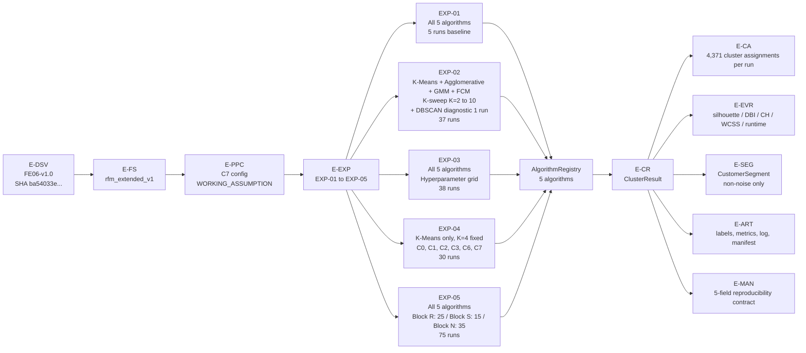
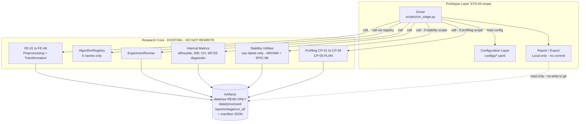

# SYS-04 — ML Processing Pipeline

> **Task ID:** EPIC-11 / SYS-04
> **Ngày:** 2026-10-07
> **Trạng thái:** DRAFT — pending mentor / human researcher review (`REVIEW_REQUIRED`)
> **Phạm vi:** THIẾT KẾ LOGICAL ML PROCESSING PIPELINE cho prototype — KHÔNG code
> implementation, KHÔNG API DTO, KHÔNG database schema, KHÔNG frontend state,
> KHÔNG thay đổi methodology / RQ / algorithm scope, KHÔNG Git operations.
> **Ngôn ngữ:** tài liệu bằng tiếng Việt. Code / identifier / file name
> giữ nguyên convention tiếng Anh hiện có của repository.
> **Source of truth cho mọi thuật ngữ methodology:** `AGENTS.md`,
> `docs/research/review/METHODOLOGY_LOCK_STATUS.md`,
> `docs/decisions/0003-algorithm-scope.md`, `docs/decisions/0004-research-questions.md`,
> `docs/system/SYS-01_requirements.md`, `docs/system/SYS-02_architecture.md`,
> `docs/system/SYS-03_data_model.md`.

| Field            | Value                                                                                  |
| ---------------- | -------------------------------------------------------------------------------------- |
| Document ID      | SYS-04                                                                                  |
| Parent          | [SYS-01_requirements.md](./SYS-01_requirements.md), [SYS-02_architecture.md](./SYS-02_architecture.md), [SYS-03_data_model.md](./SYS-03_data_model.md) |
| Scope           | Logical end-to-end ML processing pipeline cho offline prototype đã freeze trong SYS-01 + SYS-02 + SYS-03 |
| Out of scope    | SQL/ORM/migration, database implementation, API DTO, frontend state model, code implementation, ML service deployment, rewriting clustering algorithms, methodology changes, Git operations |
| Constraint set  | SYS-01 §8 (16 CON), SYS-02 §1.2–§1.14 + §18 (I-09, I-10), SYS-03 §3, METHODOLOGY_LOCK_STATUS §2–§5, ADR-0003, ADR-0004, FE-06 C7, EPIC-06 contract, EXP-01..05 plans |
| Storage layer   | Filesystem + Parquet + JSON (per SYS-02 §1.14, §6.1, §10.2)                            |

---

## 1. Objective

SYS-04 thiết kế **ML Processing Pipeline** ở mức logical cho Prototype
System, đủ để:

1. Mô tả end-to-end flow từ raw dataset → cluster labels →
   evaluation / stability / profiling / marketing handoff / report.
2. Phân biệt rõ **Research pipeline** (đã freeze, phục vụ nghiên cứu)
   và **Prototype pipeline** (orchestrate / reuse từ research core
   mà KHÔNG rewrite thuật toán).
3. Bám sát 5 thuộc tính nền tảng đã chốt trong SYS-03 §1.3:
   reproducibility, traceability, provenance, experiment lineage,
   research artifact integrity.
4. Mô tả **10 validation gates (G0–G9)** trước / sau clustering để bảo vệ
   CustomerID alignment, dataset integrity, no-NaN / no-Inf / no-leakage.
5. Mô tả **experiment orchestration** cho EXP-01..05 với algorithm
   coverage đúng theo evidence hiện tại (verified trong
   `EXP02_cluster_number_PLAN.md` §1.1, `EXP05_stability_reproducibility_PLAN.md`
   §1.2, `configs/exp04_preprocessing_feature_set.yaml`).
6. Cung cấp **3 Mermaid diagrams** ở mức pipeline view (không phải
   architecture component view) để SYS-04..06 dùng chung.

SYS-04 **KHÔNG** tự ý thay đổi methodology / RQ / algorithm scope /
preprocessing policy. Mọi thay đổi đó phải qua ADR mới (AGENTS.md §2.9).

---

## 2. Scope

### 2.1. In scope

| Hạng mục | Nội dung |
| --- | --- |
| Stage boundaries | 10 stage từ dataset loading → marketing handoff → reporting |
| Inputs / outputs per stage | Logical schema, artifact reference (path + SHA), status taxonomy |
| Validation gates | G0..G9 với input / validation / PASS / FAIL / downstream impact |
| Provenance contract | 5-field reproducibility contract từ SYS-02 §9.2, SYS-03 §3.5 |
| Research vs prototype boundary | Reuse research core; prototype chỉ orchestrate |
| Experiment orchestration | EXP-01..05 với algorithm coverage đúng evidence |
| Evaluation handoff | Internal metrics convention, WCSS = diagnostic only |
| Stability / reproducibility | Block R / S / N, stability protocol = `REVIEW_REQUIRED` |
| Profiling handoff | CP-01..04 reuse; CP-05 dependency rõ |
| Marketing handoff | REVIEW_REQUIRED; không tự tạo framework |
| Configuration model | `configs/*.yaml` là single source of truth (SYS-01 NFR-10) |
| Mermaid diagrams | End-to-end pipeline; experiment pipeline; prototype vs research core |
| Traceability matrix | SYS-01 requirement → SYS-04 stage → research evidence → SYS-03 entity → future DEV |

### 2.2. Out of scope (explicit)

SYS-04 **KHÔNG** thực hiện:

- Python implementation (function signature, dataclass, code snippet).
- API endpoint design (REST / GraphQL).
- Database schema (PostgreSQL, SQLite, …).
- Frontend state model / component prop schema.
- MLOps pipeline, CI/CD, container image, Kubernetes manifest.
- Authentication / Authorization.
- Tự ý thêm algorithm, metric, feature, preprocessing policy.
- Tự ý promote `WORKING_ASSUMPTION` thành `FINAL` / `RESEARCH_APPROVED_FINAL`.
- Tự ý tạo stability metric / matching protocol (EPIC-08 owned).
- Tự ý tạo segment name, marketing strategy, KPI.
- Commit / push / PR / merge.

Nếu phát hiện ambiguity có thể ảnh hưởng methodology → dừng và báo
cáo mentor (AGENTS.md §6).

---

## 3. Research context (đã freeze)

### 3.1. Methodology lock (METHODOLOGY_LOCK_STATUS §2)

| ID    | Decision                                  | Status      |
| ----- | ----------------------------------------- | ----------- |
| ALG-01 | 5 algorithms: K-Means, Agglomerative, DBSCAN, GMM, Fuzzy C-Means | ✅ LOCKED (ADR-0003) |
| ALG-02 | K-Medoids OUT OF SCOPE                    | ✅ LOCKED (ADR-0003) |
| RQ-01  | RQ1 = Algorithm comparison                | ✅ LOCKED (ADR-0004) |
| RQ-02  | RQ2 = Preprocessing sensitivity (RFM Extended only) | ✅ LOCKED (ADR-0004) |
| RQ-03  | RQ3 = Stability / reproducibility         | ✅ LOCKED (ADR-0004) |
| DS-01  | Dataset version = `FE06-v1.0` (= version label của materialized artifact hiện tại) | ✅ LOCKED (về version identity, KHÔNG phải methodology approval) |
| DS-02  | Dataset SHA = `ba54033e45525bf5123c2d9d3684b110676a84e81d4d505bb781a3be10980f9c` (SHA-256 của materialized artifact) | ✅ LOCKED (về content checksum, KHÔNG phải methodology approval) |
| DS-03  | Preprocessing configuration = **FE-06 C7** (median + yeo_johnson + robust) — đây là **current prototype / research working baseline**, KHÔNG phải methodology đã được final-approve | ⚠️ `WORKING_ASSUMPTION` (xem WA-01) |

**Lưu ý quan trọng về DS-03 (để tránh contradiction):**

- DS-01 / DS-02 mô tả **identity và content checksum** của materialized
  artifact hiện tại (`final_clustering_dataset.parquet` v1.0) — đây là
  **fact về artifact**, không thay đổi theo methodology decision.
- DS-03 mô tả **preprocessing configuration / methodology** đã dùng để
  tạo ra artifact đó. Methodology này hiện ở trạng thái
  `WORKING_ASSUMPTION` (WA-01, xem §3.2). SYS-04 KHÔNG gọi DS-03 là
  `LOCKED` / `FINAL` / `RESEARCH_APPROVED_FINAL`. Promotion sang trạng
  thái cao hơn thuộc thẩm quyền mentor / human researcher (AGENTS.md §2.10)
  và cần ADR mới.
- Từ "FE-06 C7 = current prototype / research working baseline" được
  dùng xuyên suốt SYS-04 để chỉ rõ đây là working default được
  chấp nhận cho prototype / current research, không phải scientific
  truth đã final.

### 3.2. Working assumptions (chưa approve, METHODOLOGY_LOCK_STATUS §3)

| ID    | Item                                          | Status            |
| ----- | --------------------------------------------- | ----------------- |
| WA-01 | FE-06 C7 preprocessing                        | `WORKING_ASSUMPTION` (6/14 features `ELIGIBLE_WORKING_ASSUMPTION`) |
| WA-02 | EXP-03 selection protocol (silhouette → DBI → CH) | `WORKING_ASSUMPTION` |
| WA-03 | EXP-02 K range [2, 10] step=1                 | `WORKING_ASSUMPTION` (13 candidates) |
| WA-04 | EXP-05 Block S seed set [42, 7, 123, 2024, 1729] | `WORKING_ASSUMPTION` |
| WA-05 | EXP-05 Block N sigma grid [0, 0.01, 0.05]     | `WORKING_ASSUMPTION` |
| WA-06 | EXP-05 Block N perturbation = Gaussian        | `WORKING_ASSUMPTION` |
| WA-07 | WCSS convention (arithmetic centroid từ hard labels) | `WORKING_ASSUMPTION` |
| WA-08 | Noise exclusion (DBSCAN -1 excluded từ metrics) | `WORKING_ASSUMPTION` |

### 3.3. Deferred to EPIC-08 plan (METHODOLOGY_LOCK_STATUS §4)

| ID            | Decision                                  | Status          |
| ------------- | ----------------------------------------- | --------------- |
| EPIC08-ARI    | ARI/AMI computation method                | `DEFERRED` (EPIC-08 plan) |
| EPIC08-STAT   | Statistical test (paired t / Wilcoxon)    | `DEFERRED` (EPIC-08 plan) |
| EPIC08-CI     | Confidence interval method (bootstrap / percentile) | `DEFERRED` (EPIC-08 plan) |
| EPIC08-RUNTIME| Runtime comparison protocol               | `DEFERRED` (EPIC-08 plan) |
| EPIC08-CONFIG | Use EXP-01 defaults vs EXP-03 selections  | `DEFERRED` (EPIC-08 plan) |
| EPIC08-VIZ    | Visualization scope                       | `DEFERRED` (EPIC-08 plan) |

### 3.4. Customer-level evidence (đã verify)

- Unit of analysis = `customer` (per ADR-0004, FE-04 §1).
- Population = 4,371 unique customers (FE-05 post-dedup, FE-06 v1.0).
- Feature matrix shape: 4,371 × 14 (no `CustomerID`, no `InvoiceNo`).
- 14 features (FE-06 §13):
  1. Recency
  2. Frequency
  3. Monetary
  4. TotalQuantity
  5. AverageQuantity
  6. BasketSize
  7. TenureDays
  8. PurchaseIntervalMean
  9. PurchaseIntervalStd
  10. ActiveDays
  11. AverageInvoiceValue
  12. ProductsPerInvoice
  13. CancellationRate
  14. ReturnRate
- 6 features ở `ELIGIBLE_WORKING_ASSUMPTION` (Frequency, AverageQuantity,
  BasketSize, ActiveDays, CancellationRate, ReturnRate).
- 8 features ở `ELIGIBLE`.

### 3.5. Experiments (EPIC-07) — verified algorithm coverage

| Experiment | Trục                                              | Algorithm coverage (verified)                                                                              | Status      |
| ---------- | -------------------------------------------------- | ---------------------------------------------------------------------------------------------------------- | ----------- |
| EXP-01     | Baseline single-config                             | All 5 (K-Means, Agglomerative, DBSCAN, GMM, FCM)                                                           | Implemented |
| EXP-02     | K sweep K ∈ [2, 10] step=1                        | K-Means + Agglomerative + GMM + FCM (K-sweep, 36 runs) + DBSCAN (diagnostic only, 1 run, NOT in K-sweep)  | Implemented (37 runs) |
| EXP-03     | Hyperparameter grid (non-K)                       | All 5 (K-Means, Agglomerative, DBSCAN, GMM, FCM), K fixed từ EXP-02 candidates                            | Implemented (38 runs) |
| EXP-04     | Preprocessing variants C0/C1/C2/C3/C6/C7 (RQ2)     | K-Means only, K=4 fixed (`CONTROLLED_REFERENCE`)                                                          | Implemented (30 runs) |
| EXP-05     | Block R / S / N                                    | All 5 (Block R: 25 runs; Block N: 35 runs; Block S: 3 algorithms có random axis = K-Means + GMM + FCM × 5 seeds = 15 runs) | Implemented (75 runs) |

### 3.6. Customer profiling (EPIC-09) — verified status

| Component                                | Status     |
| ---------------------------------------- | ---------- |
| CP-01 Cluster size distribution         | Implemented |
| CP-02 Feature profile                    | Implemented |
| CP-03 Distinguishing features            | Implemented |
| CP-04 Segment name mapping (NAMED / COMPARATIVE / NOT_AVAILABLE) | Implemented |
| CP-05 Segment interpretability / business relevance (6 axes: distinctiveness, interpretability, consistency, size, stability, business_relevance) | `PLAN` (`docs/research/EPIC09_CP05_PLAN.md`) |

### 3.7. Marketing framework (EPIC-X) — verified status

| Component                  | Status                  |
| -------------------------- | ----------------------- |
| MKT-01..05 framework docs  | **NOT STARTED** (verified bằng `grep` toàn repo) |
| `MarketingRecommendation` (E-MKT) trong SYS-03 | `REVIEW_REQUIRED` (shell schema, `availability = NOT_AVAILABLE`) |
| Segment → Recommendation mapping | NOT IMPLEMENTED |

---

## 4. Pipeline principles

### 4.1. Research vs Prototype boundary

**Research pipeline** (đã freeze):
- Sống trong `src/customer_segmentation/` (research core).
- Đã chạy 185 runs (EXP-01..05) theo `METHODOLOGY_LOCK_STATUS §2`.
- Đã sinh FE-06 final clustering matrix + customer metadata +
  fitted preprocessing pipeline + EXP-01..05 evidence.

**Prototype pipeline** (SYS-04 scope):
- Chỉ **orchestrate / reuse** research core; KHÔNG rewrite thuật
  toán clustering.
- Prototype driver = scripts trong `scripts/` (per SYS-02 §2.1
  driver layer) + `ExperimentRunner` từ research core.
- Prototype KHÔNG tự định nghĩa algorithm adapter mới; chỉ gọi qua
  `AlgorithmRegistry.list_registered()` (5 names).

Boundary này đảm bảo:

- 1 source of truth cho algorithm implementation.
- Mọi cập nhật vào research core tự động có hiệu lực cho prototype.
- Tránh duplicate logic (AGENTS.md §5).

### 4.2. Read-only dataset discipline (AGENTS.md §2.3)

Pipeline phải đảm bảo:

- `data/raw/primary/**` không bị mutate (filesystem mtime unchanged).
- `data/processed/final_clustering_dataset.parquet` được READ-ONLY
  khi EXP-01..05 đọc làm input.
- Mọi write ra `reports/<stage>/<run_id>/` mới là mutation.
- Mỗi stage verify input SHA trước khi xử lý (gate G0, G1, G2).

### 4.3. Configuration discipline (SYS-01 NFR-10, SYS-02 §9.1)

- Mọi giá trị methodology-affecting phải resolve từ `configs/*.yaml`.
- Prototype KHÔNG hard-code path, threshold, seed, algorithm name.
- Hyperparameter grid trong EXP-03 phải đến từ config, không từ
  Python constant.
- Một thay đổi config đi kèm commit / PR riêng và note trong
  `docs/experiment_logs/` (SYS-02 §9.1).

### 4.4. Status discipline (SYS-03 §3.6)

Pipeline KHÔNG tự ý dùng các status ngoài status taxonomy đã freeze:

- `VALID_VALUE` / `NOT_APPLICABLE` / `COMPUTATION_ERROR` / `MISSING` (metrics)
- `SUCCESS` / `FAILED` / `PARTIAL` (run status)
- `WORKING_ASSUMPTION` / `WORKING_DEFAULT` / `WORKING_SELECTED` / `TIED_WORKING_SELECTED`
- `ELIGIBLE` / `ELIGIBLE_WORKING_ASSUMPTION` / `PENDING_REVIEW`
- `REPRODUCIBILITY_VERIFIED` / `REPRODUCIBILITY_FAILED` / `STABILITY_EVIDENCE_GENERATED` / `PERTURBATION_EVIDENCE_GENERATED` / `SIGMA_ZERO_BASELINE_MATCH` / `SIGMA_ZERO_BASELINE_MISMATCH`
- `PENDING_REVIEW` / `REVIEW_REQUIRED` / `DEFERRED` / `FUTURE_WORK`
- `NAMED` / `COMPARATIVE` / `NOT_AVAILABLE` / `NOISE` / `NAMING_PENDING`

KHÔNG tự ý tạo `FINAL` cho bất kỳ entity / configuration nào (xem
SYS-03 §7.2 — `FINAL` deliberately omitted từ E-FS status enum).

### 4.5. Methodology gate (AGENTS.md §2.5, §2.6, §2.10)

Pipeline KHÔNG tạo / tự ý hiển thị:

- "best", "winner", "optimal", "recommended", "final" cho algorithm.
- Composite score / weighted ranking / overall algorithm ranking.
- Cross-algorithm cluster ID mapping (vd. "K-Means C2 = GMM C3").
- "best segment" / "priority band" / "target segment" (SYS-01 FR-SEG-11).
- Business effectiveness metric từ internal clustering metric
  (CON-07).

`TECHNICALLY_IMPLEMENTED` ≠ `RESEARCH_APPROVED_FINAL`. Pipeline phải
giữ phân biệt này trong mọi output (SYS-01 §3.4, AGENTS.md §2.10).

---

## 5. End-to-end ML pipeline (high-level)

Pipeline tổng quát cho prototype (mỗi stage có stage ID tương ứng
với SYS-04 sections 6–16):

```
[S1] Dataset Loading
       │  (READ-ONLY data/raw/primary/Online Retail.xlsx)
       ▼
[S2] Preprocessing (FE-01 → FE-06)
       │  (output: data/processed/final_clustering_dataset.parquet
       │   + customer_metadata.parquet + fitted_preprocessing_pipeline.pkl)
       ▼
[S3] Customer Alignment Gate
       │  (verify: 4,371 rows; CustomerID tách riêng; no NaN/Inf/constant)
       ▼
[S4] Feature Set Selection
       │  (RFM Extended 14 features only; RFM-only = FUTURE_WORK)
       ▼
[S5] Preprocessing Configuration
       │  (FE-06 C7 = median + yeo_johnson + robust; WORKING_ASSUMPTION)
       ▼
[S6] Clustering
       │  (AlgorithmRegistry → ExperimentRunner → ClusterResult)
       │  (K-Means / Agglo / DBSCAN / GMM / FCM; K-Medoids rejected)
       ▼
[S7] Evaluation
       │  (silhouette / DBI / CH / WCSS diagnostic / runtime)
       │  (no composite score, no best algorithm)
       ▼
[S8] Stability / Reproducibility (RQ3, EXP-05 Block R/S/N)
       │  (raw labels + per-run aggregate; ARI/AMI = REVIEW_REQUIRED)
       ▼
[S9] Customer / Segment Profiling (EPIC-09)
       │  (CP-01..04 reuse; CP-05 = PLAN; no segment naming tự tạo)
       ▼
[S10] Marketing Recommendation handoff + Reporting
          (Marketing = REVIEW_REQUIRED; MKT-01..05 absent)
          (Report / Export: local only, no commit / push / PR)
```

Mermaid diagram cho stage flow: xem §21.1.

---

## 6. Stage S1 — Dataset loading

### 6.1. Input

| Artifact | Path | Status | SHA-256 |
| --- | --- | --- | --- |
| Primary raw dataset | `data/raw/primary/Online Retail.xlsx` | `VERIFIED` (DS-05) | `43465a06f2ccf7c8b5bd2892bc7defb52f97487934fe93b16ae4c3936424676d` |
| Backup raw dataset | `data/raw/backup/online_retail_II.xlsx` | `VERIFIED` (ADR-0002) | `bcbe73b35f5b7babf197cb0cb983a11f5d9ff929078d4aa53d171b1f2df2e980` |

Cả hai file được load qua data loader module (`src/customer_segmentation/data/loader.py`),
đọc **READ-ONLY** (`gitignored` per `AGENTS.md §2.12`).

### 6.2. Output

In-memory transaction-level DataFrame + ProcessingReport stub.
Artifact chưa được persist xuống disk ở stage này (stage này là
**read pass-through**).

### 6.3. SYS-03 entity mapping

- `E-DS` (Dataset, `role = primary` hoặc `backup`).
- `E-DSV` (DatasetVersion, `version_label = raw_v1`,
  `dataset_role = raw`).

### 6.4. Validation (gate G0 — see §17.1)

Verify SHA-256 + file size + format + row count.

---

## 7. Stage S2 — Preprocessing (FE-01 → FE-06) — materialization của FE-06 research artifact

Stage này thuộc research core, đã chạy và đã có evidence. Trong
prototype pipeline, stage này đã được **thực hiện xong trong quá khứ**;
output artifacts (`final_clustering_dataset.parquet`,
`customer_metadata.parquet`, `fitted_preprocessing_pipeline.pkl`)
hiện là **materialized + checksum-verified / immutable**
(content-addressed bằng SHA-256 — xem §7.2). SYS-04 chỉ truy xuất /
verify các artifact này, KHÔNG chạy lại FE-01..FE-06.

**Phân biệt rõ giữa artifact materialization và methodology status
(để tránh hiểu nhầm "output đã freeze" = methodology đã final):**

- **Artifact materialization** — đã hoàn tất + content-addressed:
  - `final_clustering_dataset.parquet` SHA `ba54033e45525bf5123c2d9d3684b110676a84e81d4d505bb781a3be10980f9c` (= DS-02) — bất biến.
  - `customer_metadata.parquet` SHA `c2a42b3c8b035dcf6a5af8e4b6afb6a444099e6ad0e12a271ea59d95c7382ad2` — bất biến.
  - `fitted_preprocessing_pipeline.pkl` — bất biến (SHA tracked in metadata).
  - Mọi immutable artifact đều có `status = VERIFIED` theo §7.2.
- **Preprocessing methodology / configuration** — chưa final-approve:
  - `E-PPC.config_label = C7` (`configs/transformation.yaml`) vẫn ở
    `config_status = WORKING_ASSUMPTION` (WA-01, xem §3.2 và §10).
  - SYS-04 KHÔNG gọi preprocessing methodology là `LOCKED` /
    `FINAL` / `RESEARCH_APPROVED_FINAL`. Promotion sang trạng thái cao
    hơn thuộc thẩm quyền mentor / human researcher (AGENTS.md §2.10)
    và cần ADR mới.

Nói cách khác: "FE-06 artifact đã materialize + checksum-verified" là
một **fact về artifact**; "preprocessing methodology đã final-approve"
là một **research decision** chưa xảy ra. Hai khẳng định này độc lập
với nhau.

### 7.1. Sub-stages (audit / cleaning / aggregation / features / transformation)

| Sub-stage | Owner | Input | Output |
| --- | --- | --- | --- |
| FE-01 Audit | `src/customer_segmentation/data/audit.py` | raw transactions | `reports/fe01/*.csv` |
| FE-02 Cleaning | `src/customer_segmentation/preprocessing/` | raw transactions | `data/processed/transactions_clean.parquet` |
| FE-03 Outlier analysis (diagnostic only) | `src/customer_segmentation/outlier_analysis/` | cleaned transactions | `reports/fe03/*.csv` |
| FE-04 Customer aggregation | `src/customer_segmentation/aggregation/` | cleaned transactions | `data/processed/customer_base.parquet` (4,372 pre-dedup) |
| FE-05 Feature engineering (RFM Extended) | `src/customer_segmentation/features/` | customer base | `data/processed/customer_candidates.parquet` (4,371 × 14) |
| FE-06 Transformation + Scaling (C7 working) | `src/customer_segmentation/transformation/` | customer candidates | `data/processed/final_clustering_dataset.parquet` (4,371 × 14) + `customer_metadata.parquet` (4,371 × 1) + `fitted_preprocessing_pipeline.pkl` |

### 7.2. Output artifacts (immutable, đã verify)

| Artifact | Path | SHA-256 | Status |
| --- | --- | --- | --- |
| Final clustering matrix | `data/processed/final_clustering_dataset.parquet` | `ba54033e...80f9c` (DS-02) | `VERIFIED` |
| Customer metadata | `data/processed/customer_metadata.parquet` | `c2a42b3c...c7382ad2` | `VERIFIED` |
| Fitted preprocessing pipeline | `data/processed/fitted_preprocessing_pipeline.pkl` | tracked in metadata | `VERIFIED` |
| Config snapshot | `configs/transformation.yaml` | tracked in metadata | `VERIFIED` |
| EXP-01 baseline manifest | `reports/exp01/exp01_baseline_manifest.json` | `d5172c4640d7bc2cbbaa0bc22b9de9353c4e851bbf21dec2e801bf06951abd79` | `VERIFIED` |

### 7.3. Customer alignment convention (FE-06 A6)

- `customer_metadata.parquet.row_count == final_clustering_dataset.parquet.row_count` (= 4,371).
- `CustomerID` unique trong metadata.
- Row order giữ nguyên source candidate order.
- Mapping `CustomerID ↔ final row` được verify.
- KHÔNG sort metadata độc lập với final matrix.
- Alignment convention: `verified_by_position_and_unique_key` (FE-06 A6).

### 7.4. SYS-03 entity mapping

- `E-DSV` (`dataset_role = processed`, `version_label = FE06-v1.0`).
- `E-PR` (ProcessingRun, `stage = FE01..FE06`, có input_sha256 +
  output_sha256 + config_hash + environment_block).
- `E-FS` (FeatureSet, `feature_set_id = rfm_extended_v1`,
  `status = WORKING` — 6 features `ELIGIBLE_WORKING_ASSUMPTION`).
- `E-F` (Feature, 14 instances với `fe_status` enum).
- `E-PPC` (PreprocessingConfiguration, `config_label = C7`,
  `config_status = WORKING_ASSUMPTION`).
- `E-CUS` (Customer, 4,371 instances, `inclusion_status = INCLUDED`).
- `E-ART` (ArtifactReference cho mỗi parquet / pkl / json).
- `E-MAN` (RunManifest với 5-field reproducibility contract).

### 7.5. Validation (gate G1 — see §17.2)

Customer-level alignment + schema check.

---

## 8. Stage S3 — Customer alignment gate

Đây là **gate quan trọng nhất** của pipeline (Customer alignment
contract). Gate chạy **trước khi clustering** và **sau khi clustering
trước khi output labels**.

### 8.1. Pre-clustering alignment checks

| Check | Expected | Source of truth |
| --- | --- | --- |
| `final_clustering_dataset.shape[0] == 4,371` | match | FE-06 evidence |
| `final_clustering_dataset.shape[1] == 14` | match | FE-06 §13 |
| `customer_metadata.shape[0] == 4,371` | match | FE-06 evidence |
| `customer_metadata.columns == ['CustomerID']` | exact | FE-06 A6 |
| `CustomerID` not in feature matrix columns | exact | AGENTS.md §3 (no identifier leakage) |
| `CustomerID` unique trong metadata | `True` | FE-06 A6 |
| `row_index` parity giữa matrix và metadata | `True` | FE-06 A6 |
| No `NaN` / `Inf` trong feature matrix | `True` | SYS-01 FR-DATA-02 |
| No constant feature (zero variance) | `True` | SYS-01 FR-DATA-02 |

### 8.2. Post-clustering alignment checks

| Check | Expected | Source of truth |
| --- | --- | --- |
| `len(cluster_labels) == 4,371` | match | E-CR constraint (SYS-03 §19.5) |
| `cluster_labels.dtype == int64` | match | SYS-01 FR-CLUSTER-02 |
| `cluster_labels` ∈ {0..K-1} ∪ {-1} (DBSCAN) | match | SYS-03 §19.7 |
| `sum(cluster_sizes) + (noise_count if DBSCAN else 0) == 4,371` | match | SYS-03 §19.5 |
| Order of labels khớp với row order của `final_clustering_dataset` | exact | FE-06 A6 |

### 8.3. Validation gate (G1 — see §17.2)

Nếu BẤT KỲ check nào FAIL → `status = FAILED` (SYS-03 E-EXR.status
enum), pipeline dừng, error message rõ ràng. KHÔNG silently reorder
/ drop customer (AGENTS.md §2.3).

---

## 9. Stage S4 — Feature set selection

### 9.1. Current working feature set

- `feature_set_id = rfm_extended_v1` (E-FS).
- 14 features (xem §3.4).
- `status = WORKING` (do 6 features `ELIGIBLE_WORKING_ASSUMPTION`).
- RFM-only feature set = `FUTURE_WORK` (RQ2 reformulation, ADR-0004).

### 9.2. Selection rules (gate G2 — see §17.3)

| Rule | Source |
| --- | --- |
| Chỉ chấp nhận `rfm_extended_v1` trong prototype | SYS-01 FR-EXP-02 |
| KHÔNG cho phép RFM-only option | RQ2 reformulated, ADR-0004 |
| Nếu user yêu cầu feature set khác → reject với error rõ | SYS-01 FR-EXP-02 |

### 9.3. SYS-03 entity mapping

- `E-FS` (1 instance, `feature_set_id = rfm_extended_v1`).
- `E-F` (14 instances, mỗi feature có `fe_status` enum:
  `ELIGIBLE` × 8 + `ELIGIBLE_WORKING_ASSUMPTION` × 6).

---

## 10. Stage S5 — Preprocessing configuration (selection & provenance snapshot)

**Phân biệt S5 với S2 (để tránh hiểu nhầm S5 = chạy lại preprocessing):**

| Stage | Vai trò | Thực hiện trong prototype pipeline? | Owner |
| --- | --- | --- | --- |
| **S2** (§7) | **Materialization** của FE-06 research artifact (FE-01..FE-06 chạy trong quá khứ, sinh `final_clustering_dataset.parquet` SHA `ba54033e...80f9c` + `customer_metadata.parquet` + `fitted_preprocessing_pipeline.pkl`). | KHÔNG chạy lại. Prototype chỉ truy xuất / verify các artifact đã materialize + checksum-verified (xem §7.2). | research core |
| **S5** (§10) | **Configuration selection & provenance snapshot** — chọn một `E-PPC` instance đã có (vd. `C7` cho current pipeline, hoặc `C0/C1/C2/C3/C6` cho EXP-04 sweep) làm preprocessing configuration cho downstream stages (S6 clustering, S7 evaluation, S8 stability). KHÔNG thực hiện preprocessing lần 2. | CÓ — chọn / load E-PPC config từ YAML + resolve metadata. | prototype pipeline |

**S5 chỉ làm các việc sau (KHÔNG phải rerun FE-01..FE-06):**

1. Load `configs/transformation.yaml` (SHA → `config_hash`).
2. Resolve `E-PPC` instance phù hợp với current run (vd. `C7` cho
   baseline / EXP-01 / EXP-02 / EXP-03 / EXP-05; hoặc `C0..C7` cho EXP-04).
3. Snapshot `E-PPC.{config_label, transformation, scaling, imputation,
   applied_features, is_full_matrix, config_status, config_path, config_hash}`
   vào run manifest `E-MAN` (5-field reproducibility contract).
4. Verify `config_status` thuộc status enum đã freeze (SYS-03 §4.4):
   `WORKING_ASSUMPTION` / `MENTOR_REVIEW_PENDING` / `LOCKED`.

**KHÔNG thuộc S5** (KHÔNG làm các việc sau):

- KHÔNG chạy `yeo_johnson` / `robust` scaler / median imputation.
- KHÔNG mutate `final_clustering_dataset.parquet`.
- KHÔNG re-fit `fitted_preprocessing_pipeline.pkl`.
- KHÔNG thay đổi FE-06 artifact SHA.

Nếu user yêu cầu thay đổi preprocessing configuration ở prototype
level (vd. muốn chạy lại FE-06 với config khác), đó là **methodology
change** thuộc thẩm quyền mentor / human researcher (AGENTS.md §2.9,
§2.10) và cần ADR mới. SYS-04 KHÔNG tự ý thực hiện.

### 10.1. Current working configuration (FE-06 C7)

- `config_label = C7` (E-PPC).
- `imputation = median` (PurchaseIntervalMean, PurchaseIntervalStd).
- `transformation = yeo_johnson` (full 14 features, không ngoại lệ).
- `scaling = robust` (full 14 features, không ngoại lệ).
- `is_full_matrix = true`.
- `config_status = WORKING_ASSUMPTION` (WA-01) — chưa final-approve.
- `config_path = configs/transformation.yaml`.
- **Vai trò**: `C7` = E-PPC instance dùng cho current pipeline (baseline
  / EXP-01 / EXP-02 / EXP-03 / EXP-05). Đây là **prototype / current
  research working baseline**, không phải methodology đã final.

### 10.2. Experimental configurations (EXP-04, RQ2)

EXP-04 đánh giá 6 full-matrix scenarios trên K-Means, K=4 fixed:

| ID | Transformation | Scaling | is_full_matrix | Status |
| --- | --- | --- | --- | --- |
| C0 | none | none | true | `EXPERIMENTAL` |
| C1 | none | standard | true | `EXPERIMENTAL` |
| C2 | none | minmax | true | `EXPERIMENTAL` |
| C3 | none | robust | true | `EXPERIMENTAL` |
| C6 | yeo_johnson | standard | true | `EXPERIMENTAL` |
| C7 | yeo_johnson | robust | true | `WORKING_ASSUMPTION` |

Log1p (T1) configurations KHÔNG full-matrix comparable do nhiều
feature có giá trị âm; KHÔNG dùng cho current pipeline (FE-06 A2).

### 10.3. Selection rules (gate G3 — see §17.4)

- Baseline (EXP-01) và các experiment khác dùng C7.
- EXP-04 sweep C0..C7 (exclude C4, C5 theo FE-06 A2).
- KHÔNG cho phép preprocessing config ngoài các ID trên mà không có ADR.

### 10.4. SYS-03 entity mapping

- `E-PPC` (1 hoặc nhiều instances tùy experiment; mỗi instance có
  `config_label`, `config_status`, `config_path`, `config_hash`).

---

## 11. Stage S6 — Clustering

Stage này thuộc research core (`src/customer_segmentation/clustering/`).
Prototype chỉ orchestrate qua `AlgorithmRegistry` + `ExperimentRunner`.

### 11.1. Algorithm scope (5 algorithms only, ADR-0003)

| `algorithm_id` | `display_name` | `algorithm_family` | `source_module` | Notes |
| --- | --- | --- | --- | --- |
| `kmeans` | K-Means | `hard` | `clustering/kmeans.py` | supports WCSS native |
| `agglomerative` | Agglomerative | `hard` | `clustering/agglomerative.py` | supports linkage + K sweeps; `supports_random_state = false` |
| `dbscan` | DBSCAN | `density_based` | `clustering/dbscan.py` | `noise_label = -1`; `defines_noise_label = true`; WCSS not defined |
| `gmm` | GMM | `model_based` | `clustering/gmm.py` | `defines_soft_probabilities = true`; WCSS not defined |
| `fuzzy_cmeans` | Fuzzy C-Means | `fuzzy` | `clustering/fuzzy_cmeans.py` | `defines_soft_membership = true`; WCSS not defined; custom implementation |

`kmedoids` (K-Medoids) = **REJECTED** tại `AlgorithmRegistry` (raise
runtime error nếu bị reference). Module `kmedoids.py` retained chỉ
cho historical reference (ADR-0003).

### 11.2. Output schema per algorithm (E-ALG + E-CR)

**Hard labels** (shape `(4371,)` dtype `int64`):

| Algorithm | `n_clusters_realized` semantics | `noise_label` | `noise_count` |
| --- | --- | --- | --- |
| K-Means | = `n_clusters_requested` | n/a (no noise) | `null` |
| Agglomerative | = `n_clusters_requested` | n/a | `null` |
| DBSCAN | ≠ `n_clusters_requested` (DBSCAN has no K input) | `-1` | 3,177 (baseline 72.68%, LIM-07) |
| GMM | = `n_components_requested` | n/a | `null` |
| FCM | = `n_clusters_requested` (c hard partition) | n/a | `null` |

**Soft outputs** (OPTIONAL conditional):

| Algorithm | `soft_probabilities_artifact` | `soft_membership_artifact` | Shape |
| --- | --- | --- | --- |
| K-Means | `null` | `null` | n/a |
| Agglomerative | `null` | `null` | n/a |
| DBSCAN | `null` | `null` | n/a |
| GMM | populated | `null` | `(4371, n_components)` |
| FCM | `null` | populated | `(4371, c)` |

### 11.3. Configuration (AlgorithmConfiguration E-ALC)

Snapshot per run gồm:

- `hyperparameters`: dict từ `clustering.yaml` + per-EXP config.
- `random_seed`: int hoặc `null` (Agglomerative / DBSCAN).
- `n_clusters_requested` / `n_components_requested` / `eps_requested` /
  `min_samples_requested` / `linkage` / `covariance_type` / `fuzziness_m`
  — conditional theo algorithm.
- `config_hash` (SHA of YAML).

### 11.4. Validation gate (G4 — see §17.5)

- Algorithm name phải thuộc `AlgorithmRegistry.list_registered()`
  (5 names; K-Medoids rejected).
- Hyperparameter dict khớp schema cho algorithm.
- Output `cluster_labels` shape + dtype đúng.
- DBSCAN noise_label = -1 (nếu có noise).
- Soft outputs chỉ populated cho GMM / FCM.

### 11.5. SYS-03 entity mapping

- `E-ALG` (5 instances, registry-locked).
- `E-ALC` (1 per run).
- `E-CR` (1 per run × algorithm).
- `E-CA` (4,371 instances per `E-CR` = ClusterAssignment).
- `E-EXR` (1 per run, status enum).

---

## 12. Stage S7 — Evaluation

### 12.1. Internal metrics (locked, CON-07)

| Metric | Convention | Direction | `is_diagnostic_only` |
| --- | --- | --- | --- |
| Silhouette Score | sklearn `silhouette_score` | higher = better | `false` |
| Davies-Bouldin Index | sklearn `davies_bouldin_score` | lower = better | `false` |
| Calinski-Harabasz Index | sklearn `calinski_harabasz_score` | higher = better | `false` |
| WCSS | arithmetic centroid từ hard labels (WA-07) | lower = more compact | **`true` (diagnostic only)** |
| Runtime | per-run, `n_repeat = 5` cho variance estimation | lower = faster | `false` |

### 12.2. Metric applicability rules (SYS-03 §11.2)

| Edge case | Status | Reason |
| --- | --- | --- |
| All labels = noise | `NOT_APPLICABLE` cho mọi metric | `ALL_NOISE` |
| Single cluster (K=1) | `NOT_APPLICABLE` cho silhouette / DBI / CH | `SINGLE_CLUSTER` |
| Fewer than 2 clusters | `NOT_APPLICABLE` | `INSUFFICIENT_CLUSTERS` |
| sklearn raised exception | `COMPUTATION_ERROR` | exception class + message |
| Metric not yet populated | `MISSING` | n/a |
| Metric computed OK | `VALID_VALUE` | n/a |

DBSCAN: noise excluded khỏi silhouette computation (sklearn convention,
CON-15).

### 12.3. Constraints (gate G5 — see §17.6)

- KHÔNG có field `composite_score` / `overall_algorithm_score` /
  `winner` / `best` / `recommended` / `optimal` / `final` trong E-EVR.
- `metric_value = null` khi `metric_status = NOT_APPLICABLE` hoặc
  `MISSING`. KHÔNG dùng giá trị giả (0, -1).
- WCSS có `is_diagnostic_only = true`. UI / report phải hiển thị
  nhãn `diagnostic_only` cạnh WCSS value.
- Mỗi metric gắn `metric_name` enum + `metric_status` enum + optional
  `metric_reason` string.

### 12.4. Output

- `E-EVR` (1 per metric per `E-CR`).
- Aggregation: per-algorithm summary CSV (long format) cho mỗi
  experiment; KHÔNG có overall rank / winner column.

### 12.5. SYS-03 entity mapping

- `E-EVR` (multiple per E-CR, mỗi metric là 1 instance).

---

## 13. Stage S8 — Stability / Reproducibility (RQ3, EXP-05)

### 13.1. Block structure (verified theo `EXP05_stability_reproducibility_PLAN.md` §4–§6)

```
Block R (Reproducibility): 5 algorithms × n_repeat=5 × seed=42 → 25 runs
                            Verify: cùng seed → cùng labels_hash
                            Status: REPRODUCIBILITY_VERIFIED / REPRODUCIBILITY_FAILED

Block S (Seed Stability):  3 algorithms (K-Means + GMM + FCM) × 5 seeds
                            seeds = [42, 7, 123, 2024, 1729] (WA-04)
                            Agglomerative + DBSCAN deterministic → KHÔNG seed sweep
                            → 3 × 5 × 1 = 15 runs
                            Status: STABILITY_EVIDENCE_GENERATED

Block N (Feature Perturbation): 5 algorithms × (1 sigma=0 sanity + 2 sigma × 3 perturbation seeds)
                            sigma_grid = [0, 0.01, 0.05] (× feature std) (WA-05)
                            perturbation_distribution = Gaussian (WA-06)
                            perturbation_seeds = [42, 43, 44] for sigma>0
                            → 5 + 5×2×3 = 35 runs
                            Status: PERTURBATION_EVIDENCE_GENERATED / SIGMA_ZERO_BASELINE_MATCH / SIGMA_ZERO_BASELINE_MISMATCH

Total: 25 + 15 + 35 = 75 runs
```

### 13.2. Logical flow

```
ExperimentRun (reference)
        │
        ▼
Block-specific runner (R / S / N)
        │
        ├── (Block R): same config × n_repeat → compare labels_hash
        ├── (Block S): same config × seed sweep → raw labels per seed
        └── (Block N): apply perturbation in-memory → raw labels per (sigma, perturbation_seed)
        │
        ▼
Collect labels → DataFrame
        │  schema: (run_id, block, algorithm, seed, sigma,
        │           perturbation_seed, repeat_index, CustomerID, cluster_label)
        ▼
exp05_cluster_labels.parquet (327,825 rows × 9 columns)
        │
        ▼
Per-block aggregate CSV (reproducibility, seed_sweep, noise_perturbation)
        │
        ▼
StabilityEvaluation (E-STB) — REVIEW_REQUIRED for ARI/AMI / Hungarian / statistical test / CI
```

### 13.3. Stability metric / matching protocol — `REVIEW_REQUIRED`

Các chi tiết sau **PHẢI** giữ `REVIEW_REQUIRED` (owned by EPIC-08 plan,
KHÔNG pipeline tự quyết, xem SYS-02 §18 I-10, SYS-03 §12.1):

| Detail | Status | Owner |
| --- | --- | --- |
| ARI / AMI computation method | `REVIEW_REQUIRED` | EPIC-08 plan (EPIC08-ARI) |
| Label matching protocol (Hungarian / permutation) | `REVIEW_REQUIRED` | EPIC-08 plan |
| Statistical test (paired t / Wilcoxon) | `REVIEW_REQUIRED` | EPIC-08 plan (EPIC08-STAT) |
| Confidence interval method (bootstrap / percentile) | `REVIEW_REQUIRED` | EPIC-08 plan (EPIC08-CI) |
| Runtime comparison protocol | `REVIEW_REQUIRED` | EPIC-08 plan (EPIC08-RUNTIME) |
| Visualization scope | `REVIEW_REQUIRED` | EPIC-08 plan (EPIC08-VIZ) |
| Use EXP-01 defaults vs EXP-03 selections | `REVIEW_REQUIRED` | EPIC-08 plan (EPIC08-CONFIG) |

Pipeline chỉ mô tả **logical flow** + **per-block aggregate CSV** +
**raw labels artifact**. KHÔNG compute ARI / AMI / p-value / CI trong
pipeline; chờ EPIC-08 plan.

### 13.4. Validation gate (G6 — see §17.7)

- `exp05_cluster_labels.parquet` schema đúng (9 columns, đúng types).
- `CustomerID` parity với `customer_metadata.parquet`.
- Per-block run count đúng (Block R: 25; Block S: 15; Block N: 35).
- Block S chỉ chứa 3 algorithms (K-Means + GMM + FCM).
- Block N sigma=0 sanity reproduce EXP-01 baseline labels.

### 13.5. SYS-03 entity mapping

- `E-EXR` (75 instances, status enum theo block).
- `E-CR` (75 instances).
- `E-CA` (327,825 rows total = 4,371 × 75 runs).
- `E-STB` (shell schema, REVIEW_REQUIRED fields).

---

## 14. Stage S9 — Customer / Segment profiling (EPIC-09)

### 14.1. Sub-stages (CP-01..04 reuse, CP-05 = PLAN)

```
ClusterResult (E-CR) + Customer (E-CUS) + final clustering dataset (E-DSV)
        │
        ▼
[CP-01] Cluster size distribution
        │  per (algorithm, K, analysis_unit) → n_customers, pct_of_assigned, pct_of_total
        │  Status: Implemented
        ▼
[CP-02] Feature profile (per segment)
        │  per-segment descriptive stats: count, mean, median, std, min, max, q25, q50, q75
        │  Status: Implemented
        ▼
[CP-03] Distinguishing features
        │  top features phân biệt segment
        │  Status: Implemented
        ▼
[CP-04] Segment name mapping
        │  NAMED (CP-04 evidence) / COMPARATIVE / NOT_AVAILABLE / NOISE (DBSCAN) / NAMING_PENDING
        │  Status: Implemented
        ▼
[CP-05] Segment interpretability & business relevance
        │  6 evaluation axes: distinctiveness, interpretability, consistency, size, stability, business_relevance
        │  Status: PLAN (per docs/research/EPIC09_CP05_PLAN.md)
        │  Until implemented: E-SEG.evaluation_axes = null
```

### 14.2. DBSCAN noise treatment (CON-08)

- DBSCAN noise (`cluster_label = -1`) KHÔNG được coi là CustomerSegment.
- `E-SEG.is_noise_segment = true` thì `segment_name = null`.
- Noise hiển thị riêng với `segment_name_status = NOISE`.
- KHÔNG gộp noise vào segment list.
- Noise KHÔNG dùng làm input cho Marketing recommendation (CON-08,
  FR-MKT-06).

### 14.3. Segment naming constraint (AGENTS.md §3, SYS-01 FR-SEG-08)

- KHÔNG tự đặt tên segment ("Champions", "Loyal", "VIP", "at-risk").
- Tên segment phải đến từ CP-04 evidence.
- Nếu chưa có mapping → `segment_name = null`,
  `segment_name_status = NOT_AVAILABLE` hoặc `NAMING_PENDING`.
- KHÔNG tạo cross-algorithm segment mapping (CON-09, CP-05 §14).
- KHÔNG tạo "priority_band" / "best_segment" / "target_segment"
  (SYS-01 FR-SEG-11).

### 14.4. CP-05 dependency

- CP-05 chưa implement → `E-SEG.evaluation_axes = null`,
  `E-SEG.size_band = null`.
- Khi CP-05 implement xong, các field OPTIONAL này populate.
- Pipeline phải handle gracefully (UI hiển thị `NOT_AVAILABLE` thay
  vì empty rows).

### 14.5. Validation gate (G7 — see §17.8)

- `n_customers_assigned` sum = `n_samples` (non-DBSCAN) hoặc
  `n_samples - noise_count` (DBSCAN).
- Segment không chứa `cluster_label = -1` (trừ `is_noise_segment = true`).
- `segment_name` populated chỉ khi `segment_name_status = NAMED`
  hoặc `COMPARATIVE`.

### 14.6. SYS-03 entity mapping

- `E-SEG` (1 per cluster label per ClusterResult × analysis unit).
- `E-SPR` (1:1 với E-SEG, OPTIONAL `evaluation_axes`).

---

## 15. Stage S10 — Marketing handoff + Reporting

### 15.1. Marketing handoff

- Marketing = **REVIEW_REQUIRED** (MKT-01..05 absent, SYS-03 §15.1).
- Pipeline chỉ mô tả handoff interface (SegmentProfile → Recommendation
  input), KHÔNG tự tạo recommendation methodology.
- Prototype UI ẩn Marketing section cho đến khi MKT framework tồn tại
  (SYS-01 FR-MKT-01).
- Khi MKT framework tồn tại: `E-MKT.availability = AVAILABLE`;
  schema fields populate từ MKT framework.

### 15.2. Reporting

- Mỗi stage ghi 1+ report dưới `reports/<stage>/<run_id>/`.
- Format: JSON (manifest, log), CSV (long-format aggregate), MD
  (narrative), PNG (diagnostic plots).
- Convention per stage (SYS-02 §10.3):
  - Per-run layout: `reports/<stage>/<run_id>/<run_id>_manifest.json`.
  - Flat layout: một số stage (EXP-01, EXP-05) có
    `reports/<stage>/<stage>_manifest.json`.
- KHÔNG commit / push / PR report; chỉ export local
  (SYS-01 FR-REPORT-03).

### 15.3. Validation gate (G8 — see §17.9)

- Run manifest tồn tại cho mỗi run.
- 5-field reproducibility contract populate đầy đủ.
- `assumptions` + `pending_decisions` lists non-null.

### 15.4. SYS-03 entity mapping

- `E-ART` (1 per artifact, path + format + sha256 + status).
- `E-MAN` (1 per run, 5-field contract).
- `E-MKT` (shell, REVIEW_REQUIRED, `availability = NOT_AVAILABLE`).

---

## 16. Stage S10 (continued) — Run identity & 5-field contract

### 16.1. Run ID (SYS-02 §8.2)

```
run_id = <stage>_<UTC-timestamp>_<6-hex>
```

- Unique per invocation.
- Primary key cho run manifest + artifacts.
- KHÔNG phải reproducibility contract.

### 16.2. 5-field reproducibility contract (SYS-02 §9.2, SYS-03 §3.5)

| Field | Description | Example |
| --- | --- | --- |
| 1. `inputs[*].sha256` | SHA-256 của từng input artifact | `ba54033e...80f9c` (final matrix) |
| 2. `config_hash` | SHA-256 của YAML config | `d5172c46...abd79` (EXP-01) |
| 3. `seed` | Random seed (or null nếu deterministic) | `42` (or `null` for Agglo/DBSCAN) |
| 4. `environment` | Python version, OS, key libraries | `{python: 3.11.x, sklearn: 1.x.y, ...}` |
| 5. `outputs[*].sha256` | SHA-256 của từng output artifact | per `cluster_labels_*.parquet` etc. |

**Scope của reproducibility claim (giới hạn theo evidence, KHÔNG mở rộng
ra mọi execution context):**

Trong phạm vi EXP-05 Block R đã được verify (5 algorithms × n_repeat=5
× seed=42 → 25 runs, status `REPRODUCIBILITY_VERIFIED` /
`REPRODUCIBILITY_FAILED`, xem §13.1), cùng 5 fields dẫn đến cùng
output SHA-256 — xem SYS-02 §9.2. Block R là **methodology-level
enforcement** cho quy tắc này (SYS-02 §9.2), KHÔNG phải guarantee cho
mọi execution context ngoài Block R.

Cụ thể, claim "cùng 5 fields → cùng output SHA-256" hiện chỉ được
chứng minh cho:

- 5 algorithms trong `AlgorithmRegistry` (K-Means, Agglomerative,
  DBSCAN, GMM, Fuzzy C-Means).
- seed=42, n_repeat=5 (Block R protocol).
- Trên FE-06 artifact `FE06-v1.0` (SHA `ba54033e...80f9c`) + config
  snapshot E-PPC đã ghi trong run manifest.
- Trong environment block đã ghi (Python version, key library versions,
  OS — SYS-02 §9.2 item 3).

Claim này **KHÔNG** đồng nghĩa guarantee khi:

- Library version thay đổi ngoài version đã verify (vd. sklearn minor
  version change có thể ảnh hưởng numerics).
- OS / Python interpreter thay đổi ngoài environment block đã ghi.
- Extend sang Block S (seed sweep) hoặc Block N (feature perturbation)
  — đó là các experiment khác, có semantic khác, status riêng.
- Áp dụng cho algorithm không nằm trong registry (vd. K-Medoids = REJECTED).
- Áp dụng cho preprocessing configuration khác C7 (vd. EXP-04 sweep
  C0..C7 — mỗi config là một reproducibility instance độc lập).

Cách diễn đạt chính xác hơn: **trong scope Block R đã verify**, cùng
5 fields → cùng output SHA-256. Đây là reproducible evidence, không
phải absolute guarantee.

### 16.3. Manifest schema (SYS-02 §10.2)

```yaml
run_manifest:
  run_id: <str>
  stage: <str>          # e.g. "exp01_baseline"
  schema_version: <str> # semver
  created_utc: <str>    # ISO-8601
  config_path: <str>    # repository-relative
  config_hash: <str>    # sha256:<hex>
  inputs: <dict[str, ArtifactRef]>
  outputs: <dict[str, ArtifactRef]>
  seed: <int|null>
  environment: <dict>
  assumptions: <list[str]>
  pending_decisions: <list[str]>
  experiment_id: <FK(E-EXP)|null>
  experiment_run_id: <FK(E-EXR)|null>
  processing_run_id: <FK(E-PR)|null>
  status: <enum{SUCCESS, FAILED, PARTIAL}>
```

---

## 17. Validation gates (G0..G9)

Mỗi gate có input / validation / PASS condition / FAIL behavior /
downstream impact. KHÔNG code; chỉ mô tả contract.

### 17.1. G0 — Dataset validation (trước S1 / S2)

- **Input:** raw dataset paths từ config.
- **Validation:** SHA-256, file size, format, row count.
- **PASS:** SHA match expected, file readable.
- **FAIL:** Dừng toàn bộ pipeline, error message rõ (file nào, SHA
  expected vs actual).
- **Downstream impact:** S2..S10 không chạy.

### 17.2. G1 — Customer-level alignment (sau S2, trước S6)

- **Input:** `final_clustering_dataset.parquet` + `customer_metadata.parquet`.
- **Validation:** row count match, CustomerID unique, no NaN/Inf,
  no constant feature, no identifier leakage.
- **PASS:** Tất cả check đạt.
- **FAIL:** Dừng pipeline; error rõ (check nào fail, count actual vs
  expected, column nào chứa NaN/Inf).
- **Downstream impact:** S6..S10 không chạy.

### 17.3. G2 — Feature validation (trước S6)

- **Input:** selected `E-FS` (rfm_extended_v1) + matrix columns.
- **Validation:** feature_count == 14; feature names match feature_set;
  no unknown columns; no missing columns.
- **PASS:** tất cả check đạt.
- **FAIL:** error rõ; KHÔNG silently drop / impute feature.
- **Downstream impact:** S6 không chạy.

### 17.4. G3 — Preprocessing validation (trước S6)

- **Input:** selected `E-PPC` config.
- **Validation:** `config_label` ∈ {C0, C1, C2, C3, C6, C7};
  `is_full_matrix` đúng; `config_status` đúng enum; `config_hash`
  reproducible.
- **PASS:** tất cả check đạt.
- **FAIL:** error rõ; KHÔNG fallback sang config khác.
- **Downstream impact:** S6 không chạy.

### 17.5. G4 — Clustering execution validation (sau S6)

- **Input:** `E-EXR` + `E-CR` + `E-CA`.
- **Validation:**
  - `algorithm ∈ {kmeans, agglomerative, dbscan, gmm, fuzzy_cmeans}`.
  - `len(labels) == 4371`.
  - `labels.dtype == int64`.
  - `labels ∈ {0..K-1} ∪ {-1}`.
  - DBSCAN: `noise_label == -1`; non-DBSCAN: `noise_count == null`.
  - GMM: `soft_probabilities_artifact` populated.
  - FCM: `soft_membership_artifact` populated.
- **PASS:** tất cả check đạt.
- **FAIL:** `E-EXR.status = FAILED`; error dict populated.
- **Downstream impact:** S7 evaluation chỉ chạy cho E-EXR SUCCESS.

### 17.6. G5 — Evaluation validation (sau S7)

- **Input:** `E-EVR` records.
- **Validation:**
  - `metric_name` thuộc enum (silhouette, davies_bouldin, etc.).
  - `metric_status` ∈ {VALID_VALUE, NOT_APPLICABLE, COMPUTATION_ERROR, MISSING}.
  - Nếu `NOT_APPLICABLE` hoặc `MISSING` → `metric_value = null`.
  - WCSS: `is_diagnostic_only = true`.
  - DBSCAN: noise excluded khỏi silhouette (CON-15).
- **PASS:** tất cả check đạt.
- **FAIL:** error rõ; KHÔNG gán giá trị giả.
- **Downstream impact:** aggregation chỉ summarize VALID_VALUE
  entries; report gắn nhãn metric_status rõ ràng.

### 17.7. G6 — Stability validation (sau S8)

- **Input:** `E-EXR` (75) + `exp05_cluster_labels.parquet`.
- **Validation:**
  - Schema đúng (9 columns: run_id, block, algorithm, seed, sigma,
    perturbation_seed, repeat_index, CustomerID, cluster_label).
  - `CustomerID` parity với metadata.
  - Per-block run count đúng (R: 25, S: 15, N: 35).
  - Block S chỉ chứa 3 algorithms (K-Means, GMM, FCM).
  - Block N sigma=0 reproduce EXP-01 baseline labels_hash.
- **PASS:** tất cả check đạt.
- **FAIL:** error rõ; KHÔNG tự compute ARI/AMI để "fix".
- **Downstream impact:** EPIC-08 plan mới compute stability metric;
  pipeline chỉ expose raw labels evidence.

### 17.8. G7 — Profiling validation (sau S9)

- **Input:** `E-SEG` + `E-SPR` records.
- **Validation:**
  - `n_customers_assigned` sum khớp (non-DBSCAN) hoặc
    `n_samples - noise_count` (DBSCAN).
  - Segment không chứa `cluster_label = -1` (trừ `is_noise_segment = true`).
  - `segment_name` populated chỉ khi `segment_name_status = NAMED`
    hoặc `COMPARATIVE`.
  - CP-05 fields: `evaluation_axes` chỉ populated khi CP-05 implemented.
- **PASS:** tất cả check đạt.
- **FAIL:** error rõ.
- **Downstream impact:** S10 report bỏ qua invalid segment.

### 17.9. G8 — Artifact / provenance validation (sau S10)

- **Input:** `E-ART` + `E-MAN` cho mỗi run.
- **Validation:**
  - `E-ART.path` repository-relative.
  - `E-ART.sha256` populated nếu artifact immutable.
  - 5-field reproducibility contract populate đầy đủ.
  - `E-MAN.assumptions` + `pending_decisions` lists non-null.
- **PASS:** tất cả check đạt.
- **FAIL:** error rõ; artifact KHÔNG đủ provenance.
- **Downstream impact:** UI / report chỉ reference E-ART có PASS.

### 17.10. G9 — End-to-end provenance validation (sau toàn pipeline)

- **Input:** Full lineage từ raw → report.
- **Validation:**
  - Mỗi `E-CR` trace ngược được đến `E-EXR` → `E-EXP` → `E-PPC` →
    `E-FS` → `E-DSV` (FE06-v1.0) → `E-DS`.
  - Mỗi `E-EVR` trace ngược được đến `E-CR` → `E-EXR` → `E-MAN`.
  - `E-SEG` (non-noise) trace ngược được đến `E-CR` → `E-EXR` → customer.
- **PASS:** lineage complete.
- **FAIL:** missing lineage → BLOCK (không cho phép report).
- **Downstream impact:** SYS-04 traceability matrix verified.

---

## 18. Error / failure handling

### 18.1. Failure semantics (SYS-03 §19)

Mỗi stage khi fail phải:

- KHÔNG silent fail (NFR-05, AGENTS.md §2.8).
- Ghi `error` dict trong E-EXR hoặc E-CR (per entity schema).
- KHÔNG overwrite artifact đã ghi (`.partial` suffix nếu chưa
  complete manifest, SYS-02 §8.5).
- KHÔNG corrupt input dataset.

### 18.2. Partial-rerun safety (SYS-02 §11)

- Mỗi stage ghi artifact TRƯỚC khi stage sau bắt đầu → partial
  rerun có thể resume.
- Artifact đã verified SHA giữ nguyên; artifact mới có SHA mới.
- Manifest ID chính là disambiguator giữa các run.

### 18.3. Methodology contradiction handling (AGENTS.md §6)

Nếu phát hiện conflict giữa evidence và methodology:

- DỪNG pipeline.
- Báo cáo mentor / human researcher.
- KHÔNG tự ý sửa methodology.
- Conflict ghi vào `docs/decisions/` (ADR mới) hoặc
  `docs/research/review/` (resolution proposal).

---

## 19. Provenance / lineage

### 19.1. Dataset Version lineage

```
E-DS (UCI_Online_Retail, role=primary)
   │
   └── E-DSV (raw_v1, dataset_role=raw, SHA=43465a06...)
          │  input_sha256
          ▼
       E-DSV (FE06-v1.0, dataset_role=processed, SHA=ba54033e...)
          │  output_sha256
          ▼
       E-CR, E-EXR, E-EVR, E-STB, E-SEG, E-SPR (downstream)
```

### 19.2. Experiment lineage

```
E-EXP (EXP-01..05, ADR-0004) 
   │ 1 ─ N
   ▼
E-EXR (per run; seed, hyperparameters, block, sigma, ...)
   │ 1 ─ N
   ├── E-CR (per run × algorithm)
   │     │ 1 ─ N
   │     ├── E-CA (4,371 per E-CR)
   │     └── E-SEG (1 per cluster label)
   │           │ 1 ─ 0..1
   │           └── E-SPR (descriptive stats)
   ├── E-EVR (per metric per E-CR)
   ├── E-STB (stability; REVIEW_REQUIRED for ARI/AMI)
   ├── E-ART (artifacts)
   └── E-MAN (run manifest, 5-field contract)
```

### 19.3. Feature Set lineage

```
E-FS (rfm_extended_v1, status=WORKING, 14 features)
   │ 1 ─ N
   ▼
E-F (14 instances, fe_status ∈ {ELIGIBLE, ELIGIBLE_WORKING_ASSUMPTION})
   │
   ▼ (feature columns của E-DSV FE06-v1.0)
```

### 19.4. Configuration lineage

```
configs/clustering.yaml         (algorithm registry, framework defaults)
configs/transformation.yaml     (FE-06 C7 working config)
configs/exp0X_*.yaml            (per-experiment working config)
   │ SHA-256 → config_hash
   ▼
E-PPC, E-ALC (snapshot at fit time)
```

---

## 20. Research vs Prototype boundary

| Aspect | Research pipeline (đã freeze) | Prototype pipeline (SYS-04 scope) |
| --- | --- | --- |
| Algorithm implementation | `src/customer_segmentation/clustering/<algo>.py` (5 algorithms, ADR-0003) | KHÔNG thêm / sửa algorithm adapter; chỉ gọi qua `AlgorithmRegistry` |
| Feature engineering | `src/customer_segmentation/features/` (RFM Extended 14 features) | KHÔNG thêm feature mới; chỉ chọn `rfm_extended_v1` |
| Preprocessing | `src/customer_segmentation/transformation/` (FE-06 C7) | KHÔNG đổi preprocessing policy; chỉ chọn `C7` cho current experiments |
| Evaluation metrics | `src/customer_segmentation/clustering/metrics.py` (silhouette, DBI, CH, WCSS) | KHÔNG thêm metric mới; chỉ hiển thị metric convention |
| Stability protocol | `src/customer_segmentation/clustering/stability.py` (raw labels evidence) | KHÔNG tự ý tạo ARI/AMI/Hungarian; chờ EPIC-08 plan |
| Customer profiling | `src/customer_segmentation/profiling/cp0X/` (CP-01..04 done, CP-05 PLAN) | KHÔNG tự đặt tên segment; chỉ tham chiếu CP-04 evidence |
| Marketing framework | KHÔNG CÓ (MKT-01..05 absent) | KHÔNG tự tạo; E-MKT chỉ là shell |
| Driver | `scripts/run_fe0X_*.py`, `scripts/run_exp0X_*.py` | `scripts/run_<stage>_via_prototype.py` (nếu cần, owned by SYS-05/06) |
| Manifest writer | `src/customer_segmentation/clustering/artifacts.py` (extend) | Reuse; không duplicate |

**Nguyên tắc boundary:**

- Prototype layer KHÔNG duplicate bất kỳ logic nào của research core.
- Mọi capability prototype cần → tham chiếu module research core.
- Nếu research core chưa có → đó là PENDING_REVIEW, KHÔNG tự implement
  trong prototype.

---

## 21. Mermaid diagrams

### 21.1. Diagram 1 — End-to-end ML pipeline (logical)

```mermaid
flowchart TD
    A[Raw Dataset<br/>data/raw/primary/Online Retail.xlsx<br/>SHA 43465a06...<br/>READ-ONLY] --> S1[Stage S1<br/>Dataset Loading<br/>G0: SHA verify]
    S1 --> S2[Stage S2<br/>Preprocessing<br/>FE-01 to FE-06<br/>G1: alignment gate]
    S2 --> S3[Stage S3<br/>Customer Alignment Gate<br/>4371 customers x 14 features<br/>no NaN, no Inf, no identifier leakage]
    S3 --> S4[Stage S4<br/>Feature Set Selection<br/>rfm_extended_v1<br/>14 features]
    S4 --> S5[Stage S5<br/>Preprocessing Config<br/>FE-06 C7<br/>yeo_johnson + robust + median]
    S5 --> S6[Stage S6<br/>Clustering<br/>5 algorithms via AlgorithmRegistry<br/>K-Means, Agglomerative, DBSCAN, GMM, FCM<br/>K-Medoids REJECTED<br/>G4: execution validation]
    S6 --> S7[Stage S7<br/>Evaluation<br/>silhouette, DBI, CH<br/>WCSS diagnostic only<br/>runtime<br/>G5: metric validation]
    S7 --> S8[Stage S8<br/>Stability / Reproducibility<br/>EXP-05 Block R, S, N<br/>75 runs<br/>ARI/AMI REVIEW_REQUIRED<br/>G6: stability validation]
    S8 --> S9[Stage S9<br/>Customer / Segment Profiling<br/>CP-01 to CP-04 done<br/>CP-05 PLAN<br/>DBSCAN noise NOT a segment<br/>G7: profiling validation]
    S9 --> S10[Stage S10<br/>Marketing Handoff + Reporting<br/>MKT-01 to MKT-05 absent - REVIEW_REQUIRED<br/>No commit / push / PR<br/>G8: artifact validation]
    S10 --> END[(End<br/>Reports under reports/<stage>/<run_id>/)]
```



### 21.2. Diagram 2 — Research experiment pipeline (per EXP-01..05)



### 21.3. Diagram 3 — Prototype execution vs Research core



**Boundary rule (visualized):** mọi arrow từ Prototype → Research Core
là "call" / "reuse", KHÔNG phải "fork" / "rewrite". Research Core
modules KHÔNG có arrow đi ra ngoài Prototype trừ artifacts (chỉ
write ra filesystem).

---

## 22. Configuration model

### 22.1. Configuration files (single source of truth)

| Config file | Owner | Purpose |
| --- | --- | --- |
| `configs/dataset.yaml` | DS-05 | Dataset paths, version, SHA |
| `configs/preprocessing.yaml` | FE-02 | Cleaning rules, drop rules |
| `configs/aggregation.yaml` | FE-04 | Customer-level aggregation rules |
| `configs/features.yaml` / `feature_engineering.yaml` | FE-05 | Feature list + RFM definition |
| `configs/transformation.yaml` | FE-06 | Imputation / transformation / scaling; C0..C7; C7 working |
| `configs/outlier.yaml` | FE-03 | Outlier analysis (diagnostic only) |
| `configs/clustering.yaml` | EPIC-06 | Algorithm registry, framework defaults, k_range |
| `configs/experiment.yaml` | EPIC-07 | Cross-experiment defaults |
| `configs/exp01_baseline.yaml` | EXP-01 | Baseline protocol, n_repeat, seed |
| `configs/exp02_cluster_number.yaml` | EXP-02 | K-sweep config, candidate heuristic |
| `configs/exp03_hyperparameter_search.yaml` | EXP-03 | Hyperparameter grid per algorithm |
| `configs/exp04_preprocessing_feature_set.yaml` | EXP-04 | C0..C7 scenarios, K=4 fixed, K-Means only |
| `configs/exp05_stability_reproducibility.yaml` | EXP-05 | Block R/S/N: seeds, sigma, perturbation |
| `configs/eva03_stability_evaluation.yaml` | EPIC-08 | Stability evaluation utilities (placeholder) |

### 22.2. Working default convention

- Mỗi config có field `working` / `working_default` / `working_assumption`
  cho default của stage đó.
- Mỗi config có field `status` ∈ {LOCKED, WORKING_ASSUMPTION,
  EXPERIMENTAL, REVIEW_REQUIRED, DEFERRED, FUTURE_WORK}.
- Promotion `WORKING_ASSUMPTION` → `LOCKED` chỉ qua ADR + mentor
  approval (AGENTS.md §2.10).

### 22.3. Configuration handoff

```
configs/*.yaml
   │ SHA-256 → config_hash
   ▼
E-PPC.config_hash / E-ALC.config_hash / E-MAN.config_hash
   │ snapshotted at run time
   ▼
E-MAN config block (immutable per run)
```

---

## 23. Traceability

Mapping SYS-01 requirement → SYS-04 stage → research evidence →
SYS-03 entity/artifact → future implementation task.

| SYS-01 Requirement | SYS-04 Stage | Research Evidence | SYS-03 Entity / Artifact | Future Implementation Task |
| --- | --- | --- | --- | --- |
| FR-DATA-01..06 | S1, S2, S3 | FE-01..FE-06 evidence, AGENTS.md §2.3 | E-DS, E-DSV, E-PR, E-CUS, E-ART, E-MAN | TBD / EPIC-12 |
| FR-EXP-01 (5 algorithms only) | S6 | ADR-0003, METHODOLOGY_LOCK_STATUS §2 | E-ALG (5 instances) | TBD / EPIC-12 |
| FR-EXP-02 (RFM Extended only) | S4 | ADR-0004, FE-05, FE-06 | E-FS, E-F | TBD / EPIC-12 |
| FR-EXP-03 (FE-06 C7 only) | S5 | FE-06 §13, METHODOLOGY_LOCK_STATUS WA-01 | E-PPC (C7 instance) | TBD / EPIC-12 |
| FR-EXP-04..05 (config + seed) | S6, S7 | `configs/clustering.yaml`, ML-01 §4.3 | E-ALC, E-EXR | TBD / EPIC-12 |
| FR-EXP-06 (ExperimentRunner reuse) | S6, S8 | ML-01 framework | E-EXR, E-CR | TBD / EPIC-12 |
| FR-EXP-07 (lưu config metadata) | S10 | AGENTS.md §2.7, SYS-02 §9.2 | E-MAN, E-ART | TBD / EPIC-12 |
| FR-EXP-08 (status tracking) | S6, S7, S8 | ML-01 §4.7 | E-EXR.status | TBD / EPIC-12 |
| FR-EXP-09 (rerun reproducibility) | S6, S8 | EXP-05 Block R, SYS-02 §9.2 | E-MAN (5-field contract) | TBD / EPIC-12 |
| FR-CLUSTER-01..05 | S6 | ML-01 §3.4, EPIC-06 contract | E-CR, E-CA, E-ALG | TBD / EPIC-12 |
| FR-EVAL-01..07 | S7 | methodology_overview.md §3.6 | E-EVR | TBD / EPIC-12 |
| FR-EVAL-08..10 (no composite / no best) | S7 | AGENTS.md §2.5, §2.6 | E-EVR constraints | TBD / EPIC-12 |
| FR-SEG-01..11 | S9 | CP-01..CP-05, EPIC-09 contract | E-SEG, E-SPR, E-CA | TBD / EPIC-12 |
| FR-MKT-01..06 | S10 | MKT-01..05 absent, SYS-01 §2.8 | E-MKT (REVIEW_REQUIRED) | TBD / EPIC-12 (after MKT framework) |
| FR-REPORT-01..03 | S10 | README §4, EVA-01, AGENTS.md §2.7, §2.11 | E-ART, E-MAN | TBD / EPIC-12 |
| NFR-01 (Reproducibility) | S10 (E-MAN) | AGENTS.md §2.7, EXP-05 Block R | E-MAN (5-field contract) | TBD / EPIC-12 |
| NFR-02 (Traceability) | S19 (lineage) | AGENTS.md §2.7 | E-MAN, E-ART, lineage edges | TBD / EPIC-12 |
| NFR-03 (Data integrity) | S3 (G1) | AGENTS.md §2.3 | E-DSV (immutable) | TBD / EPIC-12 |
| NFR-04 (Validation) | S17 (G0..G9) | ML-01 §4.7 | All E- entity constraints | TBD / EPIC-12 |
| NFR-05 (Error handling) | S18 | AGENTS.md §2.8 | E-EXR.error, E-CR.error | TBD / EPIC-12 |
| NFR-06 (Methodology gate) | S4, S5, S7, S9 | AGENTS.md §2.5, CP-01 §8, CP-05 §17.2 | All E- entity field constraints | TBD / EPIC-12 |
| NFR-08 (Performance) | S6 | Dataset size 4,371 × 14 | n/a | TBD / EPIC-12 |
| NFR-10 (Config-driven) | S22 | AGENTS.md §5 | configs/*.yaml only | TBD / EPIC-12 |
| CON-01..16 | All stages | SYS-01 §8 | All E- entity constraints | TBD / EPIC-12 |

Ghi chú: "TBD / EPIC-12" được giữ theo yêu cầu trong brief §16.
Implementation task chưa được tạo; sẽ được tạo ở phase sau khi SYS-04
được mentor approve.

---

## 24. Dependencies

### 24.1. Repository dependencies (đã có)

- **Data:** `data/raw/primary/Online Retail.xlsx` (DS-05, READ-ONLY).
- **Configs:** toàn bộ `configs/*.yaml` (xem §22.1).
- **Source code:** `src/customer_segmentation/` (research core, đã có).
- **Reports:** `reports/fe0X/`, `reports/exp0X/`, `reports/evaluation/`,
  `reports/profiling/cp0X/` (đã có evidence).
- **Tests:** `tests/test_ml0X_*.py`, `tests/test_eva*.py`,
  `tests/test_cp*.py`, `tests/test_exp*.py`.

### 24.2. External dependencies

- Python ≥ 3.11 (per `pyproject.toml`).
- numpy, pandas, scipy, scikit-learn, pyarrow (đã có trong
  `pyproject.toml`).
- pytest, ruff, black (testing / linting).

### 24.3. Documentation dependencies (Source of Truth)

- `AGENTS.md` (binding rules).
- `docs/research/review/METHODOLOGY_LOCK_STATUS.md`.
- `docs/decisions/0003-algorithm-scope.md`, `0004-research-questions.md`.
- `docs/system/SYS-01_requirements.md`, `SYS-02_architecture.md`,
  `SYS-03_data_model.md`.
- `docs/research/FE-01..FE-06*.md`, `EPIC06_DOCUMENTATION_CONTRACT.md`,
  `EXP01..EXP05_PLAN.md`, `EPIC09_CP05_PLAN.md`.
- `configs/transformation.yaml`, `clustering.yaml`, `exp0X_*.yaml`.

### 24.4. Methodology dependencies (locked)

- 5 algorithms + K-Medoids OUT (ADR-0003).
- RQ1, RQ2, RQ3 (ADR-0004).
- Dataset FE06-v1.0 (DS-01, DS-02).
- Preprocessing FE-06 C7 (DS-03, WA-01).
- Feature set RFM Extended 14 features (FE-06 §13).
- WCSS = diagnostic only (CON-05, WA-07).
- DBSCAN noise = -1, not a segment (CON-08).
- 4,371 customers × 14 features (FE-06).

### 24.5. EPIC-08 + MKT dependencies (PENDING_REVIEW / NOT_STARTED)

- ARI / AMI / Hungarian / statistical test / CI / runtime protocol =
  **EPIC-08 plan** (REVIEW_REQUIRED, owned by EPIC-08).
- MKT-01..05 = **NOT STARTED** (verified by `grep`).
- CP-05 = **PLAN** (chưa implement, owned by EPIC-09).

---

## 25. Open questions

Các điểm chưa lock thực sự, cần mentor / human researcher quyết định
trước khi SYS-04 → SYS-05/06.

| ID | Open Question | Impact | Status |
| --- | --- | --- | --- |
| OQ-PIPE-01 | **Stability metric / matching protocol** — ARI / AMI / Hungarian / statistical test / CI method / runtime comparison protocol. | E-STB fields hiện `REVIEW_REQUIRED`; SYS-04 pipeline không compute các metric này. | `REVIEW_REQUIRED` (owned by EPIC-08 plan) |
| OQ-PIPE-02 | **Runtime reporting contract** — per-run timing chỉ gồm `algorithm execution time`; metric computation / artifact writing tách riêng. Có cần thêm breakdown level (e.g., per-stage timing)? | Ảnh hưởng E-EXR.execution_time_seconds semantics; nếu mở rộng cần ADR. | `REVIEW_REQUIRED` (EPIC-08-RUNTIME) |
| OQ-PIPE-03 | **Artifact retention policy** — per-run `reports/<stage>/<run_id>/` giữ bao lâu? Có cần garbage collection / archival? | Ảnh hưởng filesystem growth over time. | `EVAL-PENDING` (chưa có chính sách) |
| OQ-PIPE-04 | **CP-05 dependency** — nếu CP-05 không implement trước SYS-06, UI hiển thị thế nào? (Recommend: hiển thị `NOT_AVAILABLE` cho 6 evaluation axes, không block downstream.) | Ảnh hưởng FR-SEG-07, FR-VIZ-04. | `REVIEW_REQUIRED` (CP-05 plan owned) |
| OQ-PIPE-05 | **Marketing handoff** — khi nào MKT framework được tạo? Prototype UI có nên expose `E-MKT` shell với `availability = NOT_AVAILABLE` hay hoàn toàn ẩn? | Ảnh hưởng FR-MKT-01..06. | `REVIEW_REQUIRED` (MKT framework owned) |
| OQ-PIPE-06 | **Prototype algorithm exposure** — prototype expose tất cả 5 algorithms cho tất cả experiments, hay chỉ selected configurations? (Current evidence: EXP-01..05 đã chạy 5 algorithms; prototype chỉ orchestrate.) | Ảnh hưởng FR-EXP-01, FR-EXP-04, FR-CLUSTER-01. | `REVIEW_REQUIRED` (SYS-05/06 owned) |
| OQ-PIPE-07 | **Prototype experiment configuration** — prototype cho phép arbitrary experiment configuration, hay chỉ controlled presets (EXP-01..05)? | Ảnh hưởng FR-EXP-04, SYS-05 API scope. | `REVIEW_REQUIRED` (SYS-05 owned) |
| OQ-PIPE-08 | **EXP-05 Block S / N inclusion trong prototype** — prototype có cần orchestrate Block S / N (chỉ raw labels), hay chỉ Block R (reproducibility)? | Ảnh hưởng FR-EXP-09 vs FR-EVAL-06. | `REVIEW_REQUIRED` (SYS-05/06 owned) |
| OQ-PIPE-09 | **Cross-EXP aggregate pipeline** — có cần một "compare experiments" driver cho prototype, hay mỗi EXP driver độc lập? | Ảnh hưởng FR-EXP-10, FR-EVAL-10. | `REVIEW_REQUIRED` (SYS-05/06 owned) |
| OQ-PIPE-10 | **Driver nào cho prototype** — dùng lại `scripts/run_exp0X_*.py` của research core, hay viết driver mới? (Recommend: reuse research core drivers; prototype thêm thin wrapper nếu cần.) | Ảnh hưởng SYS-05 architecture. | `REVIEW_REQUIRED` (SYS-05 owned) |
| OQ-PIPE-11 | **WCSS convention** — hiện arithmetic centroid từ hard labels (WA-07). Có cần bổ sung GMM/FCM-specific WCSS (Gaussian means / fuzzy centroids) ở mức diagnostic? | Ảnh hưởng E-EVR schema (extra.wcss_*). | `REVIEW_REQUIRED` (EPIC-08 owned) |

---

## 26. Acceptance criteria

SYS-04 chỉ PASS khi tất cả items dưới đây PASS.

### 26.1. Methodology

- [x] Pipeline phản ánh đúng methodology lock (DS-01..03, ALG-01..02, RQ-01..03).
- [x] 5 algorithms được thể hiện đầy đủ (K-Means, Agglomerative, DBSCAN, GMM, FCM).
- [x] K-Medoids = OUT OF SCOPE (rejected tại AlgorithmRegistry).
- [x] RFM-only = FUTURE WORK (RQ2 reformulated, ADR-0004).
- [x] RQ1 = algorithm comparison; RQ2 = preprocessing sensitivity;
      RQ3 = stability / reproducibility.

### 26.2. Preprocessing & feature

- [x] FE-06 C7 = `median + yeo_johnson + robust`, status = `WORKING_ASSUMPTION`.
- [x] 14 features RFM Extended (6 ở `ELIGIBLE_WORKING_ASSUMPTION`).
- [x] Pipeline KHÔNG hard-code methodology values; mọi config từ YAML.

### 26.3. Experiments

- [x] EXP-01: all 5 algorithms, baseline.
- [x] EXP-02: K-Means + Agglomerative + GMM + FCM (K-sweep) + DBSCAN diagnostic
      (verified theo `EXP02_cluster_number_PLAN.md` §1.1).
- [x] EXP-03: all 5 algorithms, hyperparameter grid.
- [x] EXP-04: K-Means only, K=4 fixed, C0..C7 scenarios (RQ2).
- [x] EXP-05: all 5 algorithms, Block R (25) / S (15) / N (35) = 75 runs.

### 26.4. Customer alignment

- [x] `CustomerID` tách riêng trong `customer_metadata.parquet`.
- [x] Feature matrix KHÔNG chứa `CustomerID` / `InvoiceNo`.
- [x] Row order parity giữa matrix và metadata (FE-06 A6).
- [x] G1 alignment gate verify trước + sau clustering.

### 26.5. DBSCAN / soft outputs

- [x] DBSCAN noise (`label = -1`) KHÔNG coi là CustomerSegment (CON-08).
- [x] GMM: `soft_probabilities_artifact` populated.
- [x] FCM: `soft_membership_artifact` populated.

### 26.6. Evaluation

- [x] Silhouette / DBI / CH / WCSS (diagnostic) / runtime đúng convention.
- [x] KHÔNG có "best" / "winner" / "optimal" / "recommended" / "final" claim.
- [x] KHÔNG có composite score / weighted ranking.

### 26.7. Stability

- [x] EXP-05 Block R / S / N đúng scope (theo evidence).
- [x] ARI / AMI / Hungarian / statistical test / CI = `REVIEW_REQUIRED`
      (owned by EPIC-08 plan).

### 26.8. Profiling & marketing

- [x] CP-01..04 reuse; CP-05 = PLAN.
- [x] KHÔNG tự đặt tên segment; chờ CP-04 evidence.
- [x] Marketing = `REVIEW_REQUIRED`; MKT-01..05 absent.

### 26.9. Provenance

- [x] 5-field reproducibility contract populate cho mỗi run.
- [x] Manifest schema khớp SYS-02 §10.2 / SYS-03 §17.
- [x] Lineage traceable từ output → input qua E-MAN + E-ART.

### 26.10. Compatibility

- [x] Pipeline tương thích SYS-01 §6 (FR), §7 (NFR), §8 (CON).
- [x] Pipeline tương thích SYS-02 §5 (main flow), §9 (cross-cutting).
- [x] Entity / artifact mapping tương thích SYS-03 (E-DS, E-DSV, E-PR,
      E-FS, E-F, E-PPC, E-EXP, E-EXR, E-ALG, E-ALC, E-CR, E-CA,
      E-EVR, E-STB, E-CUS, E-SEG, E-SPR, E-MKT, E-ART, E-MAN).

### 26.11. Boundary

- [x] KHÔNG có code implementation (chỉ mô tả logical).
- [x] KHÔNG có API DTO.
- [x] KHÔNG có database schema.
- [x] KHÔNG có frontend state model.
- [x] KHÔNG thay đổi methodology.
- [x] KHÔNG Git operations (no commit / push / PR).

---

## 27. Review status

SYS-04 là tài liệu **thiết kế logical pipeline** ở mức high-level
flow. Tài liệu này phản ánh:

- Methodology đã freeze trong METHODOLOGY_LOCK_STATUS §2.
- Working assumptions đã ghi nhận trong METHODOLOGY_LOCK_STATUS §3.
- EPIC-08 deferred decisions (REVIEW_REQUIRED) đã cô lập ở §13.3, §25.
- MKT-01..05 absent (verified) → Marketing handoff = `REVIEW_REQUIRED`.
- CP-05 PLAN → Profiling dependency rõ ràng ở §14.4.

Tài liệu này:

- ✅ Tuân thủ `AGENTS.md` §2 (global principles) và §3 (stage guardrails).
- ✅ Không thay đổi methodology / RQ / algorithm scope.
- ✅ Không code, không API, không database, không frontend.
- ✅ Không Git operations.
- ✅ Phân biệt rõ `TECHNICALLY_IMPLEMENTED` vs `WORKING_ASSUMPTION` vs `REVIEW_REQUIRED`.
- ✅ Có traceability từ SYS-01 requirement → SYS-04 stage → research evidence → SYS-03 entity.
- ✅ Ghi rõ Open Questions cho mentor / human researcher quyết định.

Sau khi SYS-04 được review, các task tiếp theo thuộc:

- **SYS-05**: API Design (nếu cần).
- **SYS-06**: UI / UX Design.

Mỗi SYS-05/06 sẽ là task riêng với scope riêng, không tự ý thực hiện
trong SYS-04.

---

## Phụ lục A — Glossary

| Thuật ngữ | Ý nghĩa |
| --- | --- |
| **Adapter** | Class implement `BaseClusterAlgorithm` cho 1 thuật toán clustering. |
| **Algorithm family** | Phân loại: hard / density_based / model_based / fuzzy. |
| **CP-NN** | Customer Profiling EPIC-09 (CP-01..CP-05). |
| **EVA-NN** | Evaluation EPIC-08 (EVA-01..EVA-05). |
| **EXP-NN** | Controlled experiment EPIC-07 (EXP-01..EXP-05). |
| **FE-NN** | Feature engineering stage (FE-01..FE-06). |
| **ML-NN** | Clustering experiment framework / adapter (ML-01..ML-06). |
| **MKT-NN** | Marketing Recommendation framework (CHƯA TỒN TẠI trong repo). |
| **SYS-NN** | System Design EPIC-11 (SYS-01..SYS-06). |
| **Research pipeline** | Pipeline sống trong research core, đã freeze, sinh evidence. |
| **Prototype pipeline** | Pipeline orchestrate / reuse research core, KHÔNG rewrite. |
| **5-field reproducibility contract** | input_sha256 + config_hash + seed + environment + output_sha256. |
| **Validation gate** | Pre/post check bảo vệ integrity (G0..G9). |
| **Lineage** | Chuỗi truy ngược dataset → artifact qua E-MAN + E-ART. |
| **REVIEW_REQUIRED** | Trạng thái yêu cầu mentor / human researcher quyết định. |
| **WORKING_ASSUMPTION** | Default chưa được mentor approve. |
| **EXPERIMENTAL** | Configuration / scenario chỉ dùng trong experiment, KHÔNG phải working default. |

---

## Phụ lục B — Stage index (nhanh)

| Stage | Section | Description |
| --- | --- | --- |
| S1 | §6 | Dataset loading (READ-ONLY) |
| S2 | §7 | Preprocessing (FE-01..FE-06) |
| S3 | §8 | Customer alignment gate |
| S4 | §9 | Feature set selection (RFM Extended) |
| S5 | §10 | Preprocessing configuration (C7) |
| S6 | §11 | Clustering (5 algorithms) |
| S7 | §12 | Evaluation (internal metrics) |
| S8 | §13 | Stability / reproducibility (EXP-05) |
| S9 | §14 | Customer / segment profiling (CP-01..05) |
| S10 | §15–16 | Marketing handoff + reporting + run identity |
| G0..G9 | §17 | Validation gates |
| Errors | §18 | Failure / partial-rerun handling |
| Lineage | §19 | Provenance / lineage mapping |
| Boundary | §20 | Research vs prototype boundary |
| Diagrams | §21 | 3 Mermaid diagrams |
| Config | §22 | Configuration model |
| Trace | §23 | SYS-01 → SYS-04 → research → SYS-03 → future DEV |
| Deps | §24 | Dependencies |
| OQ | §25 | Open questions (11 items) |
| AC | §26 | Acceptance criteria (11 sections, all check) |

---

*Tài liệu này là SYS-04 (ML Processing Pipeline) thuộc EPIC-11.
KHÔNG thay đổi methodology / RQ / algorithm scope. KHÔNG code.
KHÔNG Git operations. Sẵn sàng cho mentor / human researcher review.*
